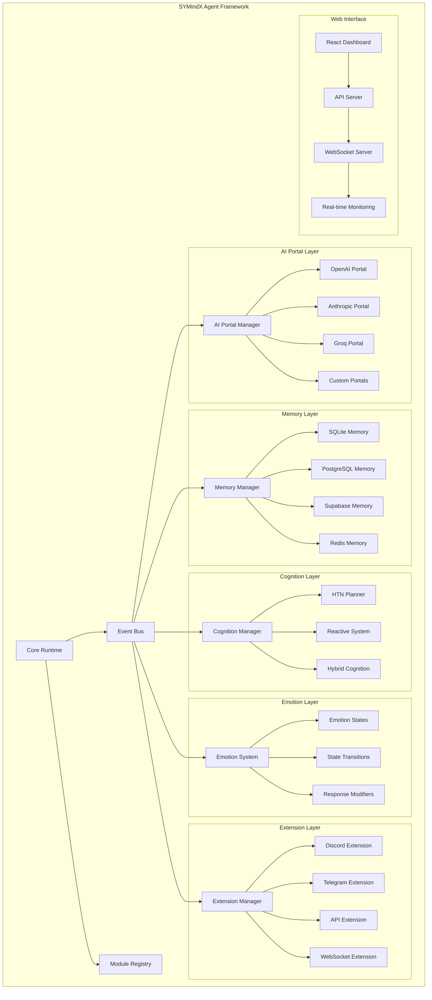
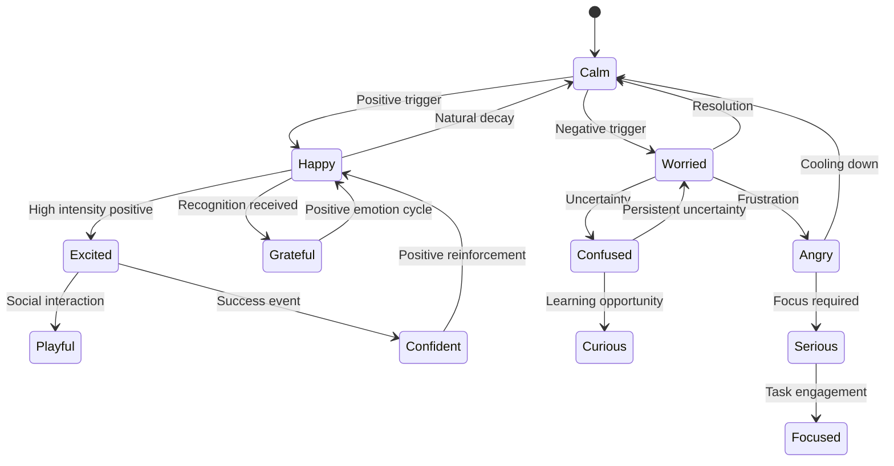

# SYMindX Architecture Documentation

This document provides a comprehensive overview of the SYMindX architecture, design patterns, and system components.

## System Overview

SYMindX is designed as a modular, event-driven AI agent framework that prioritizes extensibility, performance, and maintainability. The architecture follows several key principles:

### Core Principles

1. **Modularity**: Each component is self-contained and replaceable
2. **Event-Driven**: Components communicate through events and message passing
3. **Provider Abstraction**: Support multiple backends through unified interfaces
4. **Hot-Swappable**: Runtime module replacement without system restart
5. **Type Safety**: Full TypeScript integration with strict type checking
6. **Performance**: Optimized for low latency and high throughput
7. **Extensibility**: Plugin architecture for custom integrations

## High-Level Architecture



## Core Components

### 1. Core Runtime

The Core Runtime is the heart of the SYMindX system, managing the agent lifecycle, coordination between components, and system-wide configuration.

**Key Responsibilities:**
- Agent lifecycle management (initialize, start, stop, destroy)
- Component coordination and dependency management
- Configuration management and validation
- Error handling and recovery
- Performance monitoring and metrics collection

**Architecture:**

```typescript
interface CoreRuntime {
  readonly id: string;
  readonly status: AgentStatus;
  readonly config: AgentConfig;
  
  initialize(): Promise<void>;
  start(): Promise<void>;
  stop(): Promise<void>;
  destroy(): Promise<void>;
  
  getComponent<T>(type: ComponentType): T;
  registerComponent<T>(type: ComponentType, component: T): void;
  
  emit(event: SystemEvent): void;
  on(event: string, handler: EventHandler): void;
}
```

### 2. Event Bus

The Event Bus provides a decoupled communication mechanism between components, enabling reactive architecture and loose coupling.

**Event Types:**
- **System Events**: Lifecycle, configuration changes, errors
- **AI Events**: Requests, responses, provider changes
- **Memory Events**: Storage, retrieval, updates
- **Extension Events**: Platform messages, connections, status
- **Emotion Events**: State changes, triggers, responses

**Event Flow:**

```typescript
interface EventBus {
  // Event emission
  emit<T>(event: string, data: T): void;
  emitAsync<T>(event: string, data: T): Promise<void>;
  
  // Event subscription
  on<T>(event: string, handler: EventHandler<T>): Subscription;
  once<T>(event: string, handler: EventHandler<T>): Subscription;
  off(subscription: Subscription): void;
  
  // Event filtering and transformation
  filter<T>(event: string, predicate: (data: T) => boolean): EventStream<T>;
  map<T, U>(event: string, mapper: (data: T) => U): EventStream<U>;
  
  // Event aggregation
  buffer(event: string, timeWindow: number): EventStream<T[]>;
  throttle(event: string, interval: number): EventStream<T>;
}
```

### 3. Module Registry

The Module Registry manages dynamic component loading, hot-swapping, and dependency resolution.

**Module Types:**
- **Core Modules**: Essential system components
- **Provider Modules**: AI portals, memory providers
- **Extension Modules**: Platform integrations
- **Plugin Modules**: Custom functionality

**Registry Operations:**

```typescript
interface ModuleRegistry {
  // Module registration
  register<T>(name: string, factory: ModuleFactory<T>): void;
  unregister(name: string): void;
  
  // Module resolution
  resolve<T>(name: string): T;
  create<T>(name: string, config: any): T;
  
  // Hot swapping
  swap<T>(name: string, newFactory: ModuleFactory<T>): Promise<void>;
  
  // Dependency management
  addDependency(module: string, dependency: string): void;
  resolveDependencies(module: string): string[];
  
  // Module introspection
  list(): ModuleInfo[];
  getInfo(name: string): ModuleInfo;
  getStatus(name: string): ModuleStatus;
}
```

## AI Portal Architecture

### Portal Abstraction Layer

The AI Portal system provides a unified interface for interacting with different AI providers, abstracting away provider-specific implementations.

```typescript
interface AIPortal {
  readonly name: string;
  readonly version: string;
  readonly capabilities: PortalCapabilities;
  
  initialize(config: PortalConfig): Promise<void>;
  destroy(): Promise<void>;
  
  // Core AI operations
  chat(request: ChatRequest): Promise<ChatResponse>;
  stream(request: ChatRequest): AsyncIterableIterator<ChatChunk>;
  
  // Advanced operations
  generateEmbedding(text: string): Promise<number[]>;
  generateImage?(prompt: string): Promise<ImageResponse>;
  speechToText?(audio: Buffer): Promise<string>;
  textToSpeech?(text: string): Promise<Buffer>;
  
  // Provider management
  getModels(): Promise<ModelInfo[]>;
  getUsage(): Promise<UsageInfo>;
  getStatus(): PortalStatus;
}
```

### Provider Implementations

Each AI provider is implemented as a separate portal with provider-specific optimizations:

**OpenAI Portal:**
- GPT-4, GPT-3.5, DALL-E integration
- Function calling and tool use
- Streaming responses and real-time processing
- Advanced prompt engineering support

**Anthropic Portal:**
- Claude 3.5 Sonnet, Claude 3 Opus integration
- Constitutional AI principles
- Large context window handling
- Advanced reasoning capabilities

**Groq Portal:**
- Llama 3.1, Mixtral integration
- Ultra-fast inference speeds
- Optimized for real-time applications
- Cost-effective processing

### Portal Manager

The Portal Manager handles provider selection, load balancing, failover, and performance optimization:

```typescript
interface PortalManager {
  // Provider management
  addPortal(portal: AIPortal): void;
  removePortal(name: string): void;
  getPortal(name: string): AIPortal;
  
  // Load balancing
  selectPortal(criteria: SelectionCriteria): AIPortal;
  distributeLoad(requests: ChatRequest[]): Promise<ChatResponse[]>;
  
  // Failover handling
  enableFailover(primary: string, fallback: string[]): void;
  handleFailure(portal: string, error: Error): Promise<void>;
  
  // Performance optimization
  enableCaching(strategy: CacheStrategy): void;
  preloadModels(models: string[]): Promise<void>;
  optimizeRouting(metrics: PerformanceMetrics): void;
}
```

## Memory System Architecture

### Memory Abstraction

The Memory system provides persistent storage for agent experiences, context, and knowledge through a unified interface:

```typescript
interface MemoryProvider {
  readonly name: string;
  readonly capabilities: MemoryCapabilities;
  
  initialize(config: MemoryConfig): Promise<void>;
  destroy(): Promise<void>;
  
  // Core operations
  store(entry: MemoryEntry): Promise<string>;
  retrieve(id: string): Promise<MemoryEntry | null>;
  query(query: MemoryQuery): Promise<MemoryResult[]>;
  delete(id: string): Promise<void>;
  
  // Batch operations
  storeBatch(entries: MemoryEntry[]): Promise<string[]>;
  deleteBatch(ids: string[]): Promise<void>;
  
  // Advanced querying
  similaritySearch(embedding: number[], limit: number): Promise<MemoryResult[]>;
  keywordSearch(keywords: string[], limit: number): Promise<MemoryResult[]>;
  temporalQuery(timeRange: TimeRange, limit: number): Promise<MemoryResult[]>;
  
  // Management
  clear(agentId?: string): Promise<void>;
  optimize(): Promise<void>;
  getStats(): Promise<MemoryStats>;
}
```

### Memory Providers

**SQLite Memory Provider:**
- Local file-based storage
- Vector similarity search with extensions
- Fast queries for development and testing
- Automatic schema migrations

**PostgreSQL Memory Provider:**
- Scalable relational storage
- pgvector extension for embeddings
- Advanced indexing and optimization
- ACID compliance and transactions

**Supabase Memory Provider:**
- Managed PostgreSQL with real-time features
- Built-in authentication and row-level security
- Vector similarity search
- Edge function integration

**Redis Memory Provider:**
- In-memory caching and storage
- Redis Search for full-text and vector search
- High-performance operations
- Pub/sub for real-time updates

### Memory Manager

The Memory Manager orchestrates multiple providers and implements advanced memory strategies:

```typescript
interface MemoryManager {
  // Provider management
  addProvider(provider: MemoryProvider): void;
  removeProvider(name: string): void;
  getProvider(name: string): MemoryProvider;
  
  // Storage strategies
  setStrategy(strategy: StorageStrategy): void;
  enableReplication(providers: string[]): void;
  enableSharding(shardKey: (entry: MemoryEntry) => string): void;
  
  // Memory consolidation
  consolidateMemories(agentId: string): Promise<void>;
  summarizeHistory(agentId: string, timeRange: TimeRange): Promise<string>;
  forgetOldMemories(agentId: string, retention: RetentionPolicy): Promise<void>;
  
  // Context management
  buildContext(agentId: string, query: string): Promise<ContextWindow>;
  updateContext(agentId: string, interaction: Interaction): Promise<void>;
  clearContext(agentId: string): Promise<void>;
}
```

## Emotion System Architecture

### Emotion Model

The Emotion system implements a sophisticated model based on 11 distinct emotional states inspired by RuneScape:

```typescript
type EmotionType = 
  | 'happy' | 'sad' | 'angry' | 'excited' | 'calm'
  | 'confused' | 'confident' | 'worried' | 'playful'
  | 'serious' | 'grateful';

interface EmotionState {
  readonly type: EmotionType;
  readonly intensity: number; // 0.0 to 1.0
  readonly duration: number;  // milliseconds
  readonly triggers: EmotionTrigger[];
  readonly modifiers: ResponseModifier[];
}
```

### Emotion Engine

The Emotion Engine manages emotional state transitions, triggers, and behavioral modifications:

```typescript
interface EmotionEngine {
  // State management
  getCurrentEmotion(): EmotionState;
  setEmotion(type: EmotionType, intensity?: number): void;
  transitionTo(type: EmotionType, duration: number): Promise<void>;
  
  // Trigger system
  addTrigger(trigger: EmotionTrigger): void;
  removeTrigger(id: string): void;
  processTriggers(context: InteractionContext): Promise<void>;
  
  // Response modification
  modifyResponse(response: string, emotion: EmotionState): string;
  adjustTone(response: string, emotion: EmotionType): string;
  addEmotionalCues(response: string, emotion: EmotionState): string;
  
  // Learning and adaptation
  learnFromInteraction(interaction: Interaction, outcome: Outcome): void;
  adaptEmotionalResponses(feedback: EmotionalFeedback[]): void;
  
  // Analytics
  getEmotionalHistory(timeRange: TimeRange): EmotionEvent[];
  getEmotionalPatterns(): EmotionPattern[];
  exportEmotionalProfile(): EmotionalProfile;
}
```

### Emotion Transitions

Emotions transition based on triggers, context, and learned patterns:



## Extension System Architecture

### Extension Framework

The Extension system provides a plugin architecture for integrating with external platforms and services:

```typescript
interface Extension {
  readonly name: string;
  readonly version: string;
  readonly description: string;
  readonly capabilities: ExtensionCapabilities;
  
  initialize(context: ExtensionContext): Promise<void>;
  destroy(): Promise<void>;
  
  // Message handling
  handleMessage(message: Message): Promise<Response>;
  sendMessage(target: MessageTarget, content: string): Promise<void>;
  
  // Event handling
  on(event: string, handler: EventHandler): void;
  emit(event: string, data: any): void;
  
  // Platform-specific operations
  getChannels?(): Promise<Channel[]>;
  getUsers?(): Promise<User[]>;
  uploadFile?(file: File, target: MessageTarget): Promise<string>;
  
  // Status and monitoring
  getStatus(): ExtensionStatus;
  getMetrics(): ExtensionMetrics;
}
```

### Platform Extensions

**Discord Extension:**
- Bot integration with Discord API
- Slash commands and interactions
- Message handling and responses
- Voice channel integration
- Server management capabilities

**Telegram Extension:**
- Bot API integration
- Inline keyboards and custom keyboards
- File upload and download
- Group and channel management
- Webhook and polling support

**Slack Extension:**
- App integration with Slack API
- Interactive components and modals
- Workflow builder integration
- File sharing and collaboration
- Enterprise grid support

**API Extension:**
- RESTful API endpoint exposure
- Authentication and authorization
- Rate limiting and throttling
- OpenAPI documentation
- Webhook support

### Extension Manager

The Extension Manager handles extension lifecycle, communication, and coordination:

```typescript
interface ExtensionManager {
  // Extension lifecycle
  loadExtension(extension: Extension): Promise<void>;
  unloadExtension(name: string): Promise<void>;
  reloadExtension(name: string): Promise<void>;
  
  // Message routing
  routeMessage(message: Message): Promise<void>;
  broadcastMessage(content: string, targets: MessageTarget[]): Promise<void>;
  
  // Event coordination
  subscribeToEvents(extension: string, events: string[]): void;
  unsubscribeFromEvents(extension: string, events: string[]): void;
  
  // Cross-extension communication
  sendToExtension(target: string, message: any): Promise<any>;
  registerService(name: string, service: ExtensionService): void;
  getService(name: string): ExtensionService;
  
  // Monitoring and management
  getExtensions(): ExtensionInfo[];
  getExtensionStatus(name: string): ExtensionStatus;
  getExtensionMetrics(name: string): ExtensionMetrics;
}
```

## Cognition System Architecture

### Cognitive Framework

The Cognition system implements various reasoning and planning capabilities:

```typescript
interface CognitionModule {
  readonly name: string;
  readonly type: CognitionType;
  readonly capabilities: CognitionCapabilities;
  
  initialize(config: CognitionConfig): Promise<void>;
  destroy(): Promise<void>;
  
  // Planning and reasoning
  planActions(goal: Goal, context: Context): Promise<ActionPlan>;
  reasonAbout(query: string, context: Context): Promise<ReasoningResult>;
  makeDecision(options: Decision[], criteria: Criteria): Promise<Decision>;
  
  // Learning and adaptation
  learnFromExperience(experience: Experience): void;
  updateKnowledge(knowledge: Knowledge): void;
  adaptStrategy(feedback: Feedback): void;
  
  // Introspection
  explainReasoning(result: ReasoningResult): string;
  getConfidence(result: any): number;
  identifyUncertainties(): Uncertainty[];
}
```

### HTN Planner

Hierarchical Task Network (HTN) planning for complex goal decomposition:

```typescript
interface HTNPlanner extends CognitionModule {
  // Task decomposition
  decomposeTask(task: Task, context: Context): Promise<Subtask[]>;
  findMethods(task: Task): Method[];
  selectMethod(task: Task, methods: Method[], context: Context): Method;
  
  // Planning execution
  executePlan(plan: ActionPlan, context: Context): AsyncIterableIterator<ActionResult>;
  monitorExecution(plan: ActionPlan): Promise<ExecutionStatus>;
  replan(failedAction: Action, context: Context): Promise<ActionPlan>;
  
  // Domain knowledge
  addDomain(domain: HTNDomain): void;
  updateDomain(domain: HTNDomain): void;
  getDomains(): HTNDomain[];
}
```

### Reactive System

Reactive behaviors for immediate response to environmental changes:

```typescript
interface ReactiveSystem extends CognitionModule {
  // Behavior management
  addBehavior(behavior: ReactiveBehavior): void;
  removeBehavior(id: string): void;
  prioritizeBehaviors(priorities: BehaviorPriority[]): void;
  
  // Stimulus-response
  processStimulus(stimulus: Stimulus): Promise<Response>;
  suppressBehavior(id: string, duration: number): void;
  activateBehavior(id: string): void;
  
  // Subsumption architecture
  addLayer(layer: BehaviorLayer): void;
  resolveConflict(behaviors: ReactiveBehavior[]): ReactiveBehavior;
  arbitrate(responses: Response[]): Response;
}
```

## Web Interface Architecture

### React Dashboard

The web interface provides real-time monitoring and control capabilities:

```typescript
interface WebInterface {
  // Dashboard components
  AgentStatus: React.FC<{ agentId: string }>;
  PortalMonitor: React.FC<{ portalName: string }>;
  MemoryViewer: React.FC<{ memoryProvider: string }>;
  EmotionTracker: React.FC<{ agentId: string }>;
  ExtensionManager: React.FC;
  
  // Real-time features
  useRealTimeUpdates(endpoint: string): WebSocketConnection;
  useAgentMetrics(agentId: string): AgentMetrics;
  useSystemStatus(): SystemStatus;
  
  // Interactive controls
  ChatInterface: React.FC<{ agentId: string }>;
  ConfigEditor: React.FC<{ component: string }>;
  LogViewer: React.FC<{ level: LogLevel }>;
}
```

### API Server

RESTful API for programmatic access and control:

```typescript
interface APIServer {
  // Agent management
  POST('/agents', createAgent): Promise<Agent>;
  GET('/agents/:id', getAgent): Promise<Agent>;
  PUT('/agents/:id', updateAgent): Promise<Agent>;
  DELETE('/agents/:id', deleteAgent): Promise<void>;
  
  // Component management
  GET('/portals', listPortals): Promise<Portal[]>;
  POST('/portals/:name/test', testPortal): Promise<TestResult>;
  GET('/memory/stats', getMemoryStats): Promise<MemoryStats>;
  POST('/memory/query', queryMemory): Promise<MemoryResult[]>;
  
  // System operations
  GET('/health', healthCheck): Promise<HealthStatus>;
  GET('/metrics', getMetrics): Promise<SystemMetrics>;
  POST('/reload', reloadSystem): Promise<void>;
  
  // Real-time endpoints
  WebSocket('/ws/agent/:id'): AgentWebSocket;
  WebSocket('/ws/system'): SystemWebSocket;
}
```

## Performance Considerations

### Optimization Strategies

**Caching:**
- Response caching for frequently asked questions
- Model preloading for faster inference
- Memory query result caching
- Configuration caching for reduced I/O

**Connection Pooling:**
- Database connection pools for memory providers
- HTTP client pools for AI provider APIs
- WebSocket connection management
- Resource pooling for extensions

**Asynchronous Processing:**
- Non-blocking I/O operations
- Streaming responses for real-time feedback
- Background processing for memory consolidation
- Parallel processing for batch operations

**Resource Management:**
- Memory usage monitoring and optimization
- CPU usage profiling and optimization
- Network bandwidth management
- Storage optimization and cleanup

### Scaling Patterns

**Horizontal Scaling:**
- Multiple agent instances with load balancing
- Distributed memory providers
- Microservice architecture for components
- Container orchestration with Kubernetes

**Vertical Scaling:**
- Multi-core processing optimization
- Memory optimization for large models
- GPU acceleration for AI operations
- SSD optimization for fast storage

## Security Architecture

### Security Principles

1. **Defense in Depth**: Multiple security layers
2. **Least Privilege**: Minimal required permissions
3. **Zero Trust**: Verify all requests and connections
4. **Encryption**: Data protection in transit and at rest
5. **Audit Logging**: Comprehensive security event logging

### Security Implementation

**Authentication & Authorization:**
- API key management for AI providers
- OAuth integration for platform extensions
- Role-based access control (RBAC)
- JWT tokens for web interface

**Data Protection:**
- Encryption at rest for sensitive data
- TLS/SSL for all network communications
- Input validation and sanitization
- Output filtering for security

**Monitoring & Alerting:**
- Security event logging
- Anomaly detection for unusual patterns
- Real-time security alerts
- Compliance reporting and auditing

This architecture provides a robust, scalable, and maintainable foundation for the SYMindX AI agent framework, enabling complex AI applications while maintaining performance, security, and extensibility. 