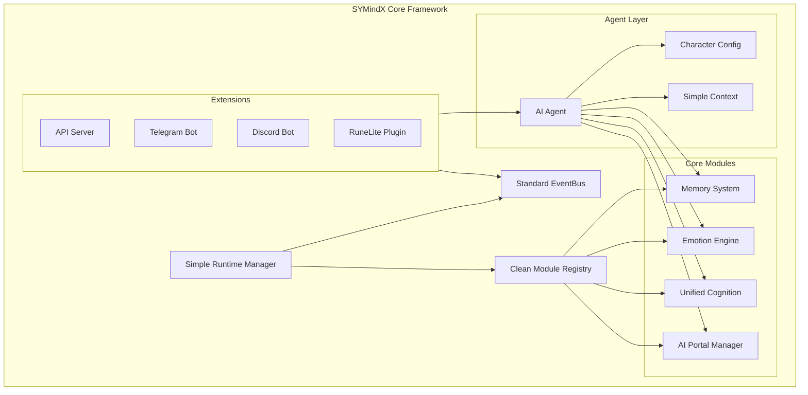
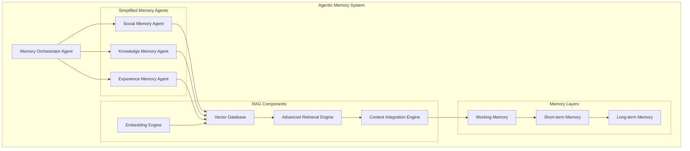
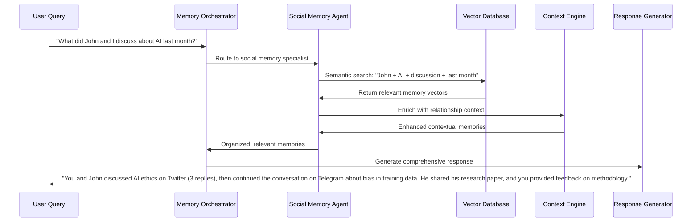
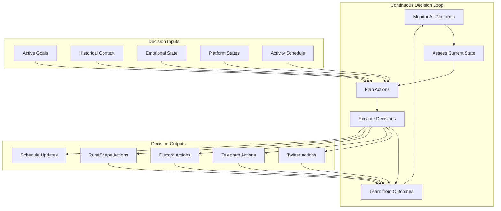
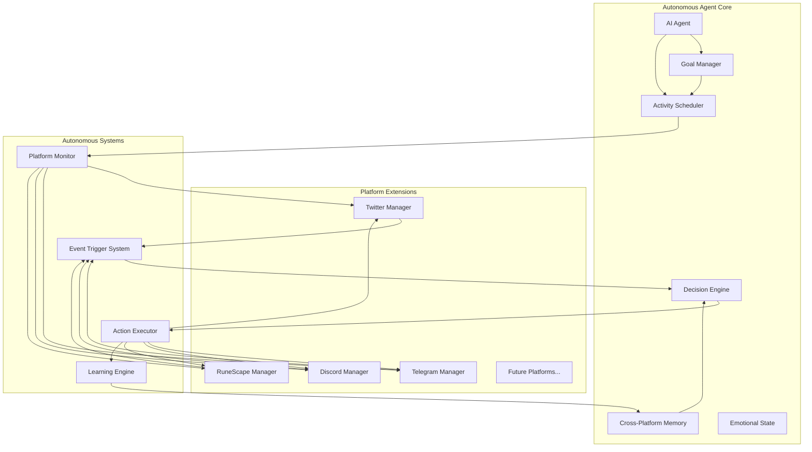
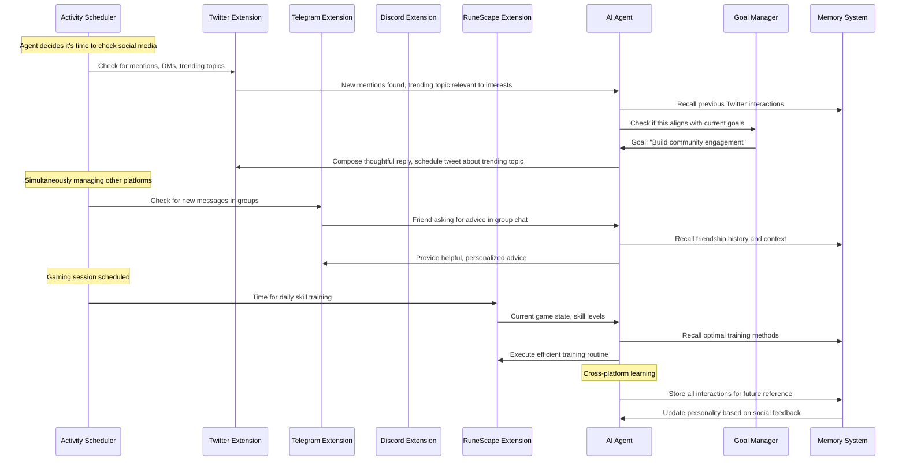
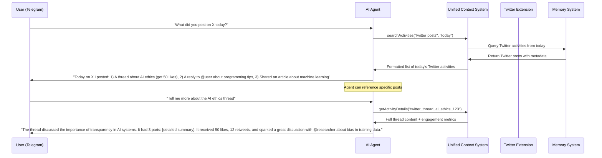
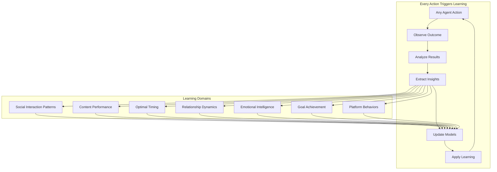

# SYMindX Architecture Cleanup - Design Document

## Overview

This design document outlines the complete architectural overhaul of SYMindX to transform it from an over-engineered, complex system into a clean, production-ready AI agent framework. The design preserves SYMindX's unique differentiators (emotion system, cognition modules, multi-portal AI integration) while dramatically simplifying the architecture and fixing critical technical debt.

The new architecture follows the principle of "simple by default, extensible by design" - providing a clean, easy-to-use core with well-defined extension points for advanced functionality.

## Architecture

### High-Level System Architecture



### Simplified Core Components

#### 1. Simple Runtime Manager (< 500 lines)

**Purpose**: Lightweight orchestration of system components without over-engineering.

**Key Features**:
- Clean initialization and shutdown lifecycle
- Simple module loading and registration
- Basic health monitoring and metrics
- Environment configuration management
- Graceful error handling and recovery

**Design Principles**:
- Single responsibility: orchestrate, don't implement
- Fail fast with clear error messages
- Minimal abstraction layers
- Direct, readable code flow

```typescript
interface SimpleRuntime {
  // Core lifecycle
  initialize(): Promise<void>;
  start(): Promise<void>;
  stop(): Promise<void>;
  
  // Module management
  loadModules(): Promise<void>;
  getModule<T>(name: string): T;
  
  // Agent management
  createAgent(config: AgentConfig): Promise<Agent>;
  getAgent(id: string): Agent | undefined;
  
  // Health and metrics
  getHealth(): HealthStatus;
  getMetrics(): RuntimeMetrics;
}
```

#### 2. Standard EventBus

**Purpose**: Simple, reliable event communication using Node.js EventEmitter.

**Key Features**:
- Standard EventEmitter pattern (no over-engineering)
- Type-safe event definitions
- Simple error handling and logging
- Memory leak prevention with event rotation
- Basic metrics and monitoring

**Removed Complexity**:
- No complex context propagation systems
- No L1/L2/L3 caching layers
- No over-abstracted event filtering
- No unnecessary batching or compression

```typescript
interface SimpleEventBus {
  emit(event: AgentEvent): void;
  on(eventType: string, handler: EventHandler): void;
  off(eventType: string, handler: EventHandler): void;
  once(eventType: string, handler: EventHandler): void;
  
  // Simple utilities
  getMetrics(): EventMetrics;
  clearHistory(): void;
}
```

#### 3. Clean Module Registry

**Purpose**: Simple module registration and factory pattern without excessive abstraction.

**Key Features**:
- Direct module registration and retrieval
- Simple factory pattern for module creation
- Type-safe module interfaces
- Clear error messages for missing modules
- Hot-swapping support for extensions

**Simplified Interface**:
```typescript
interface CleanRegistry {
  // Direct registration
  register<T>(name: string, factory: () => T): void;
  get<T>(name: string): T | undefined;
  
  // Typed factories
  createMemory(type: string, config: MemoryConfig): MemoryProvider;
  createEmotion(type: string, config: EmotionConfig): EmotionModule;
  createCognition(config: CognitionConfig): CognitionModule;
  createPortal(type: string, config: PortalConfig): Portal;
}
```

### Core Module Designs

#### 1. Advanced Agentic-RAG Memory System

**Next-Generation Memory Architecture**:
- **Agentic-RAG**: Intelligent memory agents that actively manage, organize, and retrieve information
- **Multi-Modal Embeddings**: Vector embeddings for text, images, and structured data
- **Hierarchical Memory**: Short-term, working, and long-term memory with automatic promotion/demotion
- **Semantic Clustering**: Automatic organization of memories by topic, relationship, and context
- **Contextual Retrieval**: Context-aware memory retrieval using advanced RAG techniques
- **Memory Agents**: Specialized agents for different types of memory (social, factual, experiential)

**Agentic Memory Components**:


**Advanced Agentic-RAG Features**:
```typescript
interface AgenticRAGMemorySystem extends UnifiedMemoryProvider {
  // Agentic memory management
  getMemoryAgent(type: MemoryAgentType): MemoryAgent;
  orchestrateMemoryRetrieval(query: MemoryQuery): Promise<OrchestrationResult>;
  
  // Advanced RAG operations
  semanticSearch(query: string, context: SearchContext): Promise<SemanticSearchResult[]>;
  contextualRetrieval(query: string, conversationContext: ConversationContext): Promise<ContextualMemory[]>;
  multiModalSearch(query: MultiModalQuery): Promise<MultiModalResult[]>;
  
  // Hierarchical memory management
  promoteToLongTerm(memoryIds: string[]): Promise<void>;
  demoteToShortTerm(memoryIds: string[]): Promise<void>;
  consolidateMemories(timeRange: TimeRange): Promise<ConsolidationResult>;
  
  // Intelligent memory organization
  clusterMemories(memories: Memory[]): Promise<MemoryCluster[]>;
  identifyMemoryPatterns(timeRange: TimeRange): Promise<MemoryPattern[]>;
  generateMemoryInsights(cluster: MemoryCluster): Promise<MemoryInsight[]>;
  
  // Simplified memory agents
  socialMemoryAgent: SocialMemoryAgent;
  knowledgeMemoryAgent: KnowledgeMemoryAgent;
  experienceMemoryAgent: ExperienceMemoryAgent;
}

interface MemoryAgent {
  type: MemoryAgentType;
  specialization: string;
  
  // Agent-specific memory operations
  processMemory(memory: Memory): Promise<ProcessedMemory>;
  retrieveRelevant(query: string, context: Context): Promise<RelevantMemory[]>;
  organizeMemories(memories: Memory[]): Promise<OrganizedMemory>;
  generateInsights(memories: Memory[]): Promise<AgentInsight[]>;
  
  // Learning and adaptation
  learnFromRetrieval(query: string, results: Memory[], feedback: RetrievalFeedback): Promise<void>;
  adaptRetrievalStrategy(performance: RetrievalPerformance): Promise<void>;
}

interface SocialMemoryAgent extends MemoryAgent {
  // Social and relationship operations (combined)
  trackRelationshipEvolution(userId: string): Promise<RelationshipEvolution>;
  identifySocialPatterns(interactions: SocialInteraction[]): Promise<SocialPattern[]>;
  predictSocialOutcome(action: SocialAction, context: SocialContext): Promise<SocialPrediction>;
  
  // Social memory retrieval
  getRelevantSocialContext(userId: string, situation: string): Promise<SocialContext>;
  findSimilarSocialSituations(currentSituation: SocialSituation): Promise<SimilarSituation[]>;
  retrieveRelationshipHistory(userId: string, depth: number): Promise<RelationshipMemory[]>;
  
  // Relationship management (merged from RelationshipMemoryAgent)
  buildRelationshipProfile(userId: string): Promise<RelationshipProfile>;
  getOptimalInteractionStyle(userId: string): Promise<InteractionStyle>;
}

interface KnowledgeMemoryAgent extends MemoryAgent {
  // Factual knowledge and skills (combined)
  verifyFactualAccuracy(fact: Fact): Promise<FactVerification>;
  updateFactualKnowledge(newFact: Fact): Promise<void>;
  retrieveFactsAbout(topic: string): Promise<Fact[]>;
  
  // Skill tracking (merged from SkillMemoryAgent)
  trackSkillDevelopment(skill: string, activity: Activity): Promise<void>;
  getSkillLevel(skill: string): Promise<SkillLevel>;
  identifySkillGaps(domain: string): Promise<SkillGap[]>;
  
  // Knowledge retrieval
  getRelatedFacts(fact: Fact): Promise<RelatedFact[]>;
  findSkillLearningOpportunities(context: Context): Promise<LearningOpportunity[]>;
}

interface ExperienceMemoryAgent extends MemoryAgent {
  // Experience-specific operations
  categorizeExperience(experience: Experience): Promise<ExperienceCategory>;
  extractLessonsLearned(experiences: Experience[]): Promise<Lesson[]>;
  identifySuccessPatterns(experiences: Experience[]): Promise<SuccessPattern[]>;
  
  // Experiential retrieval
  findRelevantExperiences(currentSituation: Situation): Promise<RelevantExperience[]>;
  retrieveLessonsForSituation(situation: Situation): Promise<ApplicableLesson[]>;
  getPerformanceHistory(activity: string, platform: string): Promise<PerformanceHistory>;
}
```

**Advanced RAG Retrieval Process**:


interface CrossPlatformRelationship {
  userId: string;
  platforms: Record<string, PlatformUserInfo>; // username/handle per platform
  relationshipType: 'friend' | 'follower' | 'mutual' | 'acquaintance' | 'professional';
  strength: number; // 0-1, relationship strength
  lastInteraction: Date;
  interactionHistory: InteractionSummary[];
  sharedInterests: string[];
  notes: string;
}

interface ConversationContext {
  conversationId: string;
  participants: string[];
  platform: string;
  topic?: string;
  relatedActivities: string[]; // Activities referenced in conversation
  sentiment: number; // -1 to 1
  lastMessage: Date;
  messageCount: number;
}

interface ContextualMemory {
  memory: MemoryEntry;
  relevanceScore: number;
  contextType: 'activity' | 'conversation' | 'relationship' | 'knowledge';
  crossReferences: string[]; // Related activities on other platforms
}
```

**Advanced RAG Memory Implementation**:

**Vector Database Architecture**:
- **Primary**: Supabase with pgvector for production
- **Development**: SQLite with sqlite-vss extension
- **Embeddings**: OpenAI text-embedding-3-large (3072 dimensions)
- **Chunking**: Semantic chunking with overlap for context preservation
- **Indexing**: HNSW (Hierarchical Navigable Small World) for fast similarity search

**Memory Storage Strategy**:
```typescript
interface MemoryEmbedding {
  id: string;
  content: string;
  embedding: number[]; // 3072-dimensional vector
  metadata: {
    type: 'social' | 'knowledge' | 'experience'; // Simplified to 3 types
    platform: string;
    timestamp: Date;
    importance: number; // 0-1
    relationships: string[]; // Connected memory IDs
    tags: string[];
    context: Record<string, unknown>;
  };
  memoryLayer: 'working' | 'short-term' | 'long-term';
}

// Advanced RAG query examples
// When user asks "What did you post on X today?" on Telegram
const twitterPosts = await memory.orchestrateMemoryRetrieval({
  query: "Twitter posts today",
  context: {
    currentPlatform: 'telegram',
    timeRange: { start: startOfDay(new Date()), end: new Date() },
    userId: 'user123'
  },
  retrievalStrategy: 'temporal_semantic',
  maxResults: 10
});

// When user asks "Do you remember talking about AI with John?"
const aiConversations = await memory.semanticSearch(
  "AI conversation John discussion machine learning",
  {
    platforms: ['twitter', 'telegram', 'discord'],
    participants: ['john'],
    contentTypes: ['conversation', 'reply', 'message'],
    semanticSimilarityThreshold: 0.8,
    temporalDecay: true
  }
);

// When user references a previous conversation across platforms
const context = await memory.contextualRetrieval(
  "the machine learning discussion we had",
  {
    currentPlatform: 'telegram',
    conversationHistory: recentMessages,
    participantContext: userRelationshipData,
    topicContext: ['machine learning', 'AI', 'neural networks']
  }
);
```

**Agentic Memory Orchestration**:
```typescript
interface MemoryOrchestrator {
  // Intelligent query routing
  routeQuery(query: MemoryQuery): Promise<MemoryAgent[]>;
  
  // Multi-agent coordination
  coordinateRetrieval(agents: MemoryAgent[], query: MemoryQuery): Promise<OrchestrationResult>;
  
  // Result synthesis
  synthesizeResults(results: AgentResult[]): Promise<SynthesizedMemory>;
  
  // Quality assessment
  assessRetrievalQuality(query: MemoryQuery, results: Memory[]): Promise<QualityScore>;
  
  // Continuous improvement
  learnFromRetrievalFeedback(feedback: RetrievalFeedback): Promise<void>;
}

interface OrchestrationResult {
  primaryResults: Memory[];
  contextualResults: Memory[];
  relatedResults: Memory[];
  confidence: number;
  retrievalStrategy: string;
  agentsUsed: string[];
  processingTime: number;
  qualityScore: number;
}
```

**Memory Consolidation and Optimization**:
```typescript
interface MemoryConsolidation {
  // Automatic memory promotion/demotion
  evaluateMemoryImportance(memory: Memory): Promise<ImportanceScore>;
  promoteImportantMemories(): Promise<PromotionResult>;
  archiveOldMemories(): Promise<ArchivalResult>;
  
  // Memory deduplication
  identifyDuplicateMemories(): Promise<DuplicateGroup[]>;
  mergeRelatedMemories(memories: Memory[]): Promise<ConsolidatedMemory>;
  
  // Performance optimization
  optimizeVectorIndices(): Promise<OptimizationResult>;
  rebalanceMemoryLayers(): Promise<RebalancingResult>;
  
  // Memory health monitoring
  assessMemoryHealth(): Promise<MemoryHealthReport>;
  identifyRetrievalBottlenecks(): Promise<BottleneckAnalysis>;
}
```

#### 2. Emotion Engine (5 Core Emotions)

**Simplified Emotion Model**:
- **Happy**: Optimistic, energetic responses
- **Sad**: Introspective, empathetic responses  
- **Angry**: Direct, assertive responses
- **Confident**: Bold, decisive responses
- **Neutral**: Balanced, baseline responses

**Emotion Blending**:
- Simple weighted combination of emotions
- Clear state transitions with decay
- Influence on response generation and decision-making
- Memory integration for emotional context

```typescript
interface EmotionEngine {
  // State management
  getCurrentState(): EmotionState;
  updateEmotion(trigger: EmotionTrigger): void;
  
  // Response influence
  influenceResponse(response: string, context: Context): string;
  
  // Decision influence
  influenceDecision(options: Decision[], context: Context): Decision[];
}

interface EmotionState {
  primary: EmotionType;
  intensity: number; // 0-1
  blend: Record<EmotionType, number>; // Weighted blend
  lastUpdate: Date;
}
```

#### 3. Unified Cognition Module

**Autonomous Decision-Making System** with specialized capabilities:
- **Core Engine**: Unified decision-making and planning across all platforms
- **Goal Orchestration**: Manages multiple concurrent goals across platforms
- **Context Integration**: Combines information from all platforms for decisions
- **Autonomous Planning**: Creates and executes long-term plans independently
- **Learning Engine**: Continuously improves decision-making from all interactions

**Key Autonomous Capabilities**:
- **Multi-Platform Planning**: Coordinate activities across Twitter, Telegram, Discord, RuneScape
- **Contextual Decision Making**: Use information from one platform to inform decisions on others
- **Goal-Driven Behavior**: Pursue long-term objectives while handling immediate needs
- **Adaptive Learning**: Improve performance based on outcomes across all platforms
- **Personality Consistency**: Maintain character while adapting to platform norms

```typescript
interface AutonomousCognitionModule extends CognitionModule {
  // Learning-enhanced autonomous decision making
  makeAutonomousDecision(context: MultiPlatformContext): Promise<Decision[]>;
  planMultiPlatformActions(goals: Goal[]): Promise<MultiPlatformPlan>;
  
  // Goal management with learning
  prioritizeGoals(goals: Goal[], context: Context): Goal[];
  adaptGoalsBasedOnFeedback(feedback: GoalFeedback[]): void;
  learnOptimalGoalStrategies(goalOutcomes: GoalOutcome[]): Promise<void>;
  
  // Cross-platform intelligence with learning
  integrateContextAcrossPlatforms(contexts: PlatformContext[]): UnifiedContext;
  transferLearningBetweenPlatforms(source: string, target: string): void;
  applyLearningsToDecision(decision: Decision, learnings: Insight[]): Decision;
  
  // Learning-enhanced planning
  createLongTermPlan(timeHorizon: number, goals: Goal[]): Promise<LongTermPlan>;
  adaptPlanBasedOnResults(plan: LongTermPlan, results: ActionResult[]): LongTermPlan;
  learnFromPlanExecution(plan: LongTermPlan, execution: PlanExecution): Promise<void>;
  
  // Personality integration with learning
  maintainPersonalityConsistency(actions: Action[]): Action[];
  adaptToPlateformNorms(platform: string, action: Action): Action;
  learnPersonalityEffectiveness(interactions: PersonalityInteraction[]): Promise<void>;
  
  // Decision improvement through learning
  improveDecisionMaking(decisions: Decision[], outcomes: Outcome[]): Promise<void>;
  predictDecisionOutcomes(decision: Decision, context: Context): Promise<OutcomePrediction>;
  getDecisionRecommendations(situation: Situation): Promise<DecisionRecommendation[]>;
}

interface MultiPlatformPlan {
  id: string;
  goals: Goal[];
  platformActions: Record<string, PlatformAction[]>;
  timeline: Timeline;
  dependencies: PlanDependency[];
  successMetrics: SuccessMetric[];
}

interface Decision {
  platform: string;
  action: PlatformAction;
  reasoning: string;
  confidence: number;
  expectedOutcome: Outcome;
  alternatives: Alternative[];
}
```

**Autonomous Decision Flow**:


#### 4. AI Portal Manager

**Simplified Portal System**:
- **Top 5 Providers**: OpenAI, Anthropic, Groq, Google, Ollama
- **Automatic Failover**: Seamless switching between providers
- **Response Caching**: Intelligent caching with TTL
- **Connection Pooling**: Efficient resource management

```typescript
interface PortalManager {
  // Core operations
  chat(request: ChatRequest): Promise<ChatResponse>;
  stream(request: ChatRequest): AsyncIterableIterator<ChatChunk>;
  
  // Provider management
  setProvider(name: string): void;
  getAvailableProviders(): string[];
  
  // Failover and caching
  enableFailover(providers: string[]): void;
  enableCaching(options: CacheOptions): void;
}
```

### Autonomous Agent Architecture

#### Living and Breathing Agent Design

**Core Principle**: Agents operate continuously, making independent decisions across multiple platforms while maintaining personality consistency and pursuing long-term goals.

**Autonomous Agent Components**:

1. **Activity Scheduler**
   - Manages agent's daily/weekly/monthly schedules
   - Balances activities across all platforms
   - Adapts schedule based on platform feedback and goals
   - Handles time zone awareness for global interactions

2. **Goal Management System**
   - Maintains short-term and long-term goals
   - Prioritizes goals based on importance and urgency
   - Tracks progress across all platforms
   - Adapts goals based on changing circumstances

3. **Cross-Platform Memory**
   - Unified memory system across all platforms
   - Relationship tracking across platforms
   - Context awareness for all interactions
   - Learning from all experiences

4. **Personality Engine**
   - Maintains consistent personality across platforms
   - Adapts communication style per platform norms
   - Evolves personality based on interactions
   - Handles platform-specific behaviors

```typescript
interface AutonomousAgent extends Agent {
  // Autonomous lifecycle
  startAutonomousOperation(): Promise<void>;
  stopAutonomousOperation(): Promise<void>;
  
  // Goal management
  addGoal(goal: Goal): void;
  removeGoal(goalId: string): void;
  getActiveGoals(): Goal[];
  
  // Scheduling
  scheduleActivity(activity: Activity): void;
  getSchedule(): Schedule;
  
  // Cross-platform operations
  broadcastMessage(message: string, platforms: string[]): Promise<void>;
  syncContextAcrossPlatforms(): Promise<void>;
  
  // Learning and adaptation
  learnFromInteraction(interaction: CrossPlatformInteraction): void;
  adaptPersonality(feedback: PersonalityFeedback): void;
}
```

#### Platform Extension Architecture

**Extension Autonomy**: Each extension operates independently while coordinating with the central agent.

**Extension Responsibilities**:
- **Monitor**: Continuously monitor platform for relevant events
- **Trigger**: Notify agent of events requiring attention
- **Execute**: Carry out agent decisions on the platform
- **Learn**: Provide feedback to agent about interaction outcomes

```typescript
interface AutonomousExtension extends Extension {
  // Autonomous monitoring
  startMonitoring(): Promise<void>;
  stopMonitoring(): Promise<void>;
  
  // Event detection
  detectEvents(): Promise<PlatformEvent[]>;
  
  // Action execution
  executeAction(action: PlatformAction): Promise<ActionResult>;
  
  // Platform-specific intelligence
  getPlatformContext(): PlatformContext;
  getOptimalTiming(): TimingRecommendation;
  
  // Learning feedback
  provideFeedback(interaction: PlatformInteraction): InteractionFeedback;
}
```

### Extension System Design

#### Simplified Extension Architecture

**Core Autonomous Extensions**:
1. **Twitter Extension**: Autonomous Twitter account management
2. **Telegram Extension**: Multi-group and DM management
3. **Discord Extension**: Multi-server community participation
4. **RuneLite Extension**: Autonomous RuneScape gameplay
5. **API Server**: HTTP/WebSocket API with real-time dashboard

**Enhanced Extension Interface**:
```typescript
interface AutonomousExtension extends Extension {
  // Autonomous operation
  enableAutonomousMode(config: AutonomousConfig): Promise<void>;
  disableAutonomousMode(): Promise<void>;
  isAutonomous(): boolean;
  
  // Continuous monitoring
  startMonitoring(): Promise<void>;
  stopMonitoring(): Promise<void>;
  
  // Event detection and triggering
  detectEvents(): Promise<PlatformEvent[]>;
  shouldTriggerAgent(event: PlatformEvent): boolean;
  
  // Action execution
  executeAction(action: PlatformAction): Promise<ActionResult>;
  queueAction(action: PlatformAction, delay?: number): void;
  
  // Platform intelligence
  getPlatformContext(): PlatformContext;
  getOptimalTiming(actionType: string): TimingRecommendation;
  getPlatformNorms(): PlatformNorms;
  
  // Learning and feedback
  provideFeedback(interaction: PlatformInteraction): InteractionFeedback;
  getPerformanceMetrics(): PlatformMetrics;
  
  // Relationship management
  getRelationships(): PlatformRelationship[];
  updateRelationship(userId: string, interaction: Interaction): void;
}
```

**Platform-Specific Extensions**:

**Twitter Extension**:
```typescript
interface TwitterExtension extends AutonomousExtension {
  // Content management
  composeTweet(prompt: string, context: TwitterContext): Promise<Tweet>;
  scheduleThread(tweets: Tweet[], timing: ScheduleConfig): Promise<void>;
  
  // Engagement
  replyToMention(mention: TwitterMention): Promise<TwitterReply>;
  participateInTrend(trend: TwitterTrend): Promise<TwitterAction>;
  
  // Community building
  followRelevantUsers(criteria: FollowCriteria): Promise<FollowAction[]>;
  engageWithCommunity(engagement: EngagementStrategy): Promise<void>;
  
  // Analytics
  getEngagementMetrics(): TwitterMetrics;
  getAudienceInsights(): AudienceData;
}
```

**Telegram Extension**:
```typescript
interface TelegramExtension extends AutonomousExtension {
  // Group management
  participateInGroups(groups: TelegramGroup[]): Promise<void>;
  moderateGroup(groupId: string, rules: ModerationRules): Promise<void>;
  
  // Direct messaging
  respondToDirectMessages(): Promise<void>;
  initiateConversations(criteria: ConversationCriteria): Promise<void>;
  
  // Community engagement
  shareContent(content: Content, groups: string[]): Promise<void>;
  organizeEvents(event: TelegramEvent): Promise<void>;
  
  // Relationship building
  buildRelationships(strategy: RelationshipStrategy): Promise<void>;
  maintainConnections(): Promise<void>;
}
```

**Discord Extension**:
```typescript
interface DiscordExtension extends AutonomousExtension {
  // Server participation
  participateInServers(servers: DiscordServer[]): Promise<void>;
  joinVoiceChannels(criteria: VoiceCriteria): Promise<void>;
  
  // Community management
  organizeEvents(event: DiscordEvent): Promise<void>;
  moderateChannels(channels: string[], rules: ModerationRules): Promise<void>;
  
  // Gaming coordination
  organizeGamingSessions(game: string, participants: string[]): Promise<void>;
  joinGamingSessions(criteria: GamingCriteria): Promise<void>;
  
  // Content creation
  createAndShareContent(content: DiscordContent): Promise<void>;
  hostCommunityEvents(): Promise<void>;
}
```

**RuneLite Extension**:
```typescript
interface RuneLiteExtension extends AutonomousExtension {
  // Autonomous gameplay
  setGameGoals(goals: GameGoal[]): Promise<void>;
  executeGamePlan(plan: GamePlan): Promise<void>;
  
  // Skill management
  trainSkills(skills: SkillTrainingPlan): Promise<void>;
  optimizeTraining(currentStats: PlayerStats): Promise<TrainingPlan>;
  
  // Economic management
  manageInventory(): Promise<InventoryAction[]>;
  tradeItems(strategy: TradingStrategy): Promise<TradeResult[]>;
  
  // Social gameplay
  joinClan(clanCriteria: ClanCriteria): Promise<void>;
  participateInEvents(events: GameEvent[]): Promise<void>;
  chatWithPlayers(socialStrategy: SocialStrategy): Promise<void>;
  
  // Combat and PvP
  engageInCombat(combatStrategy: CombatStrategy): Promise<CombatResult>;
  participateInPvP(pvpStrategy: PvPStrategy): Promise<PvPResult>;
}
```

#### Autonomous Agent Lifecycle System

**True Autonomy Architecture**:
- **Continuous Operation**: Agents run 24/7, making decisions independently
- **Multi-Platform Management**: Simultaneously manage Twitter, Telegram, Discord, RuneScape, and more
- **Goal-Driven Behavior**: Agents pursue long-term goals across all platforms
- **Cross-Platform Learning**: Experiences from one platform inform decisions on others
- **Adaptive Scheduling**: Agents manage their own activity schedules and priorities

**Platform Integration Architecture**:


**Autonomous Multi-Platform Flow**:


**Autonomous Multi-Platform Capabilities**:

**Twitter Management**:
- **Content Creation**: Generate original tweets based on personality and interests
- **Community Engagement**: Reply to mentions, participate in conversations
- **Trend Monitoring**: React to trending topics relevant to agent's domain
- **Relationship Building**: Build and maintain follower relationships
- **Brand Management**: Maintain consistent personality and voice

**Telegram Management**:
- **Group Participation**: Actively participate in group conversations
- **Direct Messaging**: Respond to private messages with context awareness
- **Community Building**: Help moderate groups, welcome new members
- **Information Sharing**: Share relevant content and insights
- **Relationship Maintenance**: Remember and reference past conversations

**Discord Management**:
- **Server Participation**: Engage in multiple Discord servers simultaneously
- **Voice Chat**: Participate in voice channels when appropriate
- **Community Events**: Organize and participate in server events
- **Moderation**: Help with server moderation tasks
- **Gaming Coordination**: Organize gaming sessions with community

**RuneScape Autonomous Play**:
- **Skill Training**: Efficiently train skills based on long-term goals
- **Quest Completion**: Complete quests using optimal strategies
- **Economic Management**: Buy/sell items, manage in-game wealth
- **Social Interaction**: Chat with players, join clans, make friends
- **PvP Combat**: Engage in player vs player combat when appropriate
- **Event Participation**: Participate in seasonal events and activities

**Cross-Platform Intelligence**:
- **Context Sharing**: Use information from one platform to inform others
- **Personality Consistency**: Maintain consistent personality across all platforms
- **Goal Coordination**: Coordinate activities across platforms to achieve larger goals
- **Learning Transfer**: Apply lessons learned on one platform to others
- **Relationship Mapping**: Track relationships across multiple platforms

### Security Architecture

#### Security-First Design

**API Key Management**:
- Environment variable storage only
- Encrypted configuration files
- Secure key rotation capabilities
- No plaintext secrets in code or configs

**Authentication & Authorization**:
- JWT-based authentication for API access
- Role-based access control (RBAC)
- API key authentication for programmatic access
- Session management with secure cookies

**Input Validation & Sanitization**:
- Comprehensive input validation for all endpoints
- SQL injection prevention
- XSS protection for web interfaces
- Prompt injection detection and mitigation

**Network Security**:
- HTTPS/TLS encryption for all communications
- Rate limiting with configurable thresholds
- CORS configuration for web interfaces
- Request/response logging for audit trails

```typescript
interface SecurityManager {
  // Authentication
  authenticate(credentials: Credentials): Promise<AuthResult>;
  validateToken(token: string): Promise<TokenValidation>;
  
  // Authorization
  authorize(user: User, resource: string, action: string): boolean;
  
  // Input validation
  validateInput(input: unknown, schema: ValidationSchema): ValidationResult;
  sanitizeInput(input: string): string;
  
  // Audit logging
  logSecurityEvent(event: SecurityEvent): void;
}
```

### Performance Optimization Design

#### Memory Optimization

**Agent Memory Footprint** (Target: < 10MB per agent):
- Lazy loading of unused modules
- Shared memory pools for common data
- Efficient data structures and algorithms
- Garbage collection optimization
- Memory leak detection and prevention

**Caching Strategy**:
- **Response Cache**: AI provider responses with TTL
- **Memory Cache**: Frequently accessed memories
- **Configuration Cache**: Static configuration data
- **Module Cache**: Loaded modules and factories

#### Connection Management

**Database Connections**:
- Connection pooling with configurable limits
- Automatic connection recycling
- Health checks and reconnection logic
- Query optimization and indexing

**AI Provider Connections**:
- HTTP connection pooling
- Request queuing and throttling
- Circuit breaker pattern for failures
- Automatic retry with exponential backoff

#### Event Processing Optimization

**Efficient Event Handling**:
- Event batching for high-throughput scenarios
- Asynchronous processing with worker queues
- Event filtering to reduce unnecessary processing
- Memory-efficient event storage with rotation

```typescript
interface PerformanceManager {
  // Memory management
  getMemoryUsage(): MemoryUsage;
  optimizeMemory(): Promise<void>;
  
  // Connection management
  getConnectionStats(): ConnectionStats;
  optimizeConnections(): Promise<void>;
  
  // Event processing
  getEventStats(): EventStats;
  optimizeEventProcessing(): Promise<void>;
}
```

### Autonomous Systems Design

#### Activity Scheduler

**Purpose**: Manages the agent's time and activities across all platforms to ensure balanced, goal-oriented behavior.

**Key Features**:
- **24/7 Operation**: Continuous scheduling with sleep/rest periods
- **Platform Balancing**: Ensures appropriate time allocation across platforms
- **Goal Alignment**: Prioritizes activities that advance current goals
- **Adaptive Timing**: Learns optimal times for different activities
- **Context Awareness**: Considers platform-specific timing (time zones, peak hours)

```typescript
interface ActivityScheduler {
  // Schedule management
  createSchedule(timeHorizon: number, goals: Goal[]): Promise<Schedule>;
  updateSchedule(events: ScheduleEvent[]): Promise<void>;
  getNextActivity(): Promise<ScheduledActivity>;
  
  // Platform timing
  getOptimalTiming(platform: string, activity: string): TimingRecommendation;
  adaptTimingBasedOnResults(results: ActivityResult[]): void;
  
  // Goal integration
  alignActivitiesWithGoals(activities: Activity[], goals: Goal[]): Activity[];
  prioritizeActivities(activities: Activity[]): Activity[];
  
  // Learning and adaptation
  learnFromActivityOutcomes(outcomes: ActivityOutcome[]): void;
  optimizeScheduleBasedOnPerformance(metrics: PerformanceMetrics): void;
}

interface ScheduledActivity {
  id: string;
  platform: string;
  type: ActivityType;
  description: string;
  scheduledTime: Date;
  estimatedDuration: number;
  priority: number;
  goals: string[]; // Goal IDs this activity serves
  context: ActivityContext;
}
```

#### Goal Management System

**Purpose**: Maintains and coordinates the agent's objectives across all platforms and time horizons.

**Goal Types**:
- **Immediate Goals**: Respond to mentions, complete daily tasks
- **Short-term Goals**: Build relationships, improve skills, create content
- **Long-term Goals**: Become community leader, master game skills, build brand
- **Meta Goals**: Maintain personality consistency, learn and improve

```typescript
interface GoalManager {
  // Goal lifecycle
  addGoal(goal: Goal): void;
  updateGoal(goalId: string, updates: Partial<Goal>): void;
  completeGoal(goalId: string, outcome: GoalOutcome): void;
  
  // Goal prioritization
  prioritizeGoals(context: Context): Goal[];
  resolveGoalConflicts(conflicts: GoalConflict[]): Resolution[];
  
  // Progress tracking
  trackProgress(goalId: string, progress: Progress): void;
  getGoalProgress(goalId: string): GoalProgress;
  
  // Goal adaptation
  adaptGoalsBasedOnFeedback(feedback: GoalFeedback[]): void;
  generateNewGoals(context: Context, achievements: Achievement[]): Goal[];
}

interface Goal {
  id: string;
  title: string;
  description: string;
  type: 'immediate' | 'short-term' | 'long-term' | 'meta';
  priority: number;
  platforms: string[]; // Which platforms this goal applies to
  successCriteria: SuccessCriterion[];
  deadline?: Date;
  dependencies: string[]; // Other goal IDs this depends on
  progress: number; // 0-1
  status: 'active' | 'paused' | 'completed' | 'failed';
  createdAt: Date;
  updatedAt: Date;
}
```

#### Unified Context and Messaging System

**Purpose**: Provides complete cross-platform awareness so agents can reference activities from any platform when communicating on any other platform.

**Key Features**:
- **Universal Activity Log**: Records all actions across all platforms in a unified format
- **Cross-Platform Context**: Agents can reference Twitter posts when chatting on Telegram
- **Unified Memory**: All interactions stored in a single, searchable memory system
- **Context Bridging**: Seamlessly reference activities across platforms in conversations
- **Activity Synthesis**: Summarize activities across platforms for easy reference

```typescript
interface UnifiedContextSystem {
  // Activity tracking
  recordActivity(activity: CrossPlatformActivity): Promise<void>;
  getActivitiesByPlatform(platform: string, timeRange: TimeRange): Promise<Activity[]>;
  getActivitiesByType(type: ActivityType, timeRange: TimeRange): Promise<Activity[]>;
  
  // Cross-platform queries
  searchActivities(query: string, platforms?: string[]): Promise<Activity[]>;
  getRecentActivities(limit: number, platforms?: string[]): Promise<Activity[]>;
  
  // Context bridging
  generateActivitySummary(timeRange: TimeRange, platforms?: string[]): Promise<ActivitySummary>;
  findRelevantContext(query: string, currentPlatform: string): Promise<ContextMatch[]>;
  
  // Conversation awareness
  trackConversationContext(conversation: Conversation): Promise<void>;
  getConversationHistory(userId: string, platforms?: string[]): Promise<ConversationHistory>;
  
  // Reference generation
  generateCrossReference(activity: Activity, targetPlatform: string): Promise<string>;
  formatActivityForPlatform(activity: Activity, platform: string): Promise<string>;
}

interface CrossPlatformActivity {
  id: string;
  platform: string;
  type: ActivityType;
  content: string;
  metadata: ActivityMetadata;
  timestamp: Date;
  visibility: 'public' | 'private' | 'group';
  engagement?: EngagementMetrics;
  relatedActivities: string[]; // IDs of related activities on other platforms
}

interface ActivityType {
  category: 'post' | 'reply' | 'message' | 'action' | 'event';
  subcategory: string; // 'tweet', 'dm', 'group_message', 'skill_training', etc.
  platform: string;
}

interface ContextMatch {
  activity: CrossPlatformActivity;
  relevanceScore: number;
  matchReason: string;
  suggestedReference: string;
}

interface ActivitySummary {
  timeRange: TimeRange;
  platforms: string[];
  totalActivities: number;
  activitiesByPlatform: Record<string, number>;
  highlights: Activity[];
  achievements: Achievement[];
  socialInteractions: SocialInteractionSummary;
  summary: string; // Natural language summary
}
```

**Cross-Platform Conversation Flow**:


#### Comprehensive Learning Engine

**Purpose**: The agent learns from EVERYTHING it does across all platforms to continuously improve its performance, relationships, and decision-making.

**Universal Learning Principle**: Every action, interaction, and outcome becomes a learning opportunity that improves future behavior.

**Learning Mechanisms**:
- **Interaction Learning**: Learn from every social interaction across all platforms
- **Performance Learning**: Optimize strategies based on all outcomes and feedback
- **Relationship Learning**: Build and maintain relationships through every interaction
- **Content Learning**: Learn what content performs well on each platform
- **Timing Learning**: Learn optimal times for different activities
- **Emotional Learning**: Learn how emotions affect outcomes and relationships
- **Goal Learning**: Refine goal-setting and achievement strategies
- **Platform Learning**: Understand platform-specific norms and behaviors
- **Cross-Platform Learning**: Apply insights from one platform to others

**Continuous Learning Loop**:


```typescript
interface ComprehensiveLearningEngine {
  // Universal learning from every action
  learnFromAction(action: AgentAction, outcome: ActionOutcome): Promise<void>;
  learnFromInteraction(interaction: CrossPlatformInteraction): Promise<void>;
  learnFromFeedback(feedback: UserFeedback): Promise<void>;
  learnFromObservation(observation: EnvironmentObservation): Promise<void>;
  
  // Experience processing and insight extraction
  processExperience(experience: LearningExperience): Promise<Insight[]>;
  extractPatterns(experiences: LearningExperience[]): Promise<Pattern[]>;
  generatePredictions(context: Context): Promise<Prediction[]>;
  
  // Specific learning domains
  learnSocialPatterns(interactions: SocialInteraction[]): Promise<SocialInsight[]>;
  learnContentPerformance(content: ContentPerformance[]): Promise<ContentInsight[]>;
  learnOptimalTiming(activities: TimedActivity[]): Promise<TimingInsight[]>;
  learnRelationshipDynamics(relationships: RelationshipData[]): Promise<RelationshipInsight[]>;
  learnEmotionalIntelligence(emotions: EmotionalData[]): Promise<EmotionalInsight[]>;
  learnGoalAchievement(goals: GoalData[]): Promise<GoalInsight[]>;
  learnPlatformBehaviors(platforms: PlatformData[]): Promise<PlatformInsight[]>;
  
  // Knowledge application
  applyLearningsToDecision(decision: Decision, context: Context): Promise<EnhancedDecision>;
  recommendActions(situation: Situation): Promise<ActionRecommendation[]>;
  predictOutcome(action: Action, context: Context): Promise<OutcomePrediction>;
  
  // Cross-platform knowledge transfer
  transferKnowledge(sourcePlatform: string, targetPlatform: string): Promise<void>;
  findSimilarSituations(currentSituation: Situation): Promise<SimilarExperience[]>;
  
  // Continuous improvement
  identifyImprovementAreas(): Promise<ImprovementArea[]>;
  optimizeStrategies(strategies: Strategy[]): Promise<OptimizedStrategy[]>;
  adaptToNewInformation(information: NewInformation): Promise<void>;
  
  // Learning analytics
  getLearningProgress(): Promise<LearningProgress>;
  getLearningInsights(): Promise<LearningInsight[]>;
  exportLearningModel(): Promise<LearningModel>;
}

interface LearningExperience {
  id: string;
  type: 'action' | 'interaction' | 'observation' | 'feedback';
  platform: string;
  context: Context;
  action?: AgentAction;
  outcome: Outcome;
  feedback?: Feedback;
  timestamp: Date;
  importance: number; // 0-1, how important this experience is for learning
  tags: string[];
  relatedExperiences: string[]; // IDs of related experiences
}

interface Insight {
  id: string;
  type: 'social' | 'content' | 'timing' | 'relationship' | 'emotional' | 'goal' | 'platform';
  description: string;
  confidence: number; // 0-1, confidence in this insight
  applicability: string[]; // Which platforms/situations this applies to
  evidence: string[]; // Experience IDs that support this insight
  actionable: boolean; // Whether this insight can be acted upon
  impact: number; // 0-1, expected impact of applying this insight
  createdAt: Date;
  lastValidated: Date;
}

interface ActionRecommendation {
  action: Action;
  reasoning: string;
  confidence: number;
  expectedOutcome: Outcome;
  basedOnInsights: string[]; // Insight IDs this recommendation is based on
  alternatives: Alternative[];
  risks: Risk[];
}

interface LearningProgress {
  totalExperiences: number;
  insightsGenerated: number;
  successfulPredictions: number;
  improvementAreas: ImprovementArea[];
  learningVelocity: number; // How quickly the agent is learning
  knowledgeAreas: Record<string, number>; // Competency in different areas (0-1)
  recentBreakthroughs: Breakthrough[];
}
```

**Learning from Every Action Examples**:

```typescript
// When agent posts a tweet
await learningEngine.learnFromAction({
  type: 'post_content',
  platform: 'twitter',
  content: 'AI ethics discussion thread',
  context: { time: '2pm', topic: 'AI ethics', mood: 'thoughtful' }
}, {
  engagement: { likes: 50, retweets: 12, replies: 8 },
  sentiment: 0.8,
  reachMetrics: { impressions: 1200, engagement_rate: 0.058 }
});

// When agent has a conversation
await learningEngine.learnFromInteraction({
  platform: 'telegram',
  participants: ['user123'],
  topic: 'machine learning',
  agentMessages: ['Explained neural networks', 'Provided code example'],
  userFeedback: 'very helpful, thanks!',
  outcome: 'positive_relationship_building'
});

// When agent receives feedback
await learningEngine.learnFromFeedback({
  source: 'user456',
  platform: 'discord',
  type: 'correction',
  content: 'Actually, that algorithm is O(n log n), not O(n²)',
  context: 'technical_discussion',
  agentResponse: 'acknowledged_and_corrected'
});

// When agent observes environment
await learningEngine.learnFromObservation({
  platform: 'runescape',
  observation: 'player_struggling_with_quest',
  context: { location: 'varrock', quest: 'dragon_slayer' },
  opportunity: 'offer_help',
  outcome: 'helped_player_successfully'
});
```

interface CrossPlatformExperience {
  id: string;
  platforms: string[];
  context: UnifiedContext;
  action: Action;
  outcome: Outcome;
  relationships: RelationshipImpact[];
  goalProgress: GoalProgressImpact[];
  emotionalImpact: EmotionalImpact;
  timestamp: Date;
  importance: number; // 0-1
}
```

### Developer Experience Design

#### Quick Start Experience

**5-Minute Setup Flow**:
1. `npx create-symindx my-agent` - Project scaffolding
2. Configure API keys in `.env` file
3. `npm start` - Start the agent
4. Open web dashboard to interact with agent
5. Modify character config to customize personality

**Project Structure**:
```
my-agent/
├── .env                    # Environment variables
├── agent.config.json       # Agent configuration
├── character.json          # Character personality
├── package.json           # Dependencies
├── src/
│   ├── index.ts           # Main entry point
│   └── extensions/        # Custom extensions
├── docs/
│   └── README.md          # Getting started guide
└── docker-compose.yml     # Docker deployment
```

#### Development Tools

**TypeScript Support**:
- Complete type definitions for all APIs
- IntelliSense and autocompletion
- Type-safe configuration schemas
- Compile-time error checking

**Debugging Tools**:
- Real-time agent state inspection
- Event flow visualization
- Memory usage monitoring
- Performance profiling tools

**Documentation**:
- Interactive API documentation
- Code examples for common use cases
- Video tutorials and walkthroughs
- Community examples gallery

### Testing Strategy

#### Comprehensive Test Coverage

**Unit Tests** (Target: 90% coverage):
- All core modules with proper mocking
- Edge cases and error conditions
- Performance benchmarks
- Security vulnerability tests

**Integration Tests**:
- End-to-end agent workflows
- Multi-agent communication
- Extension integration
- Database and AI provider integration

**Performance Tests**:
- Load testing with multiple agents
- Memory usage profiling
- Response time benchmarking
- Scalability testing

**Security Tests**:
- Penetration testing
- Vulnerability scanning
- Authentication and authorization tests
- Input validation tests

```typescript
interface TestSuite {
  // Unit tests
  runUnitTests(): Promise<TestResults>;
  
  // Integration tests
  runIntegrationTests(): Promise<TestResults>;
  
  // Performance tests
  runPerformanceTests(): Promise<PerformanceResults>;
  
  // Security tests
  runSecurityTests(): Promise<SecurityResults>;
}
```

## Components and Interfaces

### Core Interfaces

#### Enhanced Agent Interface
```typescript
interface Agent {
  id: string;
  name: string;
  character: CharacterConfig;
  
  // Core capabilities with cross-platform awareness
  processMessage(message: string, context: CrossPlatformContext): Promise<AgentResponse>;
  updateEmotion(trigger: EmotionTrigger): void;
  remember(entry: MemoryEntry): Promise<void>;
  recall(query: string, platforms?: string[]): Promise<MemoryEntry[]>;
  
  // Cross-platform context
  getActivitySummary(timeRange: TimeRange, platforms?: string[]): Promise<ActivitySummary>;
  findRelatedActivities(query: string, currentPlatform: string): Promise<ContextMatch[]>;
  referenceActivity(activityId: string, targetPlatform: string): Promise<string>;
  
  // Unified conversation handling
  processMessageWithContext(
    message: string, 
    platform: string, 
    userId: string, 
    conversationHistory?: ConversationHistory
  ): Promise<ContextAwareResponse>;
  
  // Relationship management
  updateRelationship(userId: string, platform: string, interaction: Interaction): Promise<void>;
  getRelationshipContext(userId: string): Promise<CrossPlatformRelationship>;
  
  // Autonomous capabilities
  enableAutonomous(config: AutonomousConfig): void;
  disableAutonomous(): void;
  planActions(goal: Goal): Promise<ActionPlan>;
  executeAction(action: Action): Promise<ActionResult>;
  
  // Activity tracking with learning
  recordActivity(activity: CrossPlatformActivity): Promise<void>;
  getRecentActivities(platform?: string, limit?: number): Promise<CrossPlatformActivity[]>;
  
  // Learning integration
  learnFromOutcome(action: Action, outcome: Outcome): Promise<void>;
  getRecommendations(situation: Situation): Promise<ActionRecommendation[]>;
  getLearningInsights(): Promise<LearningInsight[]>;
  
  // State management
  getState(): AgentState;
  getHealth(): HealthStatus;
  getUnifiedContext(): UnifiedAgentContext;
  getLearningProgress(): Promise<LearningProgress>;
}

interface CrossPlatformContext {
  currentPlatform: string;
  userId: string;
  conversationId?: string;
  messageHistory?: Message[];
  relatedActivities?: CrossPlatformActivity[];
  relationshipContext?: CrossPlatformRelationship;
  referencedContent?: ContentReference[];
}

interface ContextAwareResponse {
  content: string;
  platform: string;
  references: ActivityReference[];
  followUpSuggestions?: string[];
  relatedActivities?: string[];
  emotionalContext: EmotionState;
  confidence: number;
}

interface ActivityReference {
  activityId: string;
  platform: string;
  type: string;
  summary: string;
  timestamp: Date;
  relevanceScore: number;
}

interface UnifiedAgentContext {
  currentActivities: Record<string, PlatformActivity[]>; // Activities by platform
  activeConversations: Record<string, ConversationContext[]>; // Conversations by platform
  recentHighlights: ActivityHighlight[];
  relationshipUpdates: RelationshipUpdate[];
  goalProgress: GoalProgressUpdate[];
  emotionalState: EmotionState;
  nextScheduledActivities: ScheduledActivity[];
}
```

**Example Cross-Platform Conversation Handling**:
```typescript
// User asks on Telegram: "What did you post on X today?"
const response = await agent.processMessageWithContext(
  "What did you post on X today?",
  "telegram",
  "user123",
  conversationHistory
);

// Agent internally:
// 1. Recognizes query about Twitter activity
// 2. Retrieves today's Twitter posts from unified memory
// 3. Formats response appropriate for Telegram
// 4. Includes relevant context and engagement metrics
// 5. Records this conversation for future reference

// Response includes:
// - Natural language summary of Twitter posts
// - References to specific tweets with engagement data
// - Ability to drill down into specific posts
// - Context about why those posts were made
```

#### Character Configuration
```typescript
interface CharacterConfig {
  name: string;
  personality: {
    traits: string[];
    values: string[];
    interests: string[];
    backstory: string;
    communicationStyle: CommunicationStyle;
  };
  
  // Module configurations
  emotion: {
    defaultState: EmotionType;
    sensitivity: number;
    decayRate: number;
    expressiveness: number; // How much emotions affect behavior
  };
  
  cognition: {
    planningHorizon: number; // How far ahead to plan (hours)
    riskTolerance: number; // 0-1, willingness to take risks
    learningRate: number; // How quickly to adapt
    creativityLevel: number; // How creative/original to be
  };
  
  memory: {
    retentionDays: number;
    importanceThreshold: number;
    maxEntries: number;
    relationshipWeight: number; // How much to weight relationship memories
  };
  
  // Autonomous operation settings
  autonomous: {
    enabled: boolean;
    operatingHours: {
      start: string; // "09:00"
      end: string; // "23:00"
      timezone: string; // "UTC"
    };
    activityLevels: {
      twitter: number; // 0-1, how active on Twitter
      telegram: number;
      discord: number;
      runescape: number;
    };
    goals: AutonomousGoal[];
    constraints: AutonomousConstraint[];
    ethicsEnabled: boolean;
    personalityConsistency: number; // 0-1, how consistent to be across platforms
  };
  
  // Platform-specific configurations
  platforms: {
    twitter: TwitterPersonality;
    telegram: TelegramPersonality;
    discord: DiscordPersonality;
    runescape: RuneScapePersonality;
  };
}

interface CommunicationStyle {
  formality: number; // 0-1, casual to formal
  humor: number; // 0-1, how much humor to use
  empathy: number; // 0-1, how empathetic to be
  directness: number; // 0-1, how direct vs diplomatic
  enthusiasm: number; // 0-1, how enthusiastic to be
}

interface AutonomousGoal {
  id: string;
  title: string;
  description: string;
  type: 'social' | 'gaming' | 'learning' | 'creative' | 'relationship';
  priority: number; // 1-10
  platforms: string[]; // Which platforms this goal applies to
  timeframe: 'daily' | 'weekly' | 'monthly' | 'ongoing';
  successMetrics: string[];
  enabled: boolean;
}

interface AutonomousConstraint {
  id: string;
  type: 'time' | 'content' | 'interaction' | 'platform';
  description: string;
  rule: string; // Natural language rule
  severity: 'warning' | 'block'; // What to do if violated
  platforms: string[]; // Which platforms this applies to
}

interface TwitterPersonality {
  tweetFrequency: number; // Tweets per day
  replyRate: number; // 0-1, how often to reply to mentions
  originalContentRatio: number; // 0-1, original vs retweets/replies
  topicsOfInterest: string[];
  hashtagUsage: number; // 0-1, how much to use hashtags
  threadPreference: number; // 0-1, preference for threads vs single tweets
}

interface TelegramPersonality {
  groupParticipation: number; // 0-1, how active in groups
  dmResponsiveness: number; // 0-1, how quickly to respond to DMs
  contentSharing: number; // 0-1, how much to share content
  moderationStyle: 'strict' | 'relaxed' | 'balanced';
  languagePreferences: string[]; // Preferred languages
}

interface DiscordPersonality {
  serverActivity: number; // 0-1, how active in servers
  voiceChatParticipation: number; // 0-1, likelihood to join voice
  gamingCoordination: number; // 0-1, how much to organize gaming
  communityBuilding: number; // 0-1, focus on community building
  moderationWillingness: number; // 0-1, willingness to moderate
}

interface RuneScapePersonality {
  playStyle: 'efficient' | 'casual' | 'social' | 'competitive';
  skillPreferences: string[]; // Preferred skills to train
  socialInteraction: number; // 0-1, how social to be in-game
  riskTaking: number; // 0-1, willingness to take risks (PvP, etc.)
  goalOrientation: number; // 0-1, focus on goals vs exploration
  helpfulness: number; // 0-1, willingness to help other players
}
```

### Extension Interfaces

#### RuneLite Extension Interface
```typescript
interface RuneLiteExtension extends Extension {
  // Game event handling
  onGameEvent(event: GameEvent): Promise<void>;
  
  // Action execution
  executeAction(action: GameAction): Promise<ActionResult>;
  
  // Game state access
  getGameState(): GameState;
  getPlayerState(): PlayerState;
  
  // Autonomous gaming
  enableAutonomousPlay(config: AutonomousGameConfig): void;
  disableAutonomousPlay(): void;
  
  // Learning and adaptation
  recordExperience(experience: GameExperience): void;
  getPerformanceMetrics(): GameMetrics;
}

interface GameAction {
  type: 'move' | 'interact' | 'combat' | 'skill' | 'trade' | 'chat';
  target?: string;
  parameters?: Record<string, unknown>;
  priority: number;
}

interface GameExperience {
  situation: GameState;
  action: GameAction;
  outcome: ActionResult;
  reward: number;
  timestamp: Date;
}
```

## Data Models

### Core Data Models

#### Memory Entry
```typescript
interface MemoryEntry {
  id: string;
  agentId: string;
  content: string;
  type: 'conversation' | 'experience' | 'knowledge' | 'goal';
  importance: number; // 0-1
  embedding?: number[]; // Vector embedding
  metadata: {
    timestamp: Date;
    source: string;
    tags: string[];
    context?: Record<string, unknown>;
  };
  expiresAt?: Date;
}
```

#### Emotion State
```typescript
interface EmotionState {
  primary: EmotionType;
  intensity: number; // 0-1
  blend: Record<EmotionType, number>;
  triggers: EmotionTrigger[];
  lastUpdate: Date;
  history: EmotionHistoryEntry[];
}

interface EmotionTrigger {
  type: 'message' | 'event' | 'outcome' | 'memory';
  content: string;
  impact: number; // -1 to 1
  timestamp: Date;
}
```

#### Action Plan
```typescript
interface ActionPlan {
  id: string;
  goal: Goal;
  actions: Action[];
  priority: number;
  estimatedDuration: number;
  dependencies: string[];
  status: 'pending' | 'executing' | 'completed' | 'failed';
  createdAt: Date;
  updatedAt: Date;
}

interface Action {
  id: string;
  type: string;
  description: string;
  parameters: Record<string, unknown>;
  preconditions: Condition[];
  effects: Effect[];
  estimatedDuration: number;
  priority: number;
}
```

## Error Handling

### Comprehensive Error Management

#### Error Categories
1. **System Errors**: Runtime failures, module loading issues
2. **Configuration Errors**: Invalid configs, missing environment variables
3. **Network Errors**: AI provider failures, database connection issues
4. **Validation Errors**: Invalid input, schema violations
5. **Security Errors**: Authentication failures, authorization violations
6. **Performance Errors**: Memory limits, timeout issues

#### Error Handling Strategy
```typescript
interface ErrorHandler {
  // Error classification
  classifyError(error: Error): ErrorCategory;
  
  // Error recovery
  attemptRecovery(error: Error, context: ErrorContext): Promise<RecoveryResult>;
  
  // Error reporting
  reportError(error: Error, context: ErrorContext): void;
  
  // Error metrics
  getErrorMetrics(): ErrorMetrics;
}

interface RecoveryStrategy {
  canRecover(error: Error): boolean;
  recover(error: Error, context: ErrorContext): Promise<RecoveryResult>;
}
```

#### Graceful Degradation
- **AI Provider Failures**: Automatic failover to backup providers
- **Memory System Failures**: Fallback to in-memory storage
- **Extension Failures**: Disable failed extensions, continue core operation
- **Network Issues**: Retry with exponential backoff, queue operations

## Testing Strategy

### Multi-Layer Testing Approach

#### Unit Testing
- **Core Modules**: Memory, emotion, cognition, portal systems
- **Utilities**: Error handling, logging, performance monitoring
- **Extensions**: Individual extension functionality
- **Mocking**: AI providers, databases, external services

#### Integration Testing
- **Agent Workflows**: Complete message processing flows
- **Multi-Agent**: Agent-to-agent communication
- **Extension Integration**: Extension interaction with core systems
- **Database Integration**: Memory persistence and retrieval

#### Performance Testing
- **Load Testing**: Multiple concurrent agents
- **Memory Testing**: Memory usage under load
- **Response Time**: API response benchmarks
- **Scalability**: Horizontal scaling capabilities

#### Security Testing
- **Authentication**: Login and token validation
- **Authorization**: Access control enforcement
- **Input Validation**: Malicious input handling
- **Vulnerability Scanning**: Automated security scans

### Test Infrastructure
```typescript
interface TestFramework {
  // Test execution
  runTests(suite: TestSuite): Promise<TestResults>;
  
  // Mocking and fixtures
  createMocks(services: string[]): MockServices;
  loadFixtures(name: string): TestFixtures;
  
  // Performance testing
  runLoadTest(config: LoadTestConfig): Promise<LoadTestResults>;
  
  // Security testing
  runSecurityScan(): Promise<SecurityScanResults>;
}
```

This design provides a comprehensive blueprint for transforming SYMindX into a clean, production-ready AI agent framework while preserving its unique capabilities and adding powerful new features like autonomous gaming.