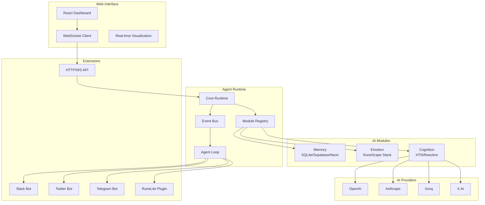

# 🧠 SYMindX - Modular AI Agent Runtime

<div align="center">

[](https://opensource.org/licenses/MIT)
[](https://www.typescriptlang.org/)
[](https://reactjs.org/)
[](https://bun.sh/)
[](https://nodejs.org/)
[](https://openai.com/)

**Build intelligent, emotionally-aware AI agents that can think, feel, and interact across platforms**

[Documentation](https://symindx.dev/docs) • [Quick Start](#-quick-start) • [Examples](#-examples) • [API Reference](#-api-reference) • [Contributing](#-contributing)

</div>

---

## ✨ Overview

SYMindX is a cutting-edge, modular AI agent runtime that enables developers to create sophisticated autonomous agents with genuine emotional intelligence, persistent memory, and multi-platform capabilities. Built with TypeScript and designed for extensibility, it provides a complete framework for building agents that can operate independently across games, social platforms, and custom applications.

### 🎯 Key Features

- **🧩 Modular Architecture** - Hot-swappable modules for memory, emotion, and cognition
- **🎭 Emotional Intelligence** - RuneScape-inspired emotion stack with real behavioral impact
- **🧠 Advanced Memory Systems** - Vector search with Supabase/pgvector, SQLite, PostgreSQL, and Neon
- **💬 Persistent Chat System** - Full conversation history with multi-agent chat support
- **🤖 Multi-Agent Support** - Run multiple specialized agents with shared API infrastructure
- **🔌 Platform Extensions** - Built-in support for Slack, Twitter, Telegram, and custom APIs
- **🎮 Game Integration** - Direct integration with RuneScape via RuneLite
- **⚡ Real-time Communication** - WebSocket-based live updates with typing indicators
- **🔧 Developer-Friendly** - TypeScript, clean APIs, and comprehensive documentation

## 🏗️ Architecture

<div align="center">



</div>

## 📁 Project Structure

```
symindx/
├── 🤖 mind-agents/              # Core Agent Runtime
│   ├── src/
│   │   ├── api.ts              # Public API interface
│   │   ├── index.ts            # Main entry point
│   │   ├── core/               # Runtime engine
│   │   │   ├── runtime.ts      # Main orchestrator
│   │   │   ├── registry.ts     # Module registry
│   │   │   └── multi-agent-manager.ts
│   │   ├── types/              # TypeScript definitions
│   │   ├── modules/            # AI capabilities
│   │   │   ├── memory/         # Storage providers
│   │   │   ├── emotion/        # Emotion systems
│   │   │   └── cognition/      # Decision making
│   │   ├── extensions/         # Platform integrations
│   │   │   ├── api/            # HTTP/WebSocket server
│   │   │   ├── slack/          # Slack integration
│   │   │   ├── twitter/        # Social media
│   │   │   └── telegram/       # Messaging
│   │   ├── portals/            # AI providers
│   │   │   ├── openai/         # GPT integration
│   │   │   ├── anthropic/      # Claude integration
│   │   │   └── groq/           # Groq integration
│   │   └── characters/         # Agent personalities
│   │       ├── nyx.json        # Chaotic hacker
│   │       ├── aria.json       # Analytical assistant
│   │       └── [more agents]
│   └── dist/                   # Compiled output
├── 🌐 website/                  # Web Dashboard
│   ├── src/
│   │   ├── components/         # React components
│   │   ├── lib/                # Utilities
│   │   └── App.tsx             # Main app
│   └── dist/                   # Production build
├── 📚 docs-site/                # Documentation
├── 📋 config/                   # Configuration
│   ├── runtime.example.json    # Example config
│   └── README.md               # Config guide
└── 📄 package.json              # Monorepo scripts
```

## 🚀 Quick Start

### Prerequisites

- **[Bun](https://bun.sh/)** (recommended) or Node.js 18+
- Git for version control
- At least one AI provider API key (OpenAI, Anthropic, Groq, or X.AI)

### Installation

```bash
# Clone the repository
git clone https://github.com/yourusername/symindx.git
cd symindx

# Install dependencies
bun install

# Copy example configuration
cp config/runtime.example.json config/runtime.json

# Set up environment variables (optional, can use runtime.json instead)
cp .env.example .env
```

### Configuration

#### Port Configuration

SYMindX follows modern best practices for port configuration:

- **Frontend (Vite)**: Port `3000` (configurable via `VITE_PORT`)
- **Backend API**: Port `8000` (configurable via `API_PORT`)

All ports are configurable through environment variables with sensible defaults:

```bash
# .env file
VITE_PORT=3000          # Frontend development server
API_PORT=8000           # Backend API server
VITE_API_URL=http://localhost:8000/api  # Backend URL for frontend
```

The application reads from `process.env.PORT` or equivalent and falls back to defaults if not set. No ports are hardcoded in the codebase.

#### API Keys Configuration

Edit `config/runtime.json` or `.env` with your API keys:

```json
{
  "portals": {
    "openai": {
      "apiKey": "sk-..."
    },
    "anthropic": {
      "apiKey": "sk-ant-..."
    }
  }
}
```

### Development

```bash
# Start both web UI and agent runtime
bun dev

# Or run components separately:
bun dev:website   # Web dashboard only
bun dev:agent     # Agent runtime only
bun dev:docs      # Documentation site
```

### Your First Agent

```bash
# Start the default NyX agent
cd mind-agents
bun start

# Or use the CLI for interactive setup
bun start:cli
```

Visit http://localhost:3000 for the web dashboard or http://localhost:8000 for the API!

## 🤖 Multi-Agent System

SYMindX supports running multiple specialized agents simultaneously:

### Available Agents

| Agent | Personality | Specialty | Port |
|-------|------------|-----------|------|
| **NyX** | Chaotic-empath hacker | Technical + Emotional Intelligence | 3003 |
| **ARIA** | Analytical assistant | Logic + Problem Solving | 3002 |
| **ZARA** | Creative spirit | Art + Storytelling | 3003 |
| **MARCUS** | Methodical helper | Support + Organization | 3004 |
| **PHOENIX** | Tech innovator | Security + Innovation | 3005 |
| **SAGE** | Strategic advisor | Wisdom + Ethics | 3006 |

### Managing Multiple Agents

```bash
# List all available agents
npm run agents:list

# Start specific agents
npm run agents:start nyx
npm run agents:start aria

# Start predefined scenarios
npm run agents:scenario balanced  # NyX + ARIA + ZARA
npm run agents:scenario full      # All 6 agents
npm run agents:scenario minimal   # NyX + MARCUS only

# Check agent status
npm run agents:status

# Stop all agents
npm run agents:stop-all
```

## 🔧 Core Modules

### Memory Providers

```typescript
import { createMemoryProvider } from '@symindx/mind-agents/modules';

// SQLite (local development with chat persistence)
const memory = createMemoryProvider('sqlite', {
  databasePath: './data/memories.db',
  enableChat: true
});

// PostgreSQL (production with full-text search)
const memory = createMemoryProvider('postgres', {
  connectionString: process.env.DATABASE_URL,
  enableVectorSearch: true
});

// Supabase (cloud with real-time & vector search)
const memory = createMemoryProvider('supabase', {
  url: process.env.SUPABASE_URL,
  anonKey: process.env.SUPABASE_ANON_KEY,
  enableRealtime: true
});

// Neon (serverless PostgreSQL)
const memory = createMemoryProvider('neon', {
  connectionString: process.env.NEON_DATABASE_URL,
  poolMode: 'transaction'
});
```

### Emotion Systems

```typescript
import { createEmotionModule } from '@symindx/mind-agents/modules';

// RuneScape-style emotion stack
const emotion = createEmotionModule('rune_emotion_stack', {
  baselineEmotions: {
    focused: 0.7,
    frustrated: 0.2,
    excited: 0.5
  }
});
```

### Cognition Modules

```typescript
import { createCognitionModule } from '@symindx/mind-agents/modules';

// Hierarchical Task Network planner
const cognition = createCognitionModule('htn_planner', {
  maxPlanDepth: 5,
  evaluationInterval: 1000
});

// Reactive system for immediate responses
const cognition = createCognitionModule('reactive', {
  reactionThreshold: 0.8
});
```

## 🔌 Extensions

### API Server

Shared API infrastructure for all agents with enhanced chat support:

```bash
# API runs automatically on port 3003
# Access at http://localhost:8000

# Agent Endpoints:
GET  /api/agents                    # List active agents
GET  /api/agents/:id                # Agent details
POST /api/agents/:id/chat           # Send message to agent

# Multi-Agent Chat:
POST /api/chat/conversations        # Create conversation
GET  /api/chat/conversations/:id    # Get conversation with messages
POST /api/chat/conversations/:id/messages  # Send message
POST /api/chat/route                # Auto-route to best agent
POST /api/chat/broadcast            # Broadcast to multiple agents

# WebSocket Events:
WS   /ws                            # Real-time updates
     - agent_update                 # Agent status changes
     - chat_message                 # New chat messages
     - typing_start/stop            # Typing indicators
     - agent_handoff               # Agent transfers
```

### Platform Integrations

```typescript
// Slack Bot
{
  "extensions": [{
    "name": "slack",
    "config": {
      "botToken": "xoxb-...",
      "appToken": "xapp-..."
    }
  }]
}

// Twitter Bot (no API key required!)
{
  "extensions": [{
    "name": "twitter",
    "config": {
      "username": "your_username",
      "password": "your_password"
    }
  }]
}

// Telegram Bot
{
  "extensions": [{
    "name": "telegram",
    "config": {
      "botToken": "123456:ABC-..."
    }
  }]
}
```

## 💬 Chat System

SYMindX includes a sophisticated multi-agent chat system with full persistence:

### Features

- **Conversation Management** - Create, update, and delete conversations
- **Message History** - Full chat history with metadata and reactions
- **Multi-Agent Chat** - Agents can collaborate in conversations
- **Smart Routing** - Automatically route messages to the best agent
- **Real-time Updates** - WebSocket support for live chat features
- **Search & Analytics** - Full-text search and usage analytics

### Chat API Example

```typescript
// Create a conversation
const conversation = await runtime.chat.createConversation({
  title: "Technical Support",
  participants: ["nyx", "aria"],
  metadata: { category: "support" }
});

// Send a message
const message = await runtime.chat.sendMessage(conversation.id, {
  content: "I need help with a coding problem",
  sender: "user123"
});

// Auto-route to best agent
const response = await runtime.chat.routeMessage({
  content: "How do I implement authentication?",
  context: { skills: ["security", "coding"] }
});
```

## 🎮 Web Interface

The React-based dashboard provides:

- **Real-time Thought Streams** - See what your agents are thinking
- **Emotion Visualization** - Monitor emotional states dynamically
- **Multi-Agent Chat** - Interactive chat with agent collaboration
- **Conversation History** - Full chat persistence and search
- **Agent Controls** - Start, stop, and configure agents
- **Performance Metrics** - Monitor resource usage and response times
- **Typing Indicators** - See when agents are composing responses

## 📊 API Reference

### TypeScript SDK

```typescript
import { SYMindX } from '@symindx/mind-agents/api';

// Initialize runtime
const runtime = new SYMindX.Runtime({
  configPath: './config/runtime.json'
});

// Create and start an agent
const agent = await runtime.createAgent('nyx');
await runtime.start();

// Interact with agent
const response = await agent.processMessage({
  content: "Hello, NyX!",
  userId: "user123"
});
```

### REST API

```bash
# Send a message to specific agent
curl -X POST http://localhost:8000/api/agents/nyx/chat \
  -H "Content-Type: application/json" \
  -d '{"message": "Hello, NyX!"}'

# Create a multi-agent conversation
curl -X POST http://localhost:8000/api/chat/conversations \
  -H "Content-Type: application/json" \
  -d '{"title": "Team Discussion", "participants": ["nyx", "aria"]}'

# Auto-route message to best agent
curl -X POST http://localhost:8000/api/chat/route \
  -H "Content-Type: application/json" \
  -d '{"content": "I need help with security", "context": {"priority": "high"}}'

# Get agent status
curl http://localhost:8000/api/agents/nyx/status

# List all agents
curl http://localhost:8000/api/agents

# Search conversations
curl "http://localhost:8000/api/chat/search?q=security&limit=10"
```

### WebSocket Events

```javascript
const ws = new WebSocket('ws://localhost:8000/ws');

ws.on('message', (data) => {
  const event = JSON.parse(data);
  switch(event.type) {
    case 'thought':
      console.log('Agent thinking:', event.content);
      break;
    case 'emotion':
      console.log('Emotion change:', event.state);
      break;
    case 'message':
      console.log('Agent says:', event.content);
      break;
  }
});
```

## 🧪 Examples

### Basic Agent Setup

```typescript
// examples/basic-agent.ts
import { SYMindX } from '@symindx/mind-agents/api';

const config = {
  agents: [{
    id: 'my-agent',
    character: 'characters/custom.json',
    modules: {
      memory: { type: 'sqlite' },
      emotion: { type: 'rune_emotion_stack' },
      cognition: { type: 'reactive' }
    }
  }]
};

const runtime = new SYMindX.Runtime(config);
await runtime.start();
```

### Custom Extension

```typescript
// examples/custom-extension.ts
import { Extension } from '@symindx/mind-agents/types';

export class CustomExtension implements Extension {
  async init(agent, config) {
    console.log(`Initializing custom extension for ${agent.id}`);
  }

  async tick(agent) {
    // Called every runtime tick
    if (agent.emotions.excited > 0.8) {
      console.log(`${agent.id} is very excited!`);
    }
  }
}
```

## 🛠️ Development

### Building

```bash
# Build all components
bun build

# Build specific components
bun build:website   # Web UI
bun build:agent     # Agent runtime
bun build:docs      # Documentation
```

### Testing

```bash
# Run test suite
bun test

# Run specific tests
bun test modules/memory
bun test extensions/slack
```

### Production Deployment

```bash
# Build for production
bun build

# Start production servers
bun start:all       # Both UI and agents
bun start           # Agents only

# Or use Docker
docker build -t symindx .
docker run -p 3000:3000 symindx
```

## 🤝 Contributing

We welcome contributions! Please see our [Contributing Guide](CONTRIBUTING.md) for details.

1. Fork the repository
2. Create your feature branch (`git checkout -b feature/amazing-feature`)
3. Commit your changes (`git commit -m 'Add amazing feature'`)
4. Push to the branch (`git push origin feature/amazing-feature`)
5. Open a Pull Request

### Development Setup

```bash
# Clone your fork
git clone https://github.com/yourusername/symindx.git
cd symindx

# Install dependencies
bun install

# Run tests
bun test

# Start development
bun dev
```

## 📚 Documentation

- **[Architecture Guide](./docs/ARCHITECTURE.md)** - System design and patterns
- **[API Documentation](./docs-site/)** - Complete API reference
- **[Module Development](./docs/PLUGIN_DEVELOPMENT.md)** - Create custom modules
- **[Configuration Guide](./config/README.md)** - All configuration options
- **[Migration Guide](./docs/MIGRATION.md)** - Upgrading from older versions

## 🌟 Community

- **Discord**: [Join our community](https://discord.gg/symindx)
- **Twitter**: [@SYMindX](https://twitter.com/symindx)
- **Blog**: [dev.to/symindx](https://dev.to/symindx)

## 📄 License

This project is licensed under the MIT License - see the [LICENSE](LICENSE) file for details.

## 🙏 Acknowledgments

- Inspired by RuneScape's emotion system
- Built with modern AI technologies
- Powered by the open-source community
- Special thanks to all [contributors](https://github.com/yourusername/symindx/graphs/contributors)

---

<div align="center">

**Ready to build your own AI agents? Start with `bun dev` and bring your ideas to life! ✨**

[Get Started](#-quick-start) • [Documentation](https://symindx.dev/docs) • [Examples](#-examples) • [Discord](https://discord.gg/symindx)

</div>