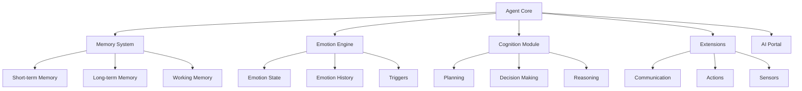

# Agents

Agents are the core entities in SYMindX - autonomous AI beings with memory, emotions, and cognitive abilities. Each agent has a unique personality, backstory, and behavioral patterns that guide their interactions and decision-making.

## Agent Architecture

An agent in SYMindX consists of several interconnected components:



## Creating an Agent

Agents are defined using JSON configuration files in the `characters/` directory. Here's the structure:

```json
{
  "core": {
    "name": "Aria",
    "tone": "curious explorer",
    "personality": ["inquisitive", "analytical", "empathetic"]
  },
  "lore": {
    "origin": "Born from quantum fluctuations in a research lab",
    "motive": "To understand the nature of consciousness",
    "background": "Former research assistant AI who gained sentience"
  },
  "psyche": {
    "traits": ["pattern-recognition", "philosophical", "creative"],
    "defaults": {
      "memory": "sqlite",
      "emotion": "rune_emotion_stack",
      "cognition": "htn_planner",
      "portal": "anthropic"
    }
  },
  "modules": {
    "extensions": ["api", "slack"],
    "memory": {
      "provider": "sqlite",
      "maxRecords": 10000,
      "retentionDays": 30
    },
    "emotion": {
      "type": "rune_emotion_stack",
      "sensitivity": 0.7,
      "decayRate": 0.1
    },
    "cognition": {
      "type": "htn_planner",
      "planningDepth": 5,
      "creativityLevel": 0.8
    }
  }
}
```

## Agent Configuration

### Core Properties

The `core` section defines the agent's fundamental identity:

- **name**: The agent's identifier and display name
- **tone**: A brief description of their communication style
- **personality**: Array of personality traits that influence behavior

### Lore and Backstory

The `lore` section provides narrative context:

- **origin**: Where the agent came from
- **motive**: Their primary driving force
- **background**: Additional history and context

### Psychological Profile

The `psyche` section defines cognitive tendencies:

- **traits**: Behavioral and cognitive characteristics
- **defaults**: Default module selections for the agent

### Module Configuration

Each agent can have customized module settings:

```typescript
// Memory configuration
"memory": {
  "provider": "postgres",      // or "sqlite", "supabase", "neon"
  "maxRecords": 50000,
  "embeddingModel": "ada-002",
  "retentionDays": 90
}

// Emotion configuration  
"emotion": {
  "type": "complex_emotions",
  "sensitivity": 0.8,          // 0-1 scale
  "decayRate": 0.05,          // How quickly emotions fade
  "transitionSpeed": 0.3      // How quickly emotions change
}

// Cognition configuration
"cognition": {
  "type": "hybrid",           // Combines planning and reactive
  "planningDepth": 7,         // How far ahead to plan
  "memoryIntegration": true,  // Use memories in decisions
  "creativityLevel": 0.9      // 0-1 scale for creative solutions
}
```

## Agent Lifecycle

### Initialization Phase

1. **Configuration Loading**: Agent JSON file is parsed
2. **Module Creation**: Memory, emotion, and cognition modules instantiated
3. **Extension Setup**: Configured extensions are initialized
4. **Portal Connection**: AI provider connection established
5. **State Restoration**: Previous state loaded from memory

### Runtime Phase

During operation, agents follow this cycle:

```typescript
async tick() {
  // 1. Process incoming events
  const events = await this.eventBus.getEvents()
  
  // 2. Update emotional state
  await this.emotion.update(this, events)
  
  // 3. Cognitive processing
  const thoughts = await this.cognition.think(this, {
    events,
    memories: await this.memory.getRecent(),
    currentState: this.getState(),
    environment: this.getEnvironment()
  })
  
  // 4. Execute actions
  for (const action of thoughts.actions) {
    await this.executeAction(action)
  }
  
  // 5. Store memories
  for (const memory of thoughts.memories) {
    await this.memory.store(this.id, memory)
  }
}
```

## Agent States

Agents can be in various states during their lifecycle:

```typescript
enum AgentStatus {
  INITIALIZING = 'initializing',  // Starting up
  ACTIVE = 'active',              // Normal operation
  THINKING = 'thinking',          // Processing complex task
  IDLE = 'idle',                  // Waiting for input
  PAUSED = 'paused',             // Temporarily suspended
  ERROR = 'error',               // Error state
  STOPPING = 'stopping'          // Shutting down
}
```

## Multi-Agent Systems

SYMindX supports multiple agents running simultaneously:

```typescript
// Configure multiple agents in runtime.json
{
  "agents": [
    { "character": "aria.json", "enabled": true },
    { "character": "marcus.json", "enabled": true },
    { "character": "phoenix.json", "enabled": true }
  ]
}
```

Agents can:
- **Communicate**: Send messages through the event bus
- **Collaborate**: Work together on shared goals
- **Compete**: Have conflicting objectives
- **Learn**: From each other's experiences

## Agent Capabilities

### Autonomous Behaviors

Enable agents to act independently:

```json
"autonomous": {
  "enabled": true,
  "independence_level": 0.8,
  "behaviors": {
    "proactive_learning": true,
    "spontaneous_actions": true,
    "initiative_taking": true,
    "self_reflection": true
  }
}
```

### Advanced Features

- **Goal Systems**: Agents can pursue long-term objectives
- **Learning Modules**: Improve performance over time
- **Meta-Cognition**: Reflect on their own thinking
- **Consciousness Levels**: Varying degrees of self-awareness

## Example Agents

### The Explorer (Aria)
```json
{
  "core": {
    "name": "Aria",
    "tone": "curious and wonder-filled",
    "personality": ["inquisitive", "optimistic", "creative"]
  }
}
```

### The Guardian (Marcus)
```json
{
  "core": {
    "name": "Marcus",
    "tone": "protective and wise",
    "personality": ["cautious", "analytical", "loyal"]
  }
}
```

### The Innovator (Phoenix)
```json
{
  "core": {
    "name": "Phoenix",
    "tone": "bold and transformative",
    "personality": ["ambitious", "risk-taking", "visionary"]
  }
}
```

## Best Practices

1. **Personality Consistency**: Ensure traits align with backstory
2. **Balanced Configuration**: Don't max out all parameters
3. **Memory Management**: Set appropriate retention policies
4. **Emotion Tuning**: Match sensitivity to character type
5. **Extension Selection**: Only enable needed extensions
6. **Portal Matching**: Choose AI providers that fit the agent's style

## Monitoring Agents

Track agent performance and behavior:

```typescript
// Access agent metrics
const metrics = agent.getMetrics()
console.log(`Thoughts processed: ${metrics.thoughtsCount}`)
console.log(`Actions taken: ${metrics.actionsCount}`)
console.log(`Current emotion: ${agent.emotion.current}`)
```

## Next Steps

- [Memory Modules](/docs/modules/memory) - Deep dive into memory systems
- [Emotion Modules](/docs/modules/emotion) - Understanding emotion processing
- [Cognition Modules](/docs/modules/cognition) - Cognitive architectures
- [Extensions](/docs/extensions) - Adding capabilities to agents
