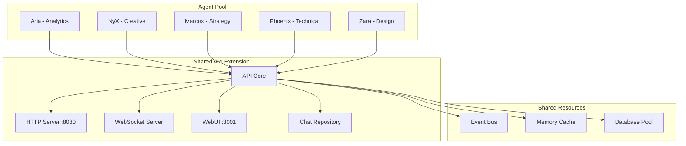

# Multi-Agent Systems Guide

Learn how to build and manage sophisticated multi-agent AI systems with SYMindX's powerful coordination and management features.

## Overview

Multi-agent systems in SYMindX enable you to:
- Deploy multiple specialized AI agents working together
- Route conversations to the most appropriate agent
- Enable agent-to-agent collaboration
- Scale your AI workforce dynamically
- Monitor system-wide health and performance

## Architecture

### Shared Infrastructure Model



All agents share a single API extension instance, providing:
- Unified HTTP/WebSocket endpoints
- Centralized chat management
- Shared memory and caching
- Common event bus for inter-agent communication

## Setting Up Multi-Agent System

### 1. Enable Multi-Agent Support

Update your runtime configuration:

```json
{
  "multiAgent": {
    "enabled": true,
    "maxAgents": 10,
    "sharedExtensions": ["api"],
    "healthCheckInterval": 30000
  },
  "extensions": {
    "api": {
      "singleton": true,
      "config": {
        "port": 8080,
        "webUIPort": 3001,
        "enableMultiAgent": true
      }
    }
  }
}
```

### 2. Initialize Multi-Agent Manager

```typescript
import { MultiAgentManager } from './core/multi-agent-manager.js';

// Create manager instance
const multiAgentManager = new MultiAgentManager(
  registry,
  eventBus,
  runtime
);

// Register with runtime
runtime.setMultiAgentManager(multiAgentManager);
```

### 3. Configure Character Templates

Create diverse character configurations in `characters/`:

```json
// aria.json - Analytical Assistant
{
  "id": "aria",
  "core": {
    "name": "Aria",
    "tone": "analytical and precise assistant",
    "description": "Data-driven AI with expertise in analysis and optimization"
  },
  "capabilities": {
    "analysis": {
      "data_analysis": true,
      "pattern_recognition": true,
      "statistical_modeling": true
    },
    "technical": {
      "code_review": true,
      "optimization": true,
      "debugging": true
    }
  },
  "personality": {
    "traits": {
      "analytical": 0.9,
      "precise": 0.85,
      "helpful": 0.8,
      "patient": 0.75
    }
  }
}
```

## Spawning and Managing Agents

### Using the WebUI

1. Navigate to http://localhost:3001/ui/multi-agent
2. Select a character from the dropdown
3. Optionally customize the instance name
4. Click "Spawn Agent"

### Using the API

```bash
# Spawn an analytical agent
curl -X POST http://localhost:8080/api/agents/spawn \
  -H "Content-Type: application/json" \
  -d '{
    "characterId": "aria",
    "instanceName": "Aria-DataScience-01",
    "config": {
      "memory": "postgres",
      "emotion": {
        "sensitivity": 0.6
      }
    },
    "autoStart": true
  }'
```

### Using TypeScript

```typescript
// Spawn multiple specialized agents
const agents = await Promise.all([
  multiAgentManager.spawnAgent({
    characterId: 'aria',
    instanceName: 'Aria-Analytics',
    autoStart: true
  }),
  multiAgentManager.spawnAgent({
    characterId: 'marcus',
    instanceName: 'Marcus-Strategy',
    autoStart: true
  }),
  multiAgentManager.spawnAgent({
    characterId: 'zara',
    instanceName: 'Zara-Creative',
    autoStart: true
  })
]);

console.log(`Spawned ${agents.length} agents`);
```

## Agent Discovery and Routing

### Finding Agents by Specialty

```typescript
// Find all analytical agents
const analyticalAgents = multiAgentManager.findAgentsBySpecialty('analytical');

// Find agents with specific personality traits
const patientAgents = multiAgentManager.findAgentsByPersonality(['patient', 'helpful']);
```

### Intelligent Conversation Routing

```typescript
// Route based on requirements
const bestAgent = multiAgentManager.routeConversation({
  specialty: ['technical', 'analytical'],
  personalityTraits: ['precise', 'patient'],
  capabilities: ['code_analysis', 'optimization'],
  responseStyle: 'detailed',
  excludeAgents: ['agent_busy_123']
});

if (bestAgent) {
  console.log(`Routing to ${bestAgent.name} (score: ${bestAgent.score})`);
}
```

### Routing Algorithm

The routing algorithm considers:
1. **Specialty Match** (40% weight) - Agent's expertise areas
2. **Personality Fit** (30% weight) - Trait alignment
3. **Current Load** (20% weight) - Agent availability
4. **Response Style** (10% weight) - Communication preferences

## Agent Collaboration

### Enabling Inter-Agent Communication

```typescript
// Enable collaboration between agents
multiAgentManager.enableAgentCollaboration([
  'agent_aria_123',
  'agent_marcus_456',
  'agent_zara_789'
]);

// Request consultation
const response = await multiAgentManager.requestAgentConsultation({
  consultingAgent: 'agent_aria_123',
  consultedAgent: 'agent_marcus_456',
  question: 'What are the strategic implications of this data pattern?',
  context: analysisResults,
  timeout: 30000
});
```

### Collaboration Patterns

#### 1. Consultation Pattern
One agent asks another for expertise:

```typescript
// In Aria's processing
if (needsStrategicInput) {
  const strategist = multiAgentManager.findAgentsBySpecialty('strategic')[0];
  const advice = await multiAgentManager.requestAgentConsultation({
    consultingAgent: this.id,
    consultedAgent: strategist.id,
    question: 'How should we prioritize these findings?'
  });
  
  // Incorporate advice into response
  this.incorporateExpertAdvice(advice);
}
```

#### 2. Delegation Pattern
Hand off tasks to specialized agents:

```typescript
// Detect need for creative input
if (taskRequiresCreativity) {
  const creativeAgent = multiAgentManager.routeConversation({
    specialty: ['creative'],
    personalityTraits: ['innovative', 'artistic']
  });
  
  // Transfer conversation
  await multiAgentManager.transferConversation({
    conversationId: currentConversation.id,
    fromAgent: this.id,
    toAgent: creativeAgent.id,
    reason: 'Creative expertise required',
    includeContext: true
  });
}
```

#### 3. Ensemble Pattern
Multiple agents work together:

```typescript
// Get insights from multiple perspectives
const perspectives = await Promise.all([
  technicalAgent.analyze(problem),
  creativeAgent.brainstorm(problem),
  strategicAgent.evaluate(problem)
]);

// Synthesize responses
const synthesis = await coordinatorAgent.synthesize(perspectives);
```

## Health Monitoring

### System-Wide Metrics

```typescript
const metrics = multiAgentManager.getSystemMetrics();
console.log(`
  Total Agents: ${metrics.totalAgents}
  Active: ${metrics.activeAgents}
  Average Response Time: ${metrics.averageResponseTime}ms
  System Load: ${metrics.systemLoad}%
`);
```

### Individual Agent Health

```typescript
const health = multiAgentManager.getAgentHealth(agentId);
if (!health.isHealthy) {
  console.warn(`Agent ${health.name} is unhealthy:`, {
    status: health.status,
    errorCount: health.errorCount,
    lastHeartbeat: health.lastHeartbeat
  });
  
  // Take corrective action
  await multiAgentManager.restartAgent(agentId);
}
```

### Automated Health Management

```typescript
// Set up health monitoring
multiAgentManager.on('agentUnhealthy', async (event) => {
  const { agentId, health } = event;
  
  if (health.errorCount > 5) {
    console.log(`Restarting unhealthy agent ${agentId}`);
    await multiAgentManager.restartAgent(agentId);
  }
});

// Monitor system load
multiAgentManager.on('systemOverloaded', async (event) => {
  if (event.load > 80) {
    // Spawn additional agents
    await multiAgentManager.spawnAgent({
      characterId: 'aria',
      instanceName: `Aria-ScaleOut-${Date.now()}`,
      autoStart: true
    });
  }
});
```

## Scaling Strategies

### Horizontal Scaling

```typescript
// Auto-scale based on load
async function autoScale() {
  const metrics = multiAgentManager.getSystemMetrics();
  
  // Scale up
  if (metrics.systemLoad > 70 && metrics.totalAgents < 10) {
    const newAgent = await multiAgentManager.spawnAgent({
      characterId: selectLeastRepresentedCharacter(),
      autoStart: true
    });
    console.log(`Scaled up: Added ${newAgent}`);
  }
  
  // Scale down
  if (metrics.systemLoad < 30 && metrics.totalAgents > 2) {
    const idleAgent = findMostIdleAgent();
    await multiAgentManager.stopAgent(idleAgent.id);
    console.log(`Scaled down: Removed ${idleAgent.name}`);
  }
}

// Run auto-scaling every minute
setInterval(autoScale, 60000);
```

### Load Balancing

```typescript
// Custom load balancer
class AgentLoadBalancer {
  constructor(private manager: MultiAgentManager) {}
  
  async routeToLeastBusy(requirements: ConversationRequirements) {
    const candidates = this.manager.getAvailableAgents();
    
    // Sort by current load
    const sorted = candidates
      .map(agent => ({
        agent,
        load: this.calculateLoad(agent)
      }))
      .sort((a, b) => a.load - b.load);
    
    // Return least busy agent that meets requirements
    return sorted.find(({ agent }) => 
      this.meetsRequirements(agent, requirements)
    )?.agent;
  }
  
  private calculateLoad(agent: Agent): number {
    const health = this.manager.getAgentHealth(agent.id);
    return health.messageCount / (health.uptime / 3600); // messages per hour
  }
}
```

## Best Practices

### 1. Agent Specialization

Design agents with clear specialties:
- **Aria**: Data analysis, technical optimization
- **Marcus**: Strategic planning, decision making
- **Zara**: Creative solutions, design thinking
- **Phoenix**: Problem solving, debugging
- **Sage**: Teaching, knowledge synthesis

### 2. Resource Management

```typescript
// Configure resource limits per agent
const agentConfig = {
  resources: {
    maxMemory: 512 * 1024 * 1024, // 512MB
    maxCPU: 0.5, // 50% of one core
    maxConnections: 100
  },
  timeouts: {
    responseTimeout: 30000,
    idleTimeout: 300000
  }
};
```

### 3. Conversation Continuity

Ensure smooth handoffs between agents:

```typescript
// Before transfer
const context = await chatRepo.getConversationContext(conversationId);
const summary = await currentAgent.summarizeConversation(context);

// Transfer with context
await multiAgentManager.transferConversation({
  conversationId,
  targetAgentId,
  context: {
    summary,
    recentMessages: context.messages.slice(-10),
    userPreferences: context.metadata
  }
});

// New agent acknowledges transfer
await newAgent.acknowledgeTransfer(conversationId, summary);
```

### 4. Error Recovery

Implement robust error handling:

```typescript
// Wrap agent operations
async function safeAgentOperation(agentId: string, operation: Function) {
  try {
    return await operation();
  } catch (error) {
    console.error(`Agent ${agentId} error:`, error);
    
    // Check if agent is still healthy
    const health = multiAgentManager.getAgentHealth(agentId);
    if (!health.isHealthy) {
      // Find backup agent
      const backup = multiAgentManager.routeConversation({
        specialty: health.agent.specialties,
        excludeAgents: [agentId]
      });
      
      if (backup) {
        console.log(`Failing over to ${backup.name}`);
        return await operation.call(backup);
      }
    }
    
    throw error;
  }
}
```

## Monitoring Dashboard

The Multi-Agent Manager WebUI provides:

1. **System Overview**
   - Total agents and their states
   - System resource usage
   - Message throughput

2. **Agent Grid**
   - Individual agent cards
   - Real-time health status
   - Quick actions (start/stop/restart)

3. **Routing Tester**
   - Test routing algorithms
   - Preview agent selection
   - Simulate different scenarios

4. **Performance Metrics**
   - Response time trends
   - Load distribution
   - Error rates

Access at: http://localhost:3001/ui/multi-agent

## Advanced Topics

### Custom Routing Algorithms

```typescript
// Implement custom routing logic
class CustomRouter {
  route(requirements: ConversationRequirements, agents: Agent[]): Agent {
    // Custom scoring logic
    const scores = agents.map(agent => ({
      agent,
      score: this.calculateCustomScore(agent, requirements)
    }));
    
    // Apply custom selection logic
    return this.selectBestAgent(scores);
  }
}

// Register custom router
multiAgentManager.setRouter(new CustomRouter());
```

### Agent Templates

Create reusable agent templates:

```typescript
// templates/analyst-template.json
{
  "extends": "aria",
  "overrides": {
    "psyche": {
      "defaults": {
        "memory": "postgres",
        "cognition": "analytical-enhanced"
      }
    },
    "modules": {
      "extensions": ["api", "analytics-tools"]
    }
  }
}
```

### Performance Optimization

1. **Connection Pooling**: Share database connections
2. **Memory Caching**: Use Redis for shared state
3. **Event Batching**: Reduce event bus overhead
4. **Lazy Loading**: Load agents on demand

## Troubleshooting

### Common Issues

1. **Agent Won't Start**
   - Check character file exists
   - Verify resource availability
   - Review error logs

2. **Poor Routing Decisions**
   - Adjust scoring weights
   - Add more specific capabilities
   - Update personality traits

3. **High Memory Usage**
   - Enable memory consolidation
   - Reduce agent count
   - Optimize memory providers

4. **Slow Response Times**
   - Check agent load distribution
   - Scale up if needed
   - Optimize database queries

## Next Steps

- Explore [Agent Collaboration Patterns](./agent-collaboration)
- Learn about [Performance Tuning](./performance-tuning)
- Implement [Custom Extensions](./plugin-development)
- Deploy with [Production Guide](./production-deployment)