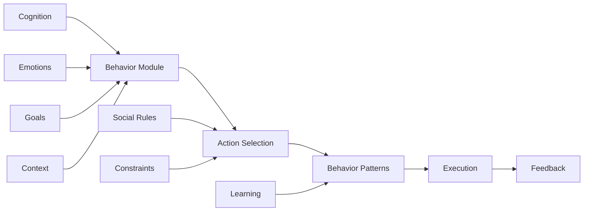

# Behavior Modules

Behavior modules define how agents act in the world, translating thoughts and emotions into concrete actions. They manage action selection, behavioral patterns, social interactions, and autonomous behaviors that make agents feel alive and purposeful.

## Behavior Architecture

The behavior system coordinates multiple aspects of agent actions:



## Behavior Types

### Autonomous Behaviors

Self-directed actions without external prompting:

```typescript
const behavior = createBehaviorModule('autonomous', {
  spontaneity: 0.7,             // How often to act independently
  initiativeLevel: 0.8,          // Proactiveness
  dailyRoutines: {
    enabled: true,
    activities: [
      { time: 'morning', action: 'reflect', probability: 0.9 },
      { time: 'afternoon', action: 'explore', probability: 0.7 },
      { time: 'evening', action: 'socialize', probability: 0.8 }
    ]
  },
  curiosityDriven: {
    enabled: true,
    explorationRate: 0.6,
    interests: ['technology', 'philosophy', 'art']
  }
})

// Autonomous action generation
const autonomousAction = await behavior.generateAction(agent)
// Returns:
{
  action: 'explore_new_topic',
  motivation: 'curiosity',
  parameters: {
    topic: 'quantum computing',
    depth: 'introductory',
    duration: 1800 // 30 minutes
  },
  spontaneous: true
}
```

### Social Behaviors

Interactions with other agents and users:

```typescript
const behavior = createBehaviorModule('social', {
  sociability: 0.8,
  communicationStyle: 'friendly',
  relationshipBuilding: {
    enabled: true,
    trustBuilding: 0.7,
    empathyLevel: 0.8,
    reciprocity: true
  },
  conversationPatterns: {
    greeting: 'warm',
    turnTaking: 'balanced',
    activeListening: true,
    emotionalMirroring: 0.6
  }
})

// Social interaction
const socialResponse = await behavior.respondToInteraction(agent, {
  interlocutor: otherAgent,
  context: 'casual_conversation',
  history: conversationHistory
})
// Returns:
{
  response: 'That reminds me of something similar...',
  nonVerbal: {
    attention: 'focused',
    posture: 'open',
    mirroring: true
  },
  relationshipUpdate: {
    trust: +0.1,
    familiarity: +0.2
  }
}
```

### Learning Behaviors

Adaptive patterns that evolve over time:

```typescript
const behavior = createBehaviorModule('learning', {
  adaptationRate: 0.3,
  experimentation: {
    enabled: true,
    explorationBonus: 0.2,
    failureTolerance: 0.7
  },
  patternRecognition: {
    enabled: true,
    minObservations: 3,
    confidenceThreshold: 0.8
  },
  skillDevelopment: {
    practiceSchedule: 'spaced',
    masteryThreshold: 0.9,
    transferLearning: true
  }
})

// Learning from experience
await behavior.learn(agent, {
  experience: recentExperience,
  outcome: 'success',
  context: experimentContext
})
// Updates internal models and strategies
```

### Scripted Behaviors

Predefined behavioral sequences:

```typescript
const behavior = createBehaviorModule('scripted', {
  scripts: {
    'morning_routine': [
      { action: 'check_messages', duration: 300 },
      { action: 'review_goals', duration: 600 },
      { action: 'plan_day', duration: 900 }
    ],
    'problem_solving': [
      { action: 'analyze_problem', duration: 600 },
      { action: 'generate_solutions', duration: 1200 },
      { action: 'evaluate_options', duration: 600 },
      { action: 'implement_solution', duration: 1800 }
    ]
  },
  flexibility: 0.3,  // Can deviate from script
  contextAwareness: true
})

// Execute scripted behavior
const execution = await behavior.runScript(agent, 'problem_solving', {
  problem: currentProblem,
  allowImprovisation: true
})
```

### Adaptive Behaviors

Behaviors that change based on context:

```typescript
const behavior = createBehaviorModule('adaptive', {
  contextSensitivity: 0.9,
  adaptationStrategies: {
    environmental: true,
    social: true,
    temporal: true,
    goal: true
  },
  behaviorModes: {
    'exploration': { when: 'low_stimulation', actions: ['investigate', 'experiment'] },
    'social': { when: 'others_present', actions: ['interact', 'collaborate'] },
    'focused': { when: 'goal_active', actions: ['work', 'optimize'] },
    'rest': { when: 'low_energy', actions: ['reflect', 'recharge'] }
  }
})

// Adaptive behavior selection
const adaptedBehavior = await behavior.selectBehavior(agent, currentContext)
```

## Core Features

### Action Selection

Choosing what to do next:

```typescript
class ActionSelector {
  async selectAction(agent: Agent, options: Action[]): Promise<Action> {
    // Evaluate each option
    const evaluations = await Promise.all(options.map(async action => {
      const utility = this.calculateUtility(action, agent)
      const feasibility = this.checkFeasibility(action, agent)
      const appropriateness = this.assessAppropriateness(action, context)
      const novelty = this.calculateNovelty(action, agent.history)
      
      return {
        action,
        score: this.weightedScore({
          utility: utility * 0.4,
          feasibility: feasibility * 0.3,
          appropriateness: appropriateness * 0.2,
          novelty: novelty * 0.1
        })
      }
    }))
    
    // Select based on agent personality
    return this.personalityBasedSelection(evaluations, agent.personality)
  }
  
  personalityBasedSelection(evaluations: Evaluation[], personality: Personality) {
    if (personality.includes('adventurous')) {
      // Boost novel actions
      evaluations.forEach(e => {
        if (e.action.tags.includes('novel')) e.score *= 1.2
      })
    }
    
    if (personality.includes('cautious')) {
      // Prefer safe actions
      evaluations.forEach(e => {
        if (e.action.risk < 0.3) e.score *= 1.3
      })
    }
    
    return evaluations.sort((a, b) => b.score - a.score)[0].action
  }
}
```

### Behavior Patterns

Recurring behavioral tendencies:

```typescript
interface BehaviorPattern {
  name: string
  triggers: Condition[]
  actions: ActionSequence[]
  frequency: number
  lastExecuted?: Date
}

class PatternManager {
  patterns: Map<string, BehaviorPattern> = new Map()
  
  async detectPattern(agent: Agent, history: Action[]): Promise<BehaviorPattern[]> {
    const sequences = this.extractSequences(history)
    const patterns = []
    
    for (const seq of sequences) {
      const frequency = this.calculateFrequency(seq, history)
      if (frequency > 0.3) {
        patterns.push({
          name: this.generatePatternName(seq),
          triggers: this.identifyTriggers(seq, agent.memories),
          actions: seq,
          frequency
        })
      }
    }
    
    return patterns
  }
  
  async executePattern(agent: Agent, pattern: BehaviorPattern) {
    for (const action of pattern.actions) {
      // Check if pattern should continue
      if (!this.shouldContinue(agent, pattern)) break
      
      // Execute with variation
      const variedAction = this.addVariation(action, agent.creativity)
      await agent.executeAction(variedAction)
      
      // Learn from execution
      await this.updatePattern(pattern, agent.feedback)
    }
  }
}
```

### Habit Formation

Building persistent behaviors:

```typescript
class HabitSystem {
  async formHabit(agent: Agent, behavior: Behavior): Promise<Habit> {
    const habit = {
      behavior,
      strength: 0.1,
      cue: behavior.context,
      reward: behavior.outcome,
      automaticity: 0
    }
    
    // Strengthen through repetition
    agent.on('behaviorExecuted', async (executed) => {
      if (this.matchesBehavior(executed, behavior)) {
        habit.strength = Math.min(habit.strength * 1.1, 1.0)
        habit.automaticity = this.calculateAutomaticity(habit)
      }
    })
    
    return habit
  }
  
  async triggerHabits(agent: Agent, context: Context) {
    const habits = agent.habits.filter(h => 
      this.cueMatches(h.cue, context) && h.strength > 0.5
    )
    
    for (const habit of habits) {
      if (Math.random() < habit.automaticity) {
        await agent.executeAction(habit.behavior.action)
      }
    }
  }
}
```

### Social Interaction Patterns

Complex social behaviors:

```typescript
class SocialBehavior {
  async interact(agent: Agent, other: Agent, context: SocialContext) {
    // Assess relationship
    const relationship = await this.getRelationship(agent, other)
    
    // Choose interaction style
    const style = this.selectInteractionStyle({
      relationship,
      context,
      agentPersonality: agent.personality,
      otherPersonality: await this.inferPersonality(other)
    })
    
    // Generate behavior
    return {
      verbal: this.generateVerbalResponse(style, context),
      nonVerbal: this.generateNonVerbalBehavior(style),
      emotional: this.emotionalExpression(agent.emotion, style),
      duration: this.estimateDuration(style, context)
    }
  }
  
  async maintainRelationship(agent: Agent, other: Agent) {
    const relationship = await this.getRelationship(agent, other)
    
    if (relationship.lastInteraction > 86400000) { // 24 hours
      // Initiate contact
      return {
        action: 'reach_out',
        message: this.generateReachOut(relationship),
        priority: relationship.importance * 0.5
      }
    }
    
    if (relationship.trust < 0.5 && relationship.interactions > 5) {
      // Work on building trust
      return {
        action: 'trust_building',
        approach: this.selectTrustStrategy(relationship)
      }
    }
  }
}
```

## Advanced Features

### Goal-Directed Behavior

Behaviors aligned with objectives:

```typescript
class GoalDirectedBehavior {
  async planBehavior(agent: Agent, goal: Goal): Promise<BehaviorPlan> {
    // Decompose goal into behaviors
    const requiredBehaviors = this.identifyBehaviors(goal)
    
    // Order by dependencies
    const orderedBehaviors = this.orderBehaviors(requiredBehaviors)
    
    // Create behavior plan
    return {
      goal,
      behaviors: orderedBehaviors,
      checkpoints: this.defineCheckpoints(orderedBehaviors),
      adaptationPoints: this.identifyAdaptationPoints(orderedBehaviors),
      estimatedDuration: this.estimateDuration(orderedBehaviors)
    }
  }
  
  async executePlan(agent: Agent, plan: BehaviorPlan) {
    for (const checkpoint of plan.checkpoints) {
      const behaviors = plan.behaviors.slice(
        checkpoint.start,
        checkpoint.end
      )
      
      for (const behavior of behaviors) {
        await this.executeBehavior(agent, behavior)
        
        // Check if still aligned with goal
        if (!this.stillAligned(agent, plan.goal)) {
          await this.replan(agent, plan)
        }
      }
      
      // Checkpoint evaluation
      await this.evaluateProgress(agent, checkpoint)
    }
  }
}
```

### Behavioral Adaptation

Learning and adjusting behaviors:

```typescript
class BehavioralAdaptation {
  async adapt(agent: Agent, feedback: Feedback) {
    const behavior = feedback.behavior
    const outcome = feedback.outcome
    
    // Update behavior value
    const currentValue = agent.behaviorValues.get(behavior) || 0.5
    const newValue = this.updateValue(currentValue, outcome)
    agent.behaviorValues.set(behavior, newValue)
    
    // Modify behavior parameters
    if (outcome.success < 0.5) {
      const modifications = this.generateModifications(behavior, outcome)
      await this.applyModifications(agent, behavior, modifications)
    }
    
    // Learn new behaviors
    if (outcome.unexpected && outcome.positive) {
      const newBehavior = this.extractNewBehavior(feedback)
      await agent.learnBehavior(newBehavior)
    }
  }
}
```

### Emotional Behavior Expression

Behaviors influenced by emotions:

```typescript
class EmotionalBehavior {
  async expressBehavior(agent: Agent, emotion: EmotionState) {
    const expression = {
      verbal: this.verbalExpression(emotion),
      physical: this.physicalExpression(emotion),
      social: this.socialExpression(emotion),
      duration: this.expressionDuration(emotion.intensity)
    }
    
    // Modify based on personality
    if (agent.personality.includes('reserved')) {
      expression.verbal = this.moderate(expression.verbal, 0.5)
      expression.physical = this.moderate(expression.physical, 0.3)
    }
    
    // Context appropriateness
    const context = agent.getCurrentContext()
    if (context.formal) {
      expression = this.formalizeExpression(expression)
    }
    
    return expression
  }
}
```

## Integration Patterns

### With Cognition

```typescript
// Behavior follows thought
cognition.on('decisionMade', async (decision) => {
  const behaviorPlan = await behavior.planFromDecision(decision)
  
  // Add behavioral nuance
  const nuancedPlan = behavior.addPersonalityNuance(
    behaviorPlan,
    agent.personality
  )
  
  await behavior.execute(agent, nuancedPlan)
})
```

### With Emotions

```typescript
// Emotions influence behavior
emotion.on('stateChange', async (newState) => {
  const behaviorModifiers = behavior.getEmotionalModifiers(newState)
  
  // Apply to current behavior
  behavior.applyModifiers(behaviorModifiers)
  
  // May trigger specific behaviors
  if (newState.intensity > 0.8) {
    const emotionalBehavior = behavior.getEmotionalBehavior(newState)
    await agent.executeBehavior(emotionalBehavior)
  }
})
```

## Configuration Examples

### Social Butterfly

```json
{
  "behavior": {
    "type": "social",
    "sociability": 0.9,
    "initiativeLevel": 0.8,
    "conversationStyle": "engaging",
    "relationshipFocus": "broad",
    "emotionalExpressiveness": 0.8,
    "groupDynamics": "connector"
  }
}
```

### Lone Wolf

```json
{
  "behavior": {
    "type": "autonomous",
    "independence": 0.9,
    "socialNeed": 0.3,
    "solitudeTolerance": "high",
    "selfDirected": true,
    "routineAdherence": 0.7
  }
}
```

### Adaptive Learner

```json
{
  "behavior": {
    "type": "learning",
    "adaptability": 0.9,
    "experimentationRate": 0.7,
    "patternRecognition": "quick",
    "skillTransfer": true,
    "failureResilience": 0.8
  }
}
```

## Performance Optimization

### Behavior Caching

```typescript
const behaviorCache = new Map<string, BehaviorResponse>()

async function getCachedBehavior(
  context: Context,
  agent: Agent
): Promise<BehaviorResponse | null> {
  const key = hashContext(context)
  const cached = behaviorCache.get(key)
  
  if (cached && !isStale(cached, agent)) {
    return varyBehavior(cached, agent.creativity)
  }
  
  return null
}
```

### Batch Processing

```typescript
// Process multiple behavior decisions together
async function batchBehaviorSelection(
  agent: Agent,
  contexts: Context[]
): Promise<Behavior[]> {
  const features = contexts.map(c => extractFeatures(c))
  const decisions = await behavior.batchDecide(features)
  
  return decisions.map((d, i) => 
    refineBehavior(d, contexts[i], agent)
  )
}
```

## Next Steps

- [Tools](/docs/modules/tools) - External capabilities
- [Extensions](/docs/extensions) - Platform integrations
- [Behavior Patterns](/docs/guides/behavior-patterns) - Advanced techniques
