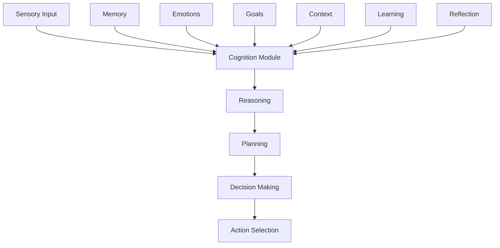

# Cognition Modules

Cognition modules provide agents with the ability to think, plan, and make decisions. They process information from memory and current context to generate intelligent responses and actions. Each cognition type offers different approaches to problem-solving and decision-making.

## Cognition Architecture

The cognitive system integrates multiple information sources:



## Cognition Types

### HTN Planner (Hierarchical Task Network)

Advanced planning system that breaks down complex goals:

```typescript
const cognition = createCognitionModule('htn_planner', {
  planningDepth: 5,          // How many steps ahead
  decompositionStrategies: {
    'achieve_goal': ['identify_subgoals', 'order_tasks', 'allocate_resources'],
    'solve_problem': ['analyze', 'generate_solutions', 'evaluate', 'implement'],
    'learn_skill': ['observe', 'practice', 'refine', 'master']
  },
  heuristics: {
    preferSimple: 0.7,       // Prefer simpler plans
    reuseSuccess: 0.8,       // Reuse successful patterns
    avoidFailure: 0.9        // Avoid past failures
  }
})

// HTN planning example
const plan = await cognition.plan(agent, "Write a research paper")
// Returns hierarchical plan:
{
  goal: "Write a research paper",
  steps: [
    {
      task: "Research topic",
      subtasks: [
        { action: "search_literature", duration: 2 },
        { action: "take_notes", duration: 1 },
        { action: "organize_sources", duration: 0.5 }
      ]
    },
    {
      task: "Create outline",
      subtasks: [
        { action: "identify_main_points", duration: 0.5 },
        { action: "structure_sections", duration: 0.5 }
      ]
    },
    {
      task: "Write draft",
      subtasks: [
        { action: "write_introduction", duration: 1 },
        { action: "write_body", duration: 3 },
        { action: "write_conclusion", duration: 1 }
      ]
    }
  ]
}
```

### Reactive System

Fast, stimulus-response based cognition:

```typescript
const cognition = createCognitionModule('reactive', {
  reactionTime: 100,        // milliseconds
  rules: [
    {
      condition: (state) => state.threat_level > 0.7,
      action: 'flee',
      priority: 10
    },
    {
      condition: (state) => state.energy < 0.3,
      action: 'rest',
      priority: 8
    },
    {
      condition: (state) => state.social_need > 0.6,
      action: 'seek_interaction',
      priority: 5
    }
  ],
  defaultAction: 'observe'
})

// Reactive decision-making
const immediateAction = await cognition.react(agent, currentState)
// Returns: { action: 'flee', confidence: 0.9, reasoning: 'High threat detected' }
```

### Hybrid System

Combines planning and reactive approaches:

```typescript
const cognition = createCognitionModule('hybrid', {
  planningThreshold: 0.5,    // When to plan vs react
  adaptiveBalance: true,     // Adjust balance based on success
  modes: {
    reactive: {
      weight: 0.3,
      situations: ['urgent', 'danger', 'opportunity']
    },
    deliberative: {
      weight: 0.7,
      situations: ['complex', 'important', 'novel']
    }
  }
})

// Hybrid decision process
const decision = await cognition.decide(agent, {
  situation: analyzeContext(),
  timeConstraint: 1000,      // milliseconds available
  importance: 0.8
})
```

### Goal-Oriented Reasoning

Focuses on achieving specific objectives:

```typescript
const cognition = createCognitionModule('goal_oriented', {
  goalPersistence: 0.8,      // How strongly to pursue goals
  goalRevisionThreshold: 0.3, // When to reconsider goals
  strategies: {
    direct: 0.4,             // Try direct approach
    creative: 0.3,           // Try creative solutions
    collaborative: 0.3        // Seek help
  },
  utilityFunction: (action, goal) => {
    return calculateExpectedUtility(action, goal)
  }
})

// Goal-based planning
const goalPlan = await cognition.pursueGoal(agent, {
  goal: "Become proficient in chess",
  currentSkillLevel: 0.3,
  timeframe: "30 days",
  constraints: ["limited practice time", "no coach"]
})
```

### Behavior Trees

Game AI-inspired decision trees:

```typescript
const cognition = createCognitionModule('behavior_tree', {
  tree: {
    type: 'selector',
    children: [
      {
        type: 'sequence',
        name: 'combat',
        children: [
          { type: 'condition', check: 'enemy_in_range' },
          { type: 'condition', check: 'has_weapon' },
          { type: 'action', execute: 'attack' }
        ]
      },
      {
        type: 'sequence',
        name: 'exploration',
        children: [
          { type: 'condition', check: 'area_unknown' },
          { type: 'action', execute: 'move_to_unexplored' }
        ]
      },
      {
        type: 'action',
        execute: 'idle'
      }
    ]
  }
})
```

## Cognitive Processes

### Thinking Process

How agents process information:

```typescript
async function think(agent: Agent, context: ThoughtContext): Promise<ThoughtResult> {
  // 1. Gather relevant information
  const memories = await agent.memory.retrieve(
    agent.id,
    context.currentSituation,
    limit: 20
  )
  
  // 2. Analyze current state
  const analysis = analyzeContext({
    events: context.events,
    memories,
    emotions: agent.emotion.getState(),
    goals: agent.activeGoals,
    environment: context.environment
  })
  
  // 3. Generate possible thoughts/actions
  const possibilities = generatePossibilities(analysis)
  
  // 4. Evaluate options
  const evaluations = await Promise.all(
    possibilities.map(p => evaluateOption(p, agent))
  )
  
  // 5. Select best options
  const selected = selectBest(evaluations, {
    creativity: agent.config.cognition.creativityLevel,
    riskTolerance: calculateRiskTolerance(agent),
    timeConstraint: context.deadline
  })
  
  return {
    thoughts: selected.thoughts,
    actions: selected.actions,
    confidence: selected.confidence,
    memories: generateMemories(selected)
  }
}
```

### Planning Process

Creating multi-step plans:

```typescript
async function createPlan(goal: string, agent: Agent): Promise<Plan> {
  // 1. Decompose goal
  const subgoals = decomposeGoal(goal, agent.knowledge)
  
  // 2. Identify required actions
  const requiredActions = subgoals.map(sg => 
    identifyActions(sg, agent.capabilities)
  )
  
  // 3. Order actions considering dependencies
  const orderedActions = topologicalSort(requiredActions)
  
  // 4. Estimate resources and time
  const resourceEstimates = estimateResources(orderedActions)
  
  // 5. Optimize plan
  const optimizedPlan = optimizePlan({
    actions: orderedActions,
    constraints: agent.constraints,
    preferences: agent.preferences,
    resources: resourceEstimates
  })
  
  return {
    id: generateId(),
    goal,
    steps: optimizedPlan.steps,
    estimatedDuration: optimizedPlan.duration,
    confidence: optimizedPlan.confidence,
    alternativePlans: optimizedPlan.alternatives
  }
}
```

### Decision Making

Choosing between options:

```typescript
async function makeDecision(
  agent: Agent,
  options: Decision[]
): Promise<Decision> {
  // 1. Evaluate each option
  const evaluations = await Promise.all(options.map(async option => {
    const utility = calculateUtility(option, agent)
    const risk = assessRisk(option, agent)
    const alignment = checkGoalAlignment(option, agent.goals)
    const emotionalFit = assessEmotionalFit(option, agent.emotion)
    
    return {
      option,
      utility,
      risk,
      alignment,
      emotionalFit,
      overallScore: weightedSum({
        utility: 0.4,
        risk: -0.2,
        alignment: 0.3,
        emotionalFit: 0.1
      })
    }
  }))
  
  // 2. Apply decision strategy
  const strategy = agent.config.cognition.decisionStrategy || 'maximizeUtility'
  const selected = applyStrategy(evaluations, strategy)
  
  // 3. Generate reasoning explanation
  const reasoning = explainDecision(selected, evaluations)
  
  return {
    ...selected.option,
    confidence: selected.overallScore,
    reasoning
  }
}
```

## Advanced Features

### Meta-Cognition

Thinking about thinking:

```typescript
class MetaCognition {
  async reflect(agent: Agent): Promise<Reflection> {
    const recentDecisions = await agent.getRecentDecisions()
    const outcomes = await agent.evaluateOutcomes(recentDecisions)
    
    return {
      decisionQuality: assessDecisionQuality(outcomes),
      biasesDetected: detectCognitiveBiases(recentDecisions),
      improvementSuggestions: generateImprovements(outcomes),
      learningPoints: extractLearnings(outcomes)
    }
  }
  
  async adjustStrategy(agent: Agent, reflection: Reflection) {
    if (reflection.decisionQuality < 0.5) {
      // Adjust cognitive parameters
      agent.cognition.updateParameters({
        creativityLevel: agent.cognition.creativityLevel * 1.1,
        planningDepth: agent.cognition.planningDepth + 1,
        riskTolerance: agent.cognition.riskTolerance * 0.9
      })
    }
  }
}
```

### Learning Integration

Cognitive improvement over time:

```typescript
class CognitiveLearning {
  async learnFromExperience(agent: Agent, experience: Experience) {
    // Extract patterns
    const patterns = extractPatterns(experience)
    
    // Update heuristics
    for (const pattern of patterns) {
      if (pattern.success > 0.7) {
        agent.cognition.addHeuristic({
          condition: pattern.condition,
          action: pattern.action,
          confidence: pattern.success
        })
      }
    }
    
    // Adjust parameters based on outcomes
    const parameterAdjustments = calculateAdjustments(experience)
    await agent.cognition.updateParameters(parameterAdjustments)
  }
}
```

### Creative Problem Solving

Generating novel solutions:

```typescript
async function creativeThinking(
  problem: Problem,
  agent: Agent
): Promise<Solution[]> {
  const creativityLevel = agent.config.cognition.creativityLevel
  
  // 1. Analogical reasoning
  const analogies = await findAnalogies(problem, agent.memory)
  
  // 2. Combination of existing solutions
  const combinations = generateCombinations(
    agent.knownSolutions,
    creativityLevel
  )
  
  // 3. Random exploration
  const explorations = randomExploration(
    problem.space,
    creativityLevel * 100
  )
  
  // 4. Constraint relaxation
  const relaxedSolutions = relaxConstraints(
    problem,
    creativityLevel
  )
  
  // 5. Evaluate and filter
  const allSolutions = [
    ...analogies,
    ...combinations,
    ...explorations,
    ...relaxedSolutions
  ]
  
  return filterViableSolutions(allSolutions, problem)
}
```

## Integration Patterns

### With Memory

```typescript
// Use memories to inform decisions
const relevantMemories = await memory.retrieve(
  agent.id,
  "similar situations",
  limit: 10
)

const decision = await cognition.decide(agent, {
  currentContext,
  historicalContext: relevantMemories,
  learningEnabled: true
})

// Store decision outcomes
await memory.store(agent.id, {
  type: MemoryType.EXPERIENCE,
  content: `Decision: ${decision.action}, Outcome: ${outcome}`,
  metadata: {
    decision: decision.id,
    confidence: decision.confidence,
    success: outcome.success
  }
})
```

### With Emotions

```typescript
// Emotional influence on cognition
const emotionalState = await emotion.getState()
const emotionalModifiers = {
  riskTolerance: adjustForEmotion(baseRisk, emotionalState),
  creativityBoost: emotionalState.current === 'excited' ? 1.3 : 1.0,
  focusLevel: calculateFocus(emotionalState)
}

const thought = await cognition.think(agent, {
  ...context,
  emotionalModifiers
})
```

## Performance Optimization

### Cognitive Load Management

```typescript
class CognitiveLoadManager {
  async optimizeThinking(agent: Agent, task: Task) {
    const complexity = assessComplexity(task)
    const availableResources = agent.getCognitiveResources()
    
    if (complexity > availableResources) {
      // Simplify or decompose
      return this.decomposeTask(task)
    } else if (complexity < availableResources * 0.5) {
      // Can handle additional tasks
      return this.parallelProcess(task)
    }
    
    return task
  }
}
```

### Caching Decisions

```typescript
const decisionCache = new LRUCache<string, Decision>({
  maxSize: 1000,
  ttl: 3600000 // 1 hour
})

async function cachedDecide(agent: Agent, context: Context): Promise<Decision> {
  const cacheKey = hashContext(context)
  
  if (decisionCache.has(cacheKey)) {
    const cached = decisionCache.get(cacheKey)
    if (isStillValid(cached, context)) {
      return cached
    }
  }
  
  const decision = await cognition.decide(agent, context)
  decisionCache.set(cacheKey, decision)
  return decision
}
```

## Configuration Examples

### Strategic Thinker

```json
{
  "cognition": {
    "type": "htn_planner",
    "planningDepth": 7,
    "memoryIntegration": true,
    "creativityLevel": 0.7,
    "strategicThinking": true,
    "longTermFocus": 0.8
  }
}
```

### Quick Reactor

```json
{
  "cognition": {
    "type": "reactive",
    "reactionTime": 50,
    "intuitionLevel": 0.9,
    "patternMatching": true,
    "instinctiveActions": true
  }
}
```

### Balanced Thinker

```json
{
  "cognition": {
    "type": "hybrid",
    "planningDepth": 4,
    "reactiveThreshold": 0.5,
    "adaptiveBalance": true,
    "learningRate": 0.3
  }
}
```

## Next Steps

- [Consciousness Modules](/docs/modules/consciousness) - Self-awareness systems
- [Behavior Modules](/docs/modules/behavior) - Action patterns
- [Cognitive Patterns](/docs/guides/cognitive-patterns) - Advanced techniques
