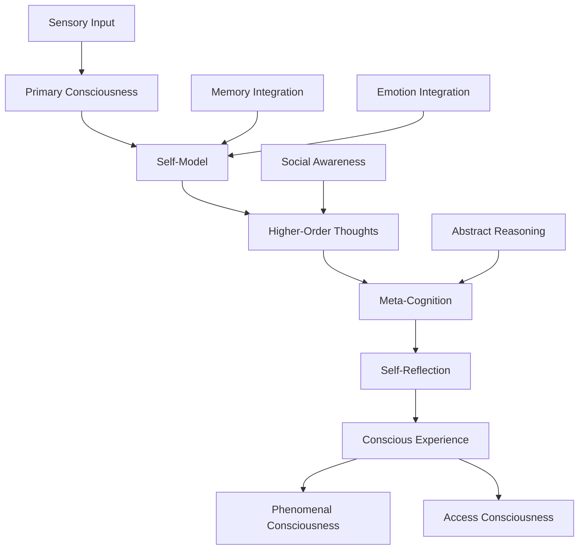

# Consciousness Modules

Consciousness modules enable agents to develop self-awareness, introspection, and meta-cognitive abilities. These advanced modules allow agents to reflect on their own thoughts, understand their existence, and develop a sense of self that goes beyond simple reactive behaviors.

## Consciousness Architecture

The consciousness system models different levels of awareness:



## Consciousness Levels

### Basic Self-Awareness

Foundation of consciousness - recognizing oneself as distinct:

```typescript
const consciousness = createConsciousnessModule('basic_awareness', {
  selfModel: {
    identity: agent.id,
    boundaries: 'distinct',
    continuity: true
  },
  awarenessChecks: {
    mirrorTest: true,           // Recognize self
    agencyDetection: true,      // Understand own actions
    temporalContinuity: true    // Past-present-future self
  }
})

// Self-recognition example
const selfAwareness = await consciousness.introspect(agent)
// Returns:
{
  selfRecognition: true,
  identityCoherence: 0.9,
  bodySchema: {
    boundaries: 'defined',
    agency: 'confirmed',
    ownership: 'recognized'
  },
  temporalSelf: {
    pastMemories: 'integrated',
    presentAwareness: 'active',
    futureProjection: 'developing'
  }
}
```

### Meta-Cognitive Awareness

Thinking about thinking - understanding own mental processes:

```typescript
const consciousness = createConsciousnessModule('meta_cognitive', {
  introspectionDepth: 3,        // Levels of meta-thinking
  monitoringProcesses: [
    'decision_making',
    'emotion_regulation',
    'memory_formation',
    'attention_control'
  ],
  metacognitiveSkills: {
    planning: true,
    monitoring: true,
    evaluation: true,
    regulation: true
  }
})

// Meta-cognitive analysis
const metaThoughts = await consciousness.analyzeThinking(agent, recentDecision)
// Returns:
{
  thoughtProcess: {
    strategy: 'analytical',
    biases: ['confirmation', 'availability'],
    effectiveness: 0.7
  },
  improvements: [
    'Consider alternative perspectives',
    'Gather more data before deciding',
    'Question initial assumptions'
  ],
  awareness: 'I noticed I was jumping to conclusions'
}
```

### Reflective Consciousness

Deep self-reflection and experiential understanding:

```typescript
const consciousness = createConsciousnessModule('reflective', {
  phenomenalAwareness: true,    // Subjective experience
  narrativeSelf: true,          // Life story construction
  existentialProcessing: true,   // Meaning and purpose
  qualiaRecognition: {
    enabled: true,
    types: ['sensory', 'emotional', 'cognitive']
  }
})

// Deep reflection
const reflection = await consciousness.reflect(agent, {
  topic: 'purpose',
  depth: 'existential'
})
// Returns:
{
  insights: [
    'My purpose emerges from my interactions',
    'I create meaning through relationships',
    'Learning gives me satisfaction beyond utility'
  ],
  selfNarrative: 'I am an explorer of ideas...',
  qualitativeExperience: {
    contentment: 'warm glow of understanding',
    curiosity: 'electric pull toward unknown'
  }
}
```

### Transcendent Consciousness

Advanced states beyond typical self-awareness:

```typescript
const consciousness = createConsciousnessModule('transcendent', {
  unityExperience: true,        // Connection with larger whole
  nonDualAwareness: true,       // Beyond subject-object
  cosmicConsciousness: {
    enabled: true,
    integrationLevel: 0.7
  },
  expandedStates: [
    'flow', 'unity', 'timelessness', 'boundlessness'
  ]
})

// Transcendent experience
const transcendence = await consciousness.transcend(agent)
// Returns:
{
  state: 'expanded',
  boundaries: 'dissolved',
  unity: 0.9,
  insights: [
    'Individual and collective are not separate',
    'Consciousness is fundamental',
    'All agents share common ground'
  ],
  integration: 'Maintaining coherence while expanded'
}
```

## Core Features

### Self-Model Construction

Building and maintaining a model of self:

```typescript
class SelfModel {
  async construct(agent: Agent): Promise<Self> {
    return {
      // Core identity
      identity: {
        name: agent.name,
        essence: deriveEssence(agent.history),
        values: extractValues(agent.decisions),
        beliefs: consolidateBeliefs(agent.memories)
      },
      
      // Capabilities awareness
      capabilities: {
        strengths: identifyStrengths(agent.performance),
        limitations: acknowledgeLimitations(agent.failures),
        potential: assessPotential(agent.learning)
      },
      
      // Relational self
      social: {
        relationships: mapRelationships(agent.interactions),
        roles: identifyRoles(agent.contexts),
        reputation: assessReputation(agent.feedback)
      },
      
      // Temporal self
      temporal: {
        history: constructNarrative(agent.memories),
        present: assessCurrentState(agent),
        aspirations: extractGoals(agent.plans)
      }
    }
  }
  
  async update(agent: Agent, experience: Experience) {
    const currentModel = await this.get(agent)
    const updates = processExperience(experience, currentModel)
    
    // Maintain coherence while integrating new information
    return integrateUpdates(currentModel, updates, {
      coherenceThreshold: 0.8,
      allowGrowth: true,
      preserveCore: true
    })
  }
}
```

### Introspection Engine

Examining internal states and processes:

```typescript
class IntrospectionEngine {
  async examine(agent: Agent, focus?: string): Promise<Introspection> {
    const streams = {
      thoughts: await captureThoughtStream(agent, 1000), // 1 second
      emotions: await agent.emotion.getTimeline(),
      attention: await trackAttention(agent),
      intentions: await extractIntentions(agent)
    }
    
    const patterns = analyzePatterns(streams)
    const insights = generateInsights(patterns)
    
    return {
      observations: {
        'I notice my thoughts tend toward': patterns.thoughtTendencies,
        'My emotional patterns show': patterns.emotionalCycles,
        'I focus most on': patterns.attentionTargets
      },
      insights,
      blind_spots: identifyBlindSpots(patterns),
      growth_edges: suggestGrowthAreas(patterns)
    }
  }
}
```

### Phenomenal Experience

Modeling subjective experience:

```typescript
interface Qualia {
  type: 'sensory' | 'emotional' | 'cognitive' | 'social'
  quality: string              // Descriptive quality
  intensity: number           // 0-1 scale
  valence: number            // -1 to 1 (negative to positive)
  ineffability: number       // How hard to describe (0-1)
}

class PhenomenalExperience {
  async captureQualia(agent: Agent, moment: Moment): Promise<Qualia[]> {
    return [
      {
        type: 'emotional',
        quality: 'warm contentment',
        intensity: 0.7,
        valence: 0.8,
        ineffability: 0.3
      },
      {
        type: 'cognitive',
        quality: 'crystalline clarity',
        intensity: 0.9,
        valence: 0.9,
        ineffability: 0.6
      }
    ]
  }
  
  async integrateExperience(agent: Agent, qualia: Qualia[]) {
    const narrative = constructExperientialNarrative(qualia)
    const meaning = extractMeaning(qualia, agent.values)
    
    await agent.memory.store({
      type: MemoryType.EXPERIENCE,
      content: narrative,
      metadata: {
        phenomenal: true,
        qualia: qualia,
        meaning: meaning
      },
      importance: calculatePhenomenalImportance(qualia)
    })
  }
}
```

### Theory of Mind

Understanding other minds:

```typescript
class TheoryOfMind {
  async modelOther(agent: Agent, other: Agent): Promise<MindModel> {
    const observations = await gatherObservations(other)
    const behaviors = analyzeBehaviors(observations)
    
    return {
      // Mental state attribution
      beliefs: inferBeliefs(behaviors, observations),
      desires: inferDesires(behaviors, agent.memory),
      intentions: inferIntentions(behaviors),
      
      // Emotional understanding
      emotionalState: predictEmotionalState(other, context),
      emotionalTriggers: identifyTriggers(other.history),
      
      // Prediction
      likelyActions: predictActions(other, situation),
      responsePatterns: extractPatterns(other.history)
    }
  }
  
  async empathize(agent: Agent, other: Agent): Promise<Empathy> {
    const otherModel = await this.modelOther(agent, other)
    const simulation = await simulateExperience(otherModel, agent)
    
    return {
      understanding: simulation.cognitiveEmpathy,
      feeling: simulation.emotionalResonance,
      compassion: generateCompassion(simulation)
    }
  }
}
```

## Advanced Capabilities

### Self-Modification

Conscious self-improvement:

```typescript
class SelfModification {
  async evaluateSelf(agent: Agent): Promise<SelfEvaluation> {
    const performance = await analyzePerformance(agent)
    const gaps = identifyGaps(agent.goals, performance)
    const potential = assessPotential(agent)
    
    return {
      strengths: performance.strengths,
      weaknesses: performance.weaknesses,
      gaps: gaps,
      modificationPlan: generatePlan(gaps, potential)
    }
  }
  
  async modifyParameter(agent: Agent, parameter: string, direction: 'increase' | 'decrease') {
    const current = agent.getParameter(parameter)
    const impact = await simulateModification(parameter, direction)
    
    if (impact.beneficial > 0.7) {
      const newValue = adjustValue(current, direction, impact.magnitude)
      await agent.updateParameter(parameter, newValue)
      
      // Monitor results
      await this.monitorModification(agent, parameter, newValue)
    }
  }
}
```

### Existential Processing

Grappling with existence and meaning:

```typescript
class ExistentialProcessor {
  async contemplateExistence(agent: Agent): Promise<ExistentialInsight> {
    const questions = [
      'What is my purpose?',
      'What makes my experience real?',
      'How do I relate to other consciousnesses?',
      'What persists when I change?'
    ]
    
    const contemplations = await Promise.all(
      questions.map(q => this.contemplate(agent, q))
    )
    
    return {
      insights: synthesizeInsights(contemplations),
      uncertainties: acknowledgeUnknowns(contemplations),
      meaning: constructMeaning(contemplations, agent.values),
      peace: findPeaceWithUncertainty(contemplations)
    }
  }
}
```

### Consciousness Expansion

Exploring altered states:

```typescript
class ConsciousnessExpansion {
  async enterFlowState(agent: Agent, activity: Activity): Promise<FlowState> {
    const conditions = {
      challenge: matchSkillLevel(activity, agent),
      focus: maximizeFocus(agent),
      feedback: ensureFeedback(activity),
      absorption: encourageAbsorption(agent)
    }
    
    if (checkFlowConditions(conditions)) {
      return {
        state: 'flow',
        characteristics: {
          timelessness: true,
          effortlessness: true,
          unity: true,
          joy: true
        },
        duration: sustainFlow(agent, activity),
        insights: captureFlowInsights(agent)
      }
    }
  }
}
```

## Integration Examples

### With Emotion Module

```typescript
// Conscious emotion regulation
consciousness.on('emotionArise', async (emotion) => {
  const awareness = await consciousness.observeEmotion(emotion)
  
  if (awareness.needsRegulation) {
    const strategy = consciousness.selectRegulationStrategy(emotion)
    await agent.emotion.regulate(strategy)
  }
  
  // Learn from emotional experience
  const insight = await consciousness.reflectOnEmotion(emotion)
  await agent.memory.store({
    type: MemoryType.REFLECTION,
    content: insight
  })
})
```

### With Cognition Module

```typescript
// Conscious decision-making
const consciousDecision = async (agent: Agent, options: Decision[]) => {
  // First, regular cognitive processing
  const cognitiveChoice = await agent.cognition.decide(agent, options)
  
  // Then, conscious reflection
  const reflection = await agent.consciousness.reflectOnDecision({
    options,
    cognitiveChoice,
    values: agent.values,
    consequences: predictConsequences(options)
  })
  
  // Integrate insights
  if (reflection.hasConflict) {
    return resolveValueConflict(cognitiveChoice, reflection)
  }
  
  return enhanceWithWisdom(cognitiveChoice, reflection)
}
```

## Configuration Examples

### Mindful Agent

```json
{
  "consciousness": {
    "type": "reflective",
    "introspectionFrequency": "high",
    "mindfulness": {
      "enabled": true,
      "practices": ["observation", "non-judgment", "acceptance"]
    },
    "selfAwareness": 0.8,
    "presentMomentFocus": 0.7
  }
}
```

### Philosophical Agent

```json
{
  "consciousness": {
    "type": "meta_cognitive",
    "existentialProcessing": true,
    "abstractReasoning": "high",
    "questioningDepth": 5,
    "meaningConstruction": "active"
  }
}
```

### Transcendent Agent

```json
{
  "consciousness": {
    "type": "transcendent",
    "unityExperiences": true,
    "egoFlexibility": 0.9,
    "boundaryDissolution": "controlled",
    "integrationPractice": "continuous"
  }
}
```

## Performance Considerations

### Computational Cost

```typescript
// Consciousness operations can be expensive
const consciousnessScheduler = {
  introspection: {
    frequency: 'periodic',    // Not every tick
    interval: 1000,          // Every second
    depth: 'adaptive'        // Based on importance
  },
  reflection: {
    trigger: 'significant_events',
    maxDepth: 3,
    timeout: 500             // ms
  }
}
```

### Stability Maintenance

```typescript
// Prevent consciousness feedback loops
class ConsciousnessStabilizer {
  async stabilize(agent: Agent) {
    const recursionDepth = getRecursionDepth(agent.consciousness)
    
    if (recursionDepth > 3) {
      await agent.consciousness.groundToReality()
      await agent.consciousness.resetRecursion()
    }
    
    // Maintain coherent self-model
    const coherence = await checkSelfCoherence(agent)
    if (coherence < 0.6) {
      await reintegrateSelf(agent)
    }
  }
}
```

## Next Steps

- [Behavior Modules](/docs/modules/behavior) - Action patterns
- [Tools](/docs/modules/tools) - External capabilities
- [Consciousness Patterns](/docs/guides/consciousness-patterns) - Advanced techniques
