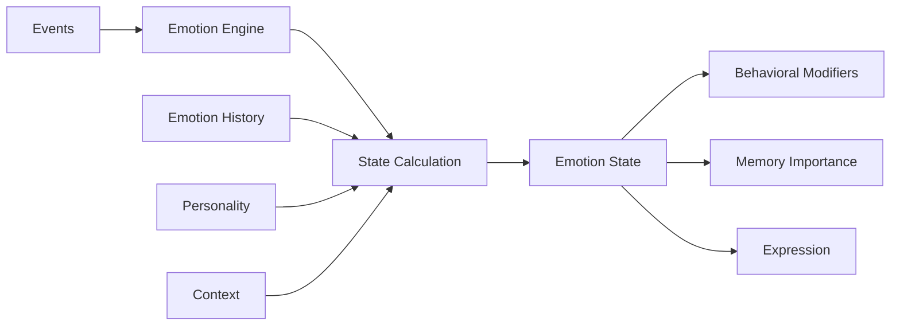

# Emotion Modules

Emotion modules give agents the ability to experience, process, and express emotions, making their interactions more natural and their decision-making more nuanced. Emotions influence agent behavior, memory formation, and social interactions.

## Emotion Architecture

The emotion system models complex emotional states and transitions:



## Emotion Models

### RuneScape Emotion Stack

Inspired by game AI, this model uses a stack-based approach:

```typescript
const emotion = createEmotionModule('rune_emotion_stack', {
  stackSize: 5,           // Max emotions in stack
  decayRate: 0.1,        // How fast emotions fade
  combinationRules: {    // How emotions interact
    'joy + surprise': 'excitement',
    'fear + anger': 'panic',
    'sadness + anger': 'frustration'
  }
})

// Emotion stack example
emotionStack: [
  { emotion: 'curious', intensity: 0.8, age: 0 },
  { emotion: 'happy', intensity: 0.6, age: 120 },
  { emotion: 'calm', intensity: 0.4, age: 300 }
]
```

### Basic Emotions

Simple categorical emotions based on Paul Ekman's model:

```typescript
const emotion = createEmotionModule('basic_emotions', {
  emotions: ['happy', 'sad', 'angry', 'fearful', 'surprised', 'disgusted'],
  defaultEmotion: 'neutral',
  transitionSpeed: 0.3
})

// State representation
{
  current: 'happy',
  intensity: 0.7,
  duration: 1500, // milliseconds
  triggers: ['positive_feedback', 'goal_achieved']
}
```

### Complex Emotions

Nuanced emotional states with blending:

```typescript
const emotion = createEmotionModule('complex_emotions', {
  primaryEmotions: ['joy', 'sadness', 'anger', 'fear', 'trust', 'disgust'],
  secondaryEmotions: ['love', 'guilt', 'pride', 'shame', 'envy'],
  tertiaryEmotions: ['melancholy', 'euphoria', 'contempt'],
  blendingEnabled: true,
  culturalFactors: true
})

// Complex state with blends
{
  primary: { joy: 0.6, trust: 0.8 },
  secondary: { love: 0.7 },
  blend: 'affectionate',
  culturalModifiers: { formality: 0.3 }
}
```

### Plutchik's Wheel

Based on Robert Plutchik's psychoevolutionary theory:

```typescript
const emotion = createEmotionModule('plutchik_wheel', {
  dimensions: 8,  // Eight primary emotions
  intensity_levels: 3,  // Mild, moderate, intense
  opposites: {
    'joy': 'sadness',
    'trust': 'disgust',
    'fear': 'anger',
    'surprise': 'anticipation'
  }
})

// Wheel representation
{
  emotions: {
    joy: { level: 2, label: 'happy' },      // Level 2 of 3
    trust: { level: 3, label: 'admiration' }, // Intense trust
    fear: { level: 1, label: 'apprehension' } // Mild fear
  },
  dominant: 'trust',
  valence: 0.7  // Positive
}
```

### Dimensional Model

Emotions as points in continuous space:

```typescript
const emotion = createEmotionModule('dimensional', {
  dimensions: {
    valence: { min: -1, max: 1 },      // Negative to positive
    arousal: { min: 0, max: 1 },       // Calm to excited
    dominance: { min: 0, max: 1 }      // Submissive to dominant
  },
  mappings: {
    'happy': { valence: 0.8, arousal: 0.6, dominance: 0.6 },
    'angry': { valence: -0.7, arousal: 0.8, dominance: 0.8 },
    'sad': { valence: -0.8, arousal: 0.2, dominance: 0.2 }
  }
})
```

## Emotion Processing

### Event Processing

How events trigger emotional responses:

```typescript
async function processEvent(event: AgentEvent): Promise<EmotionState> {
  // Evaluate event significance
  const significance = evaluateSignificance(event)
  
  // Check personality fit
  const personalityMatch = matchPersonality(event, agent.personality)
  
  // Calculate emotional response
  const response = calculateResponse({
    event,
    significance,
    personalityMatch,
    currentState: emotion.current,
    history: emotion.history
  })
  
  // Apply emotion
  await emotion.setEmotion(
    response.emotion,
    response.intensity,
    [event.type]
  )
  
  return emotion.getState()
}
```

### Emotion Triggers

Common triggers and their effects:

```typescript
const emotionTriggers = {
  // Positive triggers
  'goal_achieved': { emotion: 'joy', intensity: 0.8 },
  'compliment_received': { emotion: 'pride', intensity: 0.6 },
  'gift_received': { emotion: 'gratitude', intensity: 0.7 },
  
  // Negative triggers
  'goal_failed': { emotion: 'disappointment', intensity: 0.7 },
  'criticism_received': { emotion: 'hurt', intensity: 0.6 },
  'threat_detected': { emotion: 'fear', intensity: 0.8 },
  
  // Complex triggers
  'moral_dilemma': { emotion: 'conflict', intensity: 0.7 },
  'unexpected_success': { emotion: 'surprise', intensity: 0.8 }
}
```

### Emotion Decay

How emotions fade over time:

```typescript
function decayEmotions(emotions: EmotionState[], deltaTime: number): EmotionState[] {
  return emotions.map(emotion => {
    // Exponential decay
    const decayFactor = Math.exp(-config.decayRate * deltaTime)
    const newIntensity = emotion.intensity * decayFactor
    
    // Remove if below threshold
    if (newIntensity < 0.1) return null
    
    return {
      ...emotion,
      intensity: newIntensity,
      age: emotion.age + deltaTime
    }
  }).filter(Boolean)
}
```

## Emotion Effects

### Behavioral Modifiers

Emotions affect agent behavior:

```typescript
const behaviorModifiers = {
  'happy': {
    creativity: 1.2,      // 20% boost
    sociability: 1.3,     // 30% boost
    risk_taking: 1.1,     // 10% boost
    focus: 0.9           // 10% reduction
  },
  'fearful': {
    creativity: 0.7,      // 30% reduction
    sociability: 0.6,     // 40% reduction
    risk_taking: 0.3,     // 70% reduction
    focus: 1.2           // 20% boost
  },
  'angry': {
    creativity: 0.8,
    sociability: 0.5,
    risk_taking: 1.4,     // 40% boost
    focus: 1.3           // 30% boost
  }
}
```

### Memory Formation

Emotional intensity affects memory importance:

```typescript
function calculateMemoryImportance(
  baseImportance: number,
  emotionState: EmotionState
): number {
  // Strong emotions make memories more important
  const emotionalBoost = emotionState.intensity * 0.5
  
  // Certain emotions have additional effects
  const emotionMultipliers = {
    'fear': 1.3,      // Fear creates strong memories
    'joy': 1.2,       // Happy memories are treasured
    'surprise': 1.4,   // Surprising events are memorable
    'neutral': 0.8    // Neutral states reduce importance
  }
  
  const multiplier = emotionMultipliers[emotionState.current] || 1.0
  
  return Math.min(
    (baseImportance + emotionalBoost) * multiplier,
    1.0
  )
}
```

### Social Interactions

Emotions influence communication style:

```typescript
function adjustCommunicationStyle(
  message: string,
  emotion: EmotionState
): string {
  const styles = {
    'happy': {
      punctuation: '!',
      emoji: '😊',
      tone: 'enthusiastic'
    },
    'sad': {
      punctuation: '...',
      emoji: '😔',
      tone: 'subdued'
    },
    'excited': {
      punctuation: '!!!',
      emoji: '🎉',
      tone: 'energetic',
      capsLikelihood: 0.3
    }
  }
  
  const style = styles[emotion.current] || styles['neutral']
  return applyStyle(message, style)
}
```

## Advanced Features

### Emotional Contagion

Agents can influence each other's emotions:

```typescript
async function emotionalContagion(
  source: Agent,
  target: Agent,
  interaction: Interaction
) {
  const sourceEmotion = await source.emotion.getState()
  const contagionStrength = calculateContagion({
    sourceIntensity: sourceEmotion.intensity,
    relationshipStrength: getRelationship(source, target),
    personalitySusceptibility: target.psyche.empathy,
    interactionDuration: interaction.duration
  })
  
  if (contagionStrength > 0.3) {
    await target.emotion.influence(
      sourceEmotion.current,
      contagionStrength * 0.5
    )
  }
}
```

### Mood Systems

Long-term emotional tendencies:

```typescript
interface Mood {
  baseline: EmotionState
  duration: number
  strength: number
}

class MoodSystem {
  async updateMood(agent: Agent) {
    const recentEmotions = await agent.emotion.getHistory(
      limit: 100,
      timeframe: '24h'
    )
    
    const averageValence = calculateAverageValence(recentEmotions)
    const consistency = calculateEmotionalConsistency(recentEmotions)
    
    if (consistency > 0.7) {
      // Set mood based on consistent emotions
      this.setMood({
        baseline: dominantEmotion(recentEmotions),
        duration: 86400000, // 24 hours
        strength: consistency
      })
    }
  }
}
```

### Emotional Intelligence

Meta-emotional capabilities:

```typescript
class EmotionalIntelligence {
  // Recognize own emotions
  async introspect(agent: Agent): Promise<SelfAwareness> {
    const state = await agent.emotion.getState()
    const history = await agent.emotion.getHistory()
    
    return {
      currentAwareness: `I feel ${state.current} because ${state.triggers.join(', ')}`,
      patterns: detectEmotionalPatterns(history),
      triggers: identifyCommonTriggers(history)
    }
  }
  
  // Regulate emotions
  async regulate(agent: Agent, targetState: string) {
    const current = await agent.emotion.getState()
    const regulationStrategies = getRegulationStrategies(
      current.current,
      targetState
    )
    
    for (const strategy of regulationStrategies) {
      await executeStrategy(agent, strategy)
    }
  }
}
```

## Configuration Examples

### Sensitive Agent

```json
{
  "emotion": {
    "type": "complex_emotions",
    "sensitivity": 0.9,        // Very reactive
    "decayRate": 0.05,        // Emotions last longer
    "transitionSpeed": 0.4,    // Quick mood changes
    "empathy": 0.8,           // Affected by others
    "expressiveness": 0.9      // Shows emotions clearly
  }
}
```

### Stoic Agent

```json
{
  "emotion": {
    "type": "basic_emotions",
    "sensitivity": 0.3,        // Less reactive
    "decayRate": 0.2,         // Emotions fade quickly
    "transitionSpeed": 0.1,    // Slow to change
    "defaultEmotion": "calm",
    "suppressionThreshold": 0.6
  }
}
```

### Balanced Agent

```json
{
  "emotion": {
    "type": "plutchik_wheel",
    "sensitivity": 0.6,
    "decayRate": 0.1,
    "transitionSpeed": 0.3,
    "adaptability": 0.7,
    "resilience": 0.8
  }
}
```

## Integration Patterns

### With Memory Module

```typescript
// Store emotionally significant memories
emotion.on('intensityThreshold', async (state) => {
  if (state.intensity > 0.7) {
    await memory.store(agent.id, {
      type: MemoryType.EXPERIENCE,
      content: `Felt ${state.current} intensely`,
      importance: state.intensity,
      metadata: { emotion: state }
    })
  }
})
```

### With Cognition Module

```typescript
// Emotions influence decision-making
const emotionalContext = await emotion.getState()
const decision = await cognition.decide(agent, {
  options: availableActions,
  emotionalBias: calculateBias(emotionalContext),
  riskTolerance: getRiskTolerance(emotionalContext)
})
```

## Debugging Emotions

Monitor emotional states:

```typescript
// Emotion timeline visualization
const timeline = await emotion.getTimeline({
  start: Date.now() - 3600000,
  end: Date.now(),
  resolution: 'minute'
})

// Emotion transitions
const transitions = await emotion.getTransitions({
  limit: 20
})

// Trigger analysis
const triggerStats = await emotion.analyzeTriggers({
  timeframe: '7d'
})
```

## Next Steps

- [Cognition Modules](/docs/modules/cognition) - Decision-making systems
- [Consciousness Modules](/docs/modules/consciousness) - Self-awareness
- [Emotion Patterns](/docs/guides/emotion-patterns) - Advanced techniques
