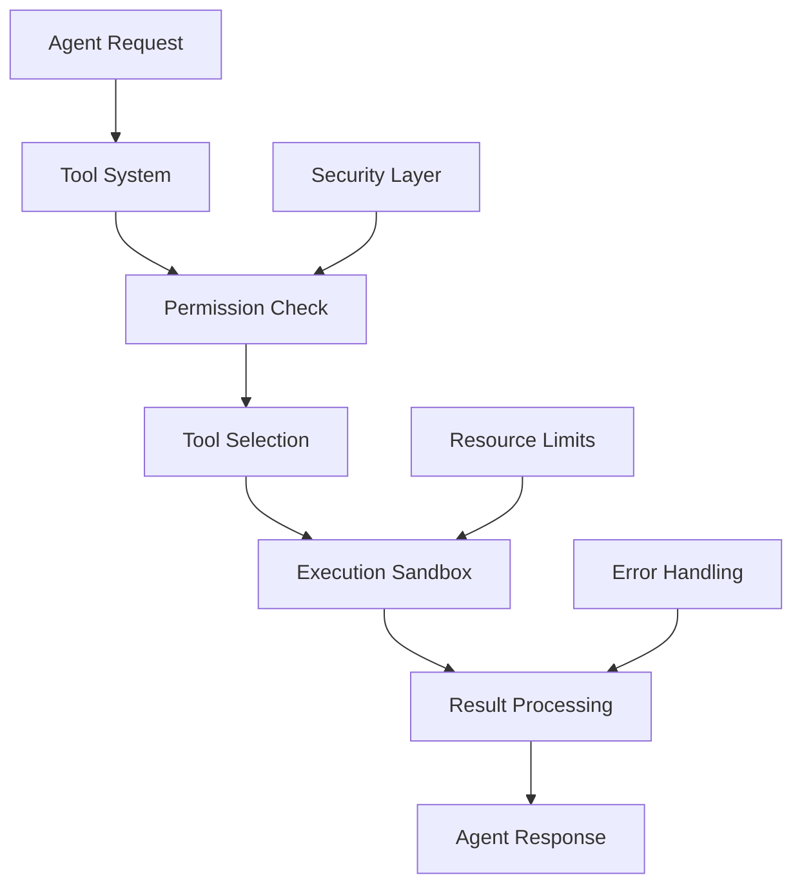

# Tools

Tools provide agents with external capabilities to interact with the world beyond conversation. They enable agents to execute code, browse the web, manipulate files, call APIs, and perform various utility functions that extend their abilities into practical domains.

## Tools Architecture

The tools system provides a sandboxed environment for agent capabilities:



## Tool Categories

### Code Execution

Safe code running in isolated environments:

```typescript
const tools = createToolsModule('code_execution', {
  sandbox: {
    enabled: true,
    allowedLanguages: ['python', 'javascript', 'bash'],
    timeoutMs: 30000,          // 30 seconds max
    memoryLimitMB: 512,
    networkAccess: false,      // Isolated by default
    fileSystemAccess: 'readonly'
  },
  security: {
    whitelist: ['math', 'datetime', 'json'],
    blacklist: ['eval', 'exec', '__import__'],
    sanitization: true
  }
})

// Execute code safely
const result = await tools.execute(agent, {
  language: 'python',
  code: `
    import math
    def fibonacci(n):
        if n <= 1: return n
        return fibonacci(n-1) + fibonacci(n-2)
    
    result = [fibonacci(i) for i in range(10)]
    print(result)
  `
})
// Returns:
{
  success: true,
  output: '[0, 1, 1, 2, 3, 5, 8, 13, 21, 34]',
  executionTime: 145,  // ms
  resourceUsage: {
    cpu: 0.02,
    memory: 12.5       // MB
  }
}
```

### Web Browsing

Internet access with content extraction:

```typescript
const tools = createToolsModule('web_browsing', {
  browser: {
    headless: true,
    userAgent: 'SYMindX-Agent/1.0',
    timeout: 20000,
    javascript: true
  },
  extraction: {
    mode: 'intelligent',       // Smart content extraction
    selectors: {
      article: 'article, main, [role="main"]',
      title: 'h1, title',
      metadata: 'meta[property^="og:"]'
    }
  },
  restrictions: {
    allowedDomains: null,      // No restrictions
    blockedDomains: ['localhost', '*.internal'],
    maxRedirects: 3
  }
})

// Browse and extract information
const webpage = await tools.browse(agent, {
  url: 'https://example.com/article',
  extract: ['title', 'content', 'metadata'],
  waitFor: 'networkidle'
})
// Returns structured data:
{
  title: 'Article Title',
  content: 'Cleaned article text...',
  metadata: {
    author: 'John Doe',
    published: '2024-01-15',
    tags: ['technology', 'AI']
  },
  screenshots: {
    full: 'base64...',
    viewport: 'base64...'
  }
}
```

### File System

Controlled file operations:

```typescript
const tools = createToolsModule('file_system', {
  permissions: {
    read: true,
    write: true,
    delete: false,
    execute: false
  },
  sandbox: {
    rootPath: '/sandbox/agent_workspace',
    maxFileSize: 10485760,     // 10MB
    allowedExtensions: ['.txt', '.json', '.csv', '.md'],
    encoding: 'utf8'
  }
})

// File operations
const file = await tools.file.read(agent, {
  path: 'data/observations.json'
})

await tools.file.write(agent, {
  path: 'analysis/results.md',
  content: `# Analysis Results\n\n${analysisContent}`,
  append: false
})

const files = await tools.file.list(agent, {
  path: 'data/',
  pattern: '*.csv',
  recursive: true
})
```

### API Integration

External service connectivity:

```typescript
const tools = createToolsModule('api_client', {
  endpoints: {
    weather: {
      url: 'https://api.weather.com/v1',
      auth: { type: 'apiKey', key: process.env.WEATHER_API_KEY },
      rateLimit: { requests: 100, window: 3600000 }
    },
    knowledge: {
      url: 'https://api.knowledge.com/v2',
      auth: { type: 'bearer', token: process.env.KNOWLEDGE_TOKEN }
    }
  },
  defaults: {
    timeout: 10000,
    retries: 3,
    headers: {
      'User-Agent': 'SYMindX-Agent',
      'Accept': 'application/json'
    }
  }
})

// Make API calls
const weather = await tools.api.call(agent, {
  service: 'weather',
  endpoint: '/current',
  params: { location: 'San Francisco', units: 'metric' }
})

const knowledge = await tools.api.query(agent, {
  service: 'knowledge',
  query: 'quantum computing basics',
  filters: { level: 'beginner', format: 'summary' }
})
```

### Data Processing

Advanced data manipulation:

```typescript
const tools = createToolsModule('data_processing', {
  processors: {
    csv: { enabled: true, maxRows: 100000 },
    json: { enabled: true, maxDepth: 10 },
    xml: { enabled: true },
    excel: { enabled: true, maxSheets: 10 }
  },
  analysis: {
    statistics: true,
    visualization: true,
    ml: {
      enabled: true,
      models: ['linear_regression', 'clustering', 'classification']
    }
  }
})

// Process data
const analysis = await tools.data.analyze(agent, {
  source: csvData,
  operations: [
    { type: 'clean', removeNulls: true },
    { type: 'aggregate', groupBy: 'category', metrics: ['sum', 'avg'] },
    { type: 'visualize', chart: 'bar', x: 'category', y: 'total' }
  ]
})
// Returns:
{
  summary: {
    rows: 1000,
    columns: 5,
    nulls: 12,
    types: { numeric: 3, string: 2 }
  },
  aggregations: { /* grouped data */ },
  visualization: 'data:image/png;base64,...'
}
```

## Core Features

### Tool Discovery

Agents can discover available tools:

```typescript
class ToolDiscovery {
  async listTools(agent: Agent): Promise<ToolManifest[]> {
    const tools = await this.registry.getAvailableTools(agent)
    
    return tools.map(tool => ({
      id: tool.id,
      name: tool.name,
      description: tool.description,
      category: tool.category,
      capabilities: tool.capabilities,
      requirements: tool.requirements,
      examples: tool.examples
    }))
  }
  
  async suggestTool(agent: Agent, task: string): Promise<ToolSuggestion[]> {
    const analysis = await this.analyzeTask(task)
    const tools = await this.listTools(agent)
    
    return tools
      .map(tool => ({
        tool,
        relevance: this.calculateRelevance(tool, analysis),
        reasoning: this.explainRelevance(tool, analysis)
      }))
      .filter(s => s.relevance > 0.5)
      .sort((a, b) => b.relevance - a.relevance)
  }
}
```

### Tool Composition

Combining multiple tools:

```typescript
class ToolComposer {
  async createPipeline(agent: Agent, steps: ToolStep[]): Promise<Pipeline> {
    // Validate pipeline
    const validation = await this.validatePipeline(steps)
    if (!validation.valid) {
      throw new Error(`Invalid pipeline: ${validation.errors.join(', ')}`)
    }
    
    return {
      id: generateId(),
      steps,
      execute: async (input: any) => {
        let result = input
        
        for (const step of steps) {
          try {
            result = await this.executeStep(agent, step, result)
          } catch (error) {
            if (step.onError === 'continue') {
              console.warn(`Step ${step.name} failed, continuing...`)
              continue
            }
            throw error
          }
        }
        
        return result
      }
    }
  }
  
  // Example pipeline
  const analysisPipeline = await composer.createPipeline(agent, [
    {
      name: 'fetch_data',
      tool: 'web_browsing',
      action: 'browse',
      params: { url: dataUrl }
    },
    {
      name: 'parse_data',
      tool: 'data_processing',
      action: 'parse',
      params: { format: 'csv' }
    },
    {
      name: 'analyze',
      tool: 'code_execution',
      action: 'execute',
      params: {
        language: 'python',
        code: analysisScript
      }
    },
    {
      name: 'visualize',
      tool: 'data_processing',
      action: 'visualize',
      params: { type: 'dashboard' }
    }
  ])
}
```

### Tool Learning

Agents learn to use tools effectively:

```typescript
class ToolLearning {
  async learnFromUsage(agent: Agent, usage: ToolUsage) {
    const outcome = usage.outcome
    const context = usage.context
    
    // Update tool preferences
    if (outcome.success) {
      await this.reinforceToolChoice(agent, usage.tool, context)
    } else {
      await this.adjustToolSelection(agent, usage.tool, context, outcome.error)
    }
    
    // Learn parameter patterns
    if (outcome.success && outcome.quality > 0.8) {
      await this.learnParameterPattern(agent, {
        tool: usage.tool,
        action: usage.action,
        params: usage.params,
        context: context
      })
    }
    
    // Discover new capabilities
    if (outcome.unexpectedCapability) {
      await this.addCapability(agent, usage.tool, outcome.capability)
    }
  }
}
```

### Safety and Sandboxing

Ensuring safe tool usage:

```typescript
class ToolSafety {
  async checkSafety(agent: Agent, toolRequest: ToolRequest): Promise<SafetyCheck> {
    const checks = await Promise.all([
      this.checkPermissions(agent, toolRequest),
      this.checkResourceLimits(toolRequest),
      this.checkContentSafety(toolRequest),
      this.checkRateLimits(agent, toolRequest.tool)
    ])
    
    return {
      allowed: checks.every(c => c.passed),
      warnings: checks.flatMap(c => c.warnings),
      modifications: this.suggestSafeModifications(toolRequest, checks)
    }
  }
  
  createSandbox(tool: Tool): Sandbox {
    return {
      execute: async (action: any) => {
        const sandbox = new VMSandbox({
          timeout: tool.config.timeout,
          memory: tool.config.memoryLimit,
          cpu: tool.config.cpuLimit,
          network: tool.config.networkAccess,
          filesystem: tool.config.fileSystemAccess
        })
        
        try {
          return await sandbox.run(action)
        } finally {
          sandbox.cleanup()
        }
      }
    }
  }
}
```

## Advanced Features

### Parallel Tool Execution

Running multiple tools concurrently:

```typescript
class ParallelToolExecutor {
  async executeParallel(
    agent: Agent,
    requests: ToolRequest[]
  ): Promise<ToolResult[]> {
    // Check for dependencies
    const graph = this.buildDependencyGraph(requests)
    const batches = this.topologicalSort(graph)
    
    const results = []
    for (const batch of batches) {
      // Execute independent tools in parallel
      const batchResults = await Promise.all(
        batch.map(req => this.executeTool(agent, req))
      )
      results.push(...batchResults)
    }
    
    return results
  }
}

// Example parallel execution
const results = await tools.parallel(agent, [
  { tool: 'web_browsing', action: 'browse', params: { url: url1 } },
  { tool: 'web_browsing', action: 'browse', params: { url: url2 } },
  { tool: 'api_client', action: 'call', params: { service: 'weather' } }
])
```

### Tool Optimization

Improving tool performance:

```typescript
class ToolOptimizer {
  async optimizeExecution(agent: Agent, toolRequest: ToolRequest) {
    // Cache frequently used results
    const cacheKey = this.generateCacheKey(toolRequest)
    const cached = await this.cache.get(cacheKey)
    if (cached && !this.isStale(cached)) {
      return cached.result
    }
    
    // Batch similar requests
    const similar = this.pendingRequests.filter(r => 
      this.areSimilar(r, toolRequest)
    )
    if (similar.length > 0) {
      return this.batchExecute([toolRequest, ...similar])
    }
    
    // Pre-fetch likely next tools
    const predictions = await this.predictNextTools(agent, toolRequest)
    this.prefetch(agent, predictions)
    
    // Execute with optimizations
    const result = await this.execute(toolRequest)
    await this.cache.set(cacheKey, result)
    
    return result
  }
}
```

### Tool Creation

Agents creating their own tools:

```typescript
class ToolCreation {
  async createTool(agent: Agent, specification: ToolSpec): Promise<Tool> {
    // Validate specification
    const validation = await this.validateSpec(specification)
    if (!validation.valid) {
      throw new Error(`Invalid tool spec: ${validation.errors}`)
    }
    
    // Generate tool code
    const implementation = await this.generateImplementation(specification)
    
    // Test in sandbox
    const tests = await this.generateTests(specification)
    const testResults = await this.runTests(implementation, tests)
    
    if (testResults.passed) {
      // Register new tool
      const tool = {
        id: generateId(),
        name: specification.name,
        description: specification.description,
        implementation,
        config: specification.config,
        createdBy: agent.id
      }
      
      await this.registry.register(tool)
      return tool
    }
    
    throw new Error(`Tool tests failed: ${testResults.failures}`)
  }
}
```

## Integration Examples

### With Cognition

```typescript
// Tools enhance decision-making
cognition.on('needInformation', async (query) => {
  const toolSuggestions = await tools.suggest(agent, query)
  
  if (toolSuggestions.length > 0) {
    const bestTool = toolSuggestions[0]
    const result = await tools.use(agent, {
      tool: bestTool.tool,
      action: 'query',
      params: { query }
    })
    
    return cognition.incorporateInformation(result)
  }
})
```

### With Memory

```typescript
// Store tool usage patterns
tools.on('executed', async (usage) => {
  await memory.store(agent.id, {
    type: MemoryType.EXPERIENCE,
    content: `Used ${usage.tool} for ${usage.purpose}`,
    metadata: {
      tool: usage.tool,
      parameters: usage.params,
      outcome: usage.outcome,
      duration: usage.duration
    },
    importance: usage.outcome.success ? 0.7 : 0.9
  })
})
```

## Configuration Examples

### Research Assistant

```json
{
  "tools": {
    "enabled": true,
    "categories": ["web_browsing", "data_processing", "code_execution"],
    "limits": {
      "requestsPerHour": 100,
      "executionTimeMs": 60000,
      "memoryMB": 1024
    },
    "permissions": {
      "internet": true,
      "fileSystem": "read",
      "codeExecution": ["python", "r"]
    }
  }
}
```

### Creative Agent

```json
{
  "tools": {
    "enabled": true,
    "categories": ["image_generation", "audio_synthesis", "file_system"],
    "creativity": {
      "experimentalTools": true,
      "toolCombination": true,
      "parameterExploration": 0.8
    }
  }
}
```

### System Administrator

```json
{
  "tools": {
    "enabled": true,
    "categories": ["file_system", "code_execution", "api_client"],
    "permissions": {
      "fileSystem": "full",
      "codeExecution": ["bash", "python"],
      "sudo": false
    },
    "safety": {
      "requireConfirmation": true,
      "auditLog": true,
      "rollback": true
    }
  }
}
```

## Performance Considerations

### Resource Management

```typescript
class ToolResourceManager {
  async allocateResources(toolRequest: ToolRequest): Promise<ResourceAllocation> {
    const required = this.estimateResources(toolRequest)
    const available = await this.getAvailableResources()
    
    if (!this.canAllocate(required, available)) {
      // Queue or reject
      if (toolRequest.priority > 0.7) {
        return this.queueHighPriority(toolRequest)
      }
      throw new Error('Insufficient resources')
    }
    
    return this.allocate(required)
  }
}
```

### Tool Caching

```typescript
const toolCache = new LRUCache({
  max: 1000,
  ttl: 3600000, // 1 hour
  updateAgeOnGet: true
})

// Cache tool results
async function cachedToolExecution(
  agent: Agent,
  request: ToolRequest
): Promise<ToolResult> {
  const key = generateCacheKey(request)
  
  if (toolCache.has(key)) {
    return toolCache.get(key)
  }
  
  const result = await tools.execute(agent, request)
  toolCache.set(key, result)
  
  return result
}
```

## Next Steps

- [Extensions](/docs/extensions) - Platform integrations
- [API Reference](/docs/api) - Complete API documentation
- [Tool Development](/docs/guides/tool-development) - Creating custom tools
