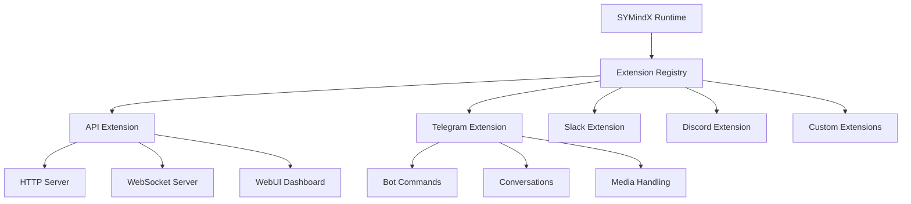

# Extensions

Extensions enable SYMindX agents to integrate with external platforms and services, expanding their capabilities beyond core AI functions. The extension system provides a modular, plugin-based architecture that allows agents to interact with chat platforms, APIs, databases, and custom services.

## Architecture Overview



## Core Extensions

### API Extension
The API extension provides HTTP and WebSocket interfaces for agent communication:

```typescript
// Configuration example
{
  "extensions": {
    "api": {
      "enabled": true,
      "port": 3000,
      "corsOrigins": ["http://localhost:5173"],
      "features": {
        "http": true,
        "websocket": true,
        "webui": true
      }
    }
  }
}
```

**Key Features:**
- RESTful API endpoints for agent management
- Real-time WebSocket streaming for thoughts and emotions
- Built-in WebUI dashboard for monitoring
- CORS support for cross-origin requests
- Authentication and rate limiting

### Telegram Extension
Enables agents to operate as Telegram bots with full conversation support:

```typescript
// Basic usage
const telegram = createExtension('telegram', {
  botToken: process.env.TELEGRAM_BOT_TOKEN,
  commands: ['/start', '/help', '/status'],
  mediaTypes: ['photo', 'document', 'voice']
});
```

**Capabilities:**
- Multi-turn conversations with context retention
- Command handling with custom responses
- Media processing (images, documents, voice)
- Group chat support with mention detection
- Inline keyboard and button interactions

### Slack Extension
Integrates agents with Slack workspaces using the Bolt framework:

```typescript
// Slack configuration
{
  "slack": {
    "enabled": true,
    "botToken": process.env.SLACK_BOT_TOKEN,
    "appToken": process.env.SLACK_APP_TOKEN,
    "signingSecret": process.env.SLACK_SIGNING_SECRET,
    "features": {
      "commands": true,
      "events": true,
      "interactivity": true
    }
  }
}
```

**Features:**
- Slash command handling
- Event subscriptions (messages, reactions, mentions)
- Interactive components (buttons, modals, select menus)
- Thread-aware conversations
- File sharing and processing

### Discord Extension
Provides Discord bot functionality with rich interactions:

```typescript
// Discord setup
const discord = createExtension('discord', {
  token: process.env.DISCORD_BOT_TOKEN,
  intents: ['GUILDS', 'GUILD_MESSAGES', 'DIRECT_MESSAGES'],
  prefix: '!',
  embedColor: '#7289DA'
});
```

**Capabilities:**
- Message handling with embeds
- Voice channel integration
- Role-based permissions
- Reaction-based interactions
- Custom command framework

## Extension Development

### Creating Custom Extensions

Extensions implement a standard interface for seamless integration:

```typescript
import { Extension, ExtensionConfig } from '@symindx/types';

export class CustomExtension implements Extension {
  name = 'custom-extension';
  
  constructor(private config: ExtensionConfig) {}
  
  async init(agent: Agent): Promise<void> {
    // Initialize extension with agent context
    console.log(`Initializing ${this.name} for ${agent.name}`);
  }
  
  async tick(agent: Agent): Promise<void> {
    // Called on each runtime tick
    // Perform periodic tasks, check for updates
  }
  
  async handleMessage(message: any): Promise<void> {
    // Process incoming messages
    const response = await this.agent.processInput(message.text);
    await this.sendResponse(response);
  }
}
```

### Extension Lifecycle

1. **Registration**: Extensions register with the runtime during startup
2. **Initialization**: Each agent initializes its configured extensions
3. **Runtime Loop**: Extensions receive tick() calls for periodic tasks
4. **Event Handling**: Extensions process platform-specific events
5. **Cleanup**: Graceful shutdown on runtime termination

### Best Practices

**Error Handling:**
```typescript
try {
  await extension.processMessage(message);
} catch (error) {
  logger.error(`Extension error: ${error.message}`);
  // Extensions should fail gracefully
  await extension.notifyError(error);
}
```

**Resource Management:**
- Use connection pooling for external services
- Implement rate limiting for API calls
- Cache frequently accessed data
- Clean up resources on shutdown

**Security Considerations:**
- Validate all external inputs
- Use environment variables for sensitive data
- Implement proper authentication
- Sanitize outputs before sending

## Configuration Reference

### Global Extension Settings

```json
{
  "extensions": {
    "autoLoad": true,
    "directory": "./src/extensions",
    "timeout": 30000,
    "retryAttempts": 3,
    "logging": {
      "level": "info",
      "includeStackTrace": true
    }
  }
}
```

### Per-Agent Configuration

```json
{
  "agents": [{
    "name": "Assistant",
    "extensions": {
      "api": { "enabled": true },
      "telegram": { 
        "enabled": true,
        "username": "@MyAssistantBot"
      },
      "slack": { "enabled": false }
    }
  }]
}
```

## Advanced Topics

### Extension Communication
Extensions can communicate through the event bus:

```typescript
// Broadcasting events
agent.eventBus.emit('extension:custom:event', { data: 'value' });

// Listening to events
agent.eventBus.on('extension:telegram:message', (msg) => {
  // React to Telegram messages in other extensions
});
```

### Skill System
Extensions can define modular skills:

```typescript
const skills = {
  weather: new WeatherSkill(),
  calendar: new CalendarSkill(),
  database: new DatabaseSkill()
};

extension.registerSkills(skills);
```

### Performance Optimization
- Batch API requests when possible
- Use webhooks instead of polling
- Implement caching strategies
- Monitor extension performance metrics

Extensions form the bridge between SYMindX agents and the external world, enabling rich interactions across multiple platforms while maintaining a clean, modular architecture.
