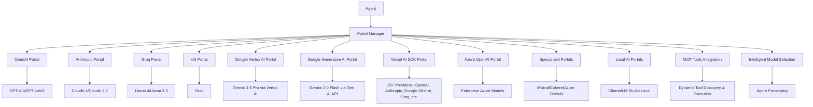

# Portals

Portals are SYMindX's abstraction layer for AI providers, enabling agents to seamlessly switch between different language models while maintaining consistent behavior. The portal system provides unified interfaces for **16+ AI providers** including OpenAI, Anthropic, Groq, xAI, Google (Vertex AI & Generative AI), Vercel AI SDK (20+ providers), Azure OpenAI, Mistral, Cohere, Ollama, LM Studio, OpenRouter, Kluster.ai, and custom multimodal solutions with MCP tools support.

## Architecture Overview



## Core Portals

### OpenAI Portal
**Latest Models**: GPT-4.1, GPT-4o, o3 reasoning models, gpt-4.1-mini

```typescript
// Configuration with dual-model architecture
{
  "portals": {
    "openai": {
      "apiKey": process.env.OPENAI_API_KEY,
      "chatModel": "gpt-4o",           // For conversations
      "toolModel": "gpt-4.1-mini",      // For fast function calls
      "embeddingModel": "text-embedding-3-large",
      "imageModel": "dall-e-3",
      "temperature": 0.7,
      "maxTokens": 4096,
      "streamingEnabled": true
    }
  }
}
```

**Advanced Features:**
- **Intelligent Model Selection**: Automatically uses appropriate model based on task
- **Dual-Model Architecture**: Separate chat and tool models for optimization
- **o3 Reasoning Models**: State-of-the-art reasoning capabilities
- **Multimodal Support**: Vision, audio, and image generation
- **Function Calling**: Advanced tool integration with parallel execution
- **Embeddings**: High-dimensional vector embeddings (3072d)

**Capabilities:**
- ✅ Text Generation
- ✅ Chat Generation  
- ✅ Embedding Generation
- ✅ Image Generation
- ✅ Streaming
- ✅ Function Calling
- ✅ Vision Analysis
- ❌ Audio Processing

### Anthropic Portal
**Latest Models**: Claude 4 Opus, Claude 4 Sonnet, Claude 3.7 Sonnet

```typescript
// Using latest Claude 4 models
const portal = createPortal('anthropic', {
  apiKey: process.env.ANTHROPIC_API_KEY,
  model: 'claude-4-sonnet',  // Superior coding and reasoning
  maxTokens: 4096,
  temperature: 0.8
});
```

**Key Features:**
- **Claude 4 Series**: World's best coding models with sustained performance
- **200K+ Context**: Extended context windows for complex tasks
- **Constitutional AI**: Built-in safety and ethical reasoning
- **Vision Support**: Advanced image and document analysis
- **Function Calling**: Tool integration capabilities
- **Streaming**: Real-time response generation

**Capabilities:**
- ✅ Text Generation
- ✅ Chat Generation
- ✅ Streaming
- ✅ Function Calling
- ✅ Vision Analysis
- ❌ Embedding Generation
- ❌ Image Generation
- ❌ Audio Processing

### Groq Portal
**Latest Models**: Llama 4 Scout, Llama 3.3 70B, optimized inference

```typescript
// High-performance inference configuration
{
  "groq": {
    "apiKey": process.env.GROQ_API_KEY,
    "model": "meta-llama/llama-4-scout-17b-16e-instruct",  // Latest model
    "toolModel": "llama-3.1-8b-instant",  // Ultra-fast for tools
    "temperature": 0.7,
    "maxTokens": 8192
  }
}
```

**Models Available:**
- **Llama 4 Scout 17B**: Latest efficient chat model (2025)
- **Llama 3.3 70B Versatile**: High-quality flagship model
- **Llama 3.1 Series**: 70B and 8B variants
- **Tool-Optimized Models**: Specialized for function calling
- **Gemma Series**: Google's open models

**Benefits:**
- ⚡ **Ultra-Fast Inference**: Industry-leading speed
- 💰 **Cost-Effective**: Excellent price-performance ratio
- 🔧 **Tool Evaluation**: Specialized evaluation capabilities
- 📊 **Dual-Model Support**: Separate models for chat and tools
- 🌐 **Open Source Models**: Llama, Gemma, and more

**Capabilities:**
- ✅ Text Generation
- ✅ Chat Generation
- ✅ Streaming
- ✅ Function Calling
- ✅ Tool Usage
- ✅ Evaluation
- ❌ Embedding Generation
- ❌ Image Generation
- ❌ Vision Analysis

### Google Vertex AI Portal
**Models**: Gemini 1.5 Pro, Gemini 1.5 Flash, Gemini 2.0 via Google Cloud

```typescript
// Google Vertex AI (Enterprise)
const vertexPortal = createPortal('google-vertex', {
  projectId: 'your-project-id',
  location: 'us-central1',
  model: 'gemini-1.5-pro',
  safetySettings: [
    { category: 'HARM_CATEGORY_HARASSMENT', threshold: 'BLOCK_MEDIUM_AND_ABOVE' }
  ],
  googleAuthOptions: {
    // Optional: custom auth configuration
  }
});
```

**Enterprise Features:**
- **Google Cloud Integration**: Full enterprise authentication via ADC
- **Vertex AI Platform**: Enterprise-grade deployment and monitoring
- **Advanced Security**: SOC2, HIPAA, and enterprise compliance
- **Multi-Region**: Global deployment with data residency controls
- **Custom Models**: Support for fine-tuned enterprise models
- **Comprehensive Logging**: Full audit trails and monitoring

### Google Generative AI Portal  
**Models**: Gemini 2.0 Flash, Gemini 1.5 Pro/Flash via Developer API

```typescript
// Google Generative AI (Developer-Friendly)
const generativePortal = createPortal('google-generative', {
  apiKey: process.env.GEMINI_API_KEY,
  model: 'gemini-2.0-flash-001',
  apiVersion: 'v1',
  safetySettings: [
    { category: 'HARM_CATEGORY_HARASSMENT', threshold: 'BLOCK_MEDIUM_AND_ABOVE' }
  ]
});
```

**Developer Features:**
- **Simple API Key Auth**: No Google Cloud setup required
- **Latest Models**: Access to Gemini 2.0 and newest releases
- **Quick Integration**: Minimal configuration needed
- **Cost Effective**: Direct API pricing without cloud overhead
- **Rapid Prototyping**: Perfect for development and testing

**Shared Capabilities (Both Portals):**
- ✅ Text Generation
- ✅ Chat Generation
- ✅ Multimodal Processing (text, image, video)
- ✅ Long Context (up to 2M tokens)
- ✅ Streaming
- ✅ Function Calling
- ✅ Vision Analysis
- ✅ Safety Filtering
- ❌ Image Generation
- ❌ Audio Processing

### xAI Portal
**Models**: Grok models with real-time capabilities

```typescript
// xAI Grok configuration
const xai = createPortal('xai', {
  apiKey: process.env.XAI_API_KEY,
  model: 'grok-beta',
  realTimeData: true,
  webSearch: true
});
```

**Features:**
- **Real-Time Data**: Access to current information
- **Web Search Integration**: Live internet search capabilities
- **Humor and Personality**: Unique conversational style
- **Code Generation**: Strong programming capabilities

**Capabilities:**
- ✅ Text Generation
- ✅ Chat Generation
- ✅ Streaming
- ✅ Function Calling
- ❌ Embedding Generation
- ❌ Image Generation
- ❌ Vision Analysis

### Vercel AI SDK Portal
**Multi-Provider Support**: 20+ AI providers through unified interface

```typescript
// Vercel AI SDK Multi-Provider Configuration
const vercelPortal = createPortal('vercel-ai', {
  providers: [
    { name: 'openai', type: 'openai', apiKey: process.env.OPENAI_API_KEY },
    { name: 'anthropic', type: 'anthropic', apiKey: process.env.ANTHROPIC_API_KEY },
    { name: 'google', type: 'google', apiKey: process.env.GOOGLE_API_KEY },
    { name: 'mistral', type: 'mistral', apiKey: process.env.MISTRAL_API_KEY },
    { name: 'groq', type: 'groq', apiKey: process.env.GROQ_API_KEY }
  ],
  enabledProviders: ['openai', 'anthropic', 'google', 'mistral', 'groq'],
  defaultProvider: 'openai',
  defaultModel: 'gpt-4.1-mini',
  tools: [
    {
      name: 'web_search',
      description: 'Search the web for current information',
      parameters: z.object({
        query: z.string().describe('Search query')
      }),
      execute: async ({ query }) => {
        return await searchWeb(query);
      }
    }
  ]
});
```

**Supported Providers:**
- **Core AI**: OpenAI, Anthropic, Google, Mistral
- **High Performance**: Groq, Together.ai, Fireworks
- **Specialized**: Cohere, Perplexity, DeepInfra
- **Open Source**: Replicate, Cerebras
- **Custom**: Any OpenAI-compatible provider

**Advanced Features:**
- **🔄 Provider Registry**: Dynamic provider management and fallbacks
- **🛠️ Runtime Tools**: Add/remove tools dynamically during execution
- **📊 Model Discovery**: Automatic model availability checking
- **⚡ Smart Routing**: Intelligent provider selection based on task
- **💰 Cost Optimization**: Automatic cost-efficient model selection
- **🔧 Tool Integration**: Built-in support for function calling and tools
- **📈 Performance Monitoring**: Real-time metrics and usage tracking

**Example Multi-Provider Usage:**
```typescript
// Use different providers for different tasks
const analysis = await vercelPortal.generateText('openai:gpt-4o', prompt);
const summary = await vercelPortal.generateText('anthropic:claude-3-5-sonnet', analysis);
const embedding = await vercelPortal.generateEmbedding('openai:text-embedding-3-small', text);
```

**Capabilities:**
- ✅ Text Generation (All Providers)
- ✅ Chat Generation (All Providers)
- ✅ Embedding Generation (OpenAI, Cohere, Google)
- ✅ Image Generation (OpenAI, Replicate, DeepInfra)
- ✅ Streaming (All Providers)
- ✅ Function Calling (Most Providers)
- ✅ Vision Analysis (OpenAI, Anthropic, Google)
- ✅ Tool Usage (Dynamic Runtime Tools)
- ✅ Multi-Provider Routing

## Specialized AI Portals

### Azure OpenAI Portal
Enterprise-grade deployment with enhanced security and compliance.

```typescript
const azurePortal = createPortal('azure-openai', {
  apiKey: process.env.AZURE_OPENAI_API_KEY,
  endpoint: 'https://your-resource.openai.azure.com',
  apiVersion: '2024-06-01',
  deploymentName: 'gpt-4o',
  enableContentFilter: true,
  region: 'eastus'
});
```

### Mistral AI Portal
European-based AI with multilingual capabilities and GDPR compliance.

```typescript
const mistralPortal = createPortal('mistral', {
  apiKey: process.env.MISTRAL_API_KEY,
  model: 'mistral-large-latest',
  safeMode: true,
  tools: [{
    type: 'function',
    function: {
      name: 'analyze_code',
      description: 'Analyze code for issues',
      parameters: {
        type: 'object',
        properties: {
          code: { type: 'string' }
        }
      }
    }
  }]
});
```

### Cohere AI Portal
Enterprise text processing with RAG capabilities.

```typescript
const coherePortal = createPortal('cohere', {
  apiKey: process.env.COHERE_API_KEY,
  model: 'command-r-plus',
  connectors: [{
    id: 'web-search',
    continueOnFailure: true
  }],
  citationQuality: 'accurate'
});
```

## Local AI Portals

### Ollama Portal
**Privacy-First Local Inference**

```typescript
// Local model configuration
{
  "ollama": {
    "baseUrl": "http://localhost:11434",
    "model": "llama3.1:70b",
    "embeddingModel": "nomic-embed-text",
    "keepAlive": "5m",
    "options": {
      "temperature": 0.8,
      "numCtx": 4096,
      "numGpu": 1
    }
  }
}
```

**Benefits:**
- 🔒 **Complete Privacy**: No data leaves your infrastructure
- 💰 **Zero API Costs**: No per-token charges
- ⚡ **Custom Models**: Run any compatible model
- 🖥️ **Hardware Control**: GPU acceleration support
- 📶 **Offline Operation**: Works without internet

**Capabilities:**
- ✅ Text Generation
- ✅ Chat Generation
- ✅ Embedding Generation
- ✅ Streaming
- ❌ Function Calling
- ❌ Image Generation
- ❌ Vision Analysis

### LM Studio Portal
**OpenAI-Compatible Local Model Serving**

```typescript
// Local model configuration with LM Studio
{
  "lmstudio": {
    "baseUrl": "http://localhost:1234",
    "model": "lmstudio-community/Meta-Llama-3.1-8B-Instruct-GGUF",
    "enableGPU": true,
    "gpuLayers": -1,
    "precision": "q4_0",
    "contextSize": 8192,
    "enablePrivacyMode": true,
    "enableOfflineMode": true
  }
}
```

**Benefits:**
- 🎯 **OpenAI Compatibility**: Drop-in replacement for OpenAI API
- 🖥️ **Advanced Model Management**: GUI-based model downloads and management
- ⚡ **GPU Acceleration**: NVIDIA, AMD, and Apple Silicon support
- 🔧 **GGUF Models**: Latest quantized models for efficient inference
- 📊 **Performance Monitoring**: Real-time metrics and server status

**Capabilities:**
- ✅ Text Generation
- ✅ Chat Generation
- ✅ Embedding Generation
- ✅ Streaming
- ✅ Function Calling
- ❌ Image Generation
- ❌ Vision Analysis

## Multimodal AI System

Advanced multimodal processing with vision, audio, and cross-modal reasoning.

```typescript
const multimodalPortal = createPortal('multimodal', {
  enableVisionAnalysis: true,
  enableAudioProcessing: true,
  enableCrossModalReasoning: true,
  visionProvider: 'google',
  audioProvider: 'openai',
  crossModalProvider: 'anthropic'
});
```

**Capabilities:**
- 👁️ **Vision Analysis**: Object detection, OCR, scene understanding
- 🎵 **Audio Processing**: Speech recognition, audio analysis
- 🎬 **Video Analysis**: Scene detection, activity recognition
- 🧠 **Cross-Modal Reasoning**: Multi-sensory understanding
- 🎤 **Speech Synthesis**: High-quality text-to-speech
- 🎼 **Music Generation**: AI-powered composition

## Portal Development

### Creating Custom Portals

Implement the Portal interface for new AI providers:

```typescript
import { BasePortal } from '@symindx/core';

export class CustomPortal extends BasePortal {
  type = PortalType.CUSTOM;
  supportedModels = [ModelType.TEXT_GENERATION, ModelType.CHAT];
  
  constructor(config: PortalConfig) {
    super('custom-ai', 'Custom AI', '1.0.0', config);
  }
  
  async generateChat(messages: ChatMessage[], options?: ChatGenerationOptions): Promise<ChatGenerationResult> {
    const response = await this.client.complete({
      model: this.config.model,
      messages: this.formatMessages(messages),
      temperature: options?.temperature || 0.7
    });
    
    return {
      message: {
        role: MessageRole.ASSISTANT,
        content: response.text
      },
      text: response.text,
      usage: {
        promptTokens: response.usage.input,
        completionTokens: response.usage.output,
        totalTokens: response.usage.total
      },
      metadata: {
        model: this.config.model,
        provider: 'custom'
      }
    };
  }
  
  hasCapability(capability: PortalCapability): boolean {
    switch (capability) {
      case PortalCapability.TEXT_GENERATION:
      case PortalCapability.CHAT_GENERATION:
        return true;
      default:
        return false;
    }
  }
}
```

### Intelligent Portal Selection

SYMindX features smart routing based on task requirements:

```typescript
// Automatic portal selection
const portalRouter = {
  // Task-based routing
  findPortalByCapability(agent, capability),
  
  // Complexity analysis
  analyzeRequestComplexity(request),
  
  // Model type selection
  getModelType(agent, request),
  
  // Cost optimization
  shouldUseToolModel(request)
};
```

**Selection Criteria:**
- **Task Complexity**: Simple tasks → faster models
- **Capability Requirements**: Vision → vision-capable portals
- **Cost Optimization**: Tools → dedicated tool models
- **User-Facing**: Conversations → primary chat models

## MCP Tools Integration

**Model Context Protocol (MCP)** provides dynamic tool discovery and execution capabilities.

```typescript
// Configure MCP servers for dynamic tools
import { mcpIntegration } from '@symindx/core';

// Add filesystem MCP server
await mcpIntegration.addServer({
  name: 'filesystem',
  command: 'npx',
  args: ['@modelcontextprotocol/server-filesystem', '/path/to/files'],
  autoReconnect: true
});

// Add GitHub MCP server
await mcpIntegration.addServer({
  name: 'github',
  command: 'npx',
  args: ['@modelcontextprotocol/server-github'],
  env: { GITHUB_TOKEN: process.env.GITHUB_TOKEN }
});

// Tools are automatically discovered and available to all portals
const tools = mcpIntegration.getAvailableTools();
console.log('Available MCP tools:', Array.from(tools.keys()));
```

**MCP Features:**
- **🔧 Dynamic Tool Discovery**: Automatically discover tools from MCP servers
- **🔄 Auto-Reconnection**: Maintain persistent connections to MCP servers
- **📁 Resource Access**: Access files, databases, and external systems
- **💭 Prompt Templates**: Use pre-defined prompts from MCP servers
- **🔗 Server Management**: Add/remove MCP servers at runtime
- **⚡ Real-time Integration**: Tools become available immediately
- **🛡️ Schema Validation**: Automatic parameter validation for all tools

**Available MCP Servers:**
- **Filesystem**: File operations, directory browsing, content reading
- **Database**: SQL queries, database introspection
- **GitHub**: Repository management, issue tracking, code analysis
- **Web**: Web scraping, HTTP requests, API interactions
- **Custom**: Build your own MCP servers for specific tools

## Portal Capabilities Matrix

| Portal | Text | Chat | Embed | Image | Stream | Functions | Vision | Audio | MCP |
|--------|------|------|-------|-------|--------|-----------|--------|-------|-----|
| **OpenAI** | ✅ | ✅ | ✅ | ✅ | ✅ | ✅ | ✅ | ❌ | ✅ |
| **Anthropic** | ✅ | ✅ | ❌ | ❌ | ✅ | ✅ | ✅ | ❌ | ✅ |
| **Groq** | ✅ | ✅ | ❌ | ❌ | ✅ | ✅ | ❌ | ❌ | ✅ |
| **Google Vertex** | ✅ | ✅ | ✅ | ❌ | ✅ | ✅ | ✅ | ❌ | ✅ |
| **Google Generative** | ✅ | ✅ | ❌ | ❌ | ✅ | ✅ | ✅ | ❌ | ✅ |
| **Vercel AI SDK** | ✅ | ✅ | ✅ | ✅ | ✅ | ✅ | ✅ | ❌ | ✅ |
| **xAI** | ✅ | ✅ | ❌ | ❌ | ✅ | ✅ | ❌ | ❌ | ✅ |
| **Azure OpenAI** | ✅ | ✅ | ✅ | ✅ | ✅ | ✅ | ✅ | ❌ | ✅ |
| **Mistral** | ✅ | ✅ | ✅ | ❌ | ✅ | ✅ | ❌ | ❌ | ✅ |
| **Cohere** | ✅ | ✅ | ✅ | ❌ | ✅ | ✅ | ❌ | ❌ | ✅ |
| **Ollama** | ✅ | ✅ | ✅ | ❌ | ✅ | ❌ | ❌ | ❌ | ✅ |
| **LM Studio** | ✅ | ✅ | ✅ | ❌ | ✅ | ✅ | ❌ | ❌ | ✅ |
| **OpenRouter** | ✅ | ✅ | ❌ | ❌ | ✅ | ✅ | ❌ | ❌ | ✅ |
| **Kluster.ai** | ✅ | ✅ | ❌ | ❌ | ✅ | ✅ | ❌ | ❌ | ✅ |
| **Multimodal** | ✅ | ✅ | ❌ | ❌ | ❌ | ❌ | ✅ | ✅ | ✅ |

## Configuration Reference

### Environment Variables

```bash
# Core Portals
OPENAI_API_KEY=sk-...
ANTHROPIC_API_KEY=sk-ant-...
GROQ_API_KEY=gsk_...
XAI_API_KEY=xai-...

# Google AI Portals
GEMINI_API_KEY=...                    # For Google Generative AI Portal
GOOGLE_CLOUD_PROJECT=your-project-id  # For Google Vertex AI Portal
GOOGLE_APPLICATION_CREDENTIALS=path/to/service-account.json

# Multi-Provider Portal (Vercel AI SDK)
# Uses any combination of the above API keys for enabled providers

# Specialized Portals
AZURE_OPENAI_API_KEY=...
MISTRAL_API_KEY=...
COHERE_API_KEY=...

# Local AI Portals
OLLAMA_BASE_URL=http://localhost:11434
LM_STUDIO_BASE_URL=http://localhost:1234

# MCP Servers
GITHUB_TOKEN=ghp_...  # For GitHub MCP server (optional)
```

### Global Portal Settings

```json
{
  "portals": {
    "default": "openai",
    "fallback": ["anthropic", "groq"],
    "timeout": 60000,
    "retryStrategy": {
      "maxAttempts": 3,
      "backoff": "exponential"
    },
    "intelligentRouting": {
      "enabled": true,
      "costOptimization": true,
      "qualityThreshold": 0.8
    }
  }
}
```

## Advanced Features

### Multi-Portal Consensus
Use multiple portals for critical decisions:

```typescript
const consensus = await portalManager.consensus({
  portals: ['openai', 'anthropic', 'claude-4'],
  prompt: criticalDecision,
  aggregation: 'weighted_vote',
  weights: { openai: 0.4, anthropic: 0.4, 'claude-4': 0.2 }
});
```

### Portal Chaining
Chain different portals for specialized workflows:

```typescript
// Use GPT-4 for analysis, Claude for writing
const analysis = await portals.openai.analyze(data);
const report = await portals.anthropic.write({
  style: 'technical',
  content: analysis,
  model: 'claude-4-sonnet'
});
```

### Cost Optimization

```typescript
// Automatic cost optimization
const costOptimizer = {
  budgets: {
    daily: 100,    // $100/day
    perAgent: 10   // $10/agent/day
  },
  
  routing: {
    simple: 'groq',        // Use fastest for simple tasks
    complex: 'openai',     // Use best for complex tasks
    tools: 'toolModel',    // Use dedicated tool models
    bulk: 'ollama'         // Use local for bulk processing
  }
};
```

### Performance Monitoring

```typescript
// Portal performance tracking
portal.on('request', (event) => {
  metrics.record({
    portal: event.portal,
    model: event.model,
    latency: event.duration,
    tokens: event.usage,
    cost: event.estimatedCost,
    success: event.success
  });
});
```

## Next Steps

- Explore [Portal Switching Guide](./portal-switching) for dynamic configuration
- Check [OpenAI Portal](./openai/) for detailed OpenAI integration
- See [Anthropic Portal](./anthropic/) for Claude-specific features
- Learn about [Google Vertex AI Portal](./google-vertex/) for enterprise Google AI
- Check [Google Generative AI Portal](./google-generative/) for developer-friendly Google AI
- Explore [Vercel AI SDK Portal](./vercel/) for multi-provider support
- See [Azure OpenAI Portal](./azure-openai/) for enterprise OpenAI through Azure
- Learn about [Mistral AI Portal](./mistral/) for European AI with GDPR compliance
- Check [Cohere Portal](./cohere/) for enterprise RAG and citation capabilities
- See [Ollama Portal](./ollama/) for privacy-first local inference
- Check [LM Studio Portal](./lmstudio/) for OpenAI-compatible local model serving
- Learn about [Custom Portals](./custom/) for building your own integrations
