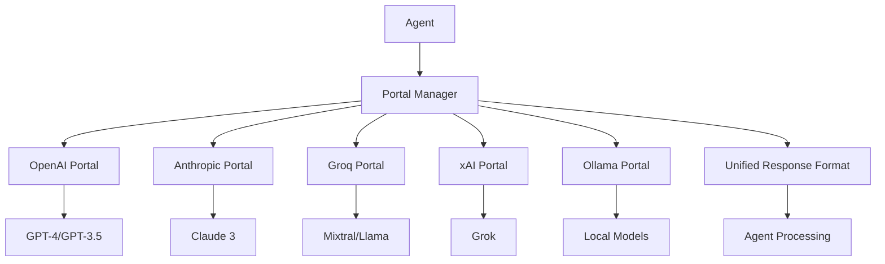

# Portals

Portals are SYMindX's abstraction layer for AI providers, enabling agents to seamlessly switch between different language models while maintaining consistent behavior. The portal system provides unified interfaces for OpenAI, Anthropic, Groq, xAI, Ollama, and custom providers.

## Architecture Overview



## Core Portals

### OpenAI Portal
Integrates with OpenAI's GPT models including GPT-4 and GPT-3.5:

```typescript
// Configuration
{
  "portals": {
    "openai": {
      "apiKey": process.env.OPENAI_API_KEY,
      "model": "gpt-4-turbo-preview",
      "temperature": 0.7,
      "maxTokens": 4096,
      "streamingEnabled": true,
      "functions": {
        "enabled": true,
        "parallel": true
      }
    }
  }
}
```

**Features:**
- Function calling with parallel execution
- Streaming responses for real-time interaction
- Vision capabilities with GPT-4V
- Fine-tuning support
- Token usage tracking and optimization

### Anthropic Portal
Provides access to Claude 3 family models:

```typescript
// Using Anthropic portal
const portal = createPortal('anthropic', {
  apiKey: process.env.ANTHROPIC_API_KEY,
  model: 'claude-3-opus-20240229',
  maxTokens: 4096,
  system: agent.character.systemPrompt
});

const response = await portal.chat({
  messages: conversation,
  temperature: 0.8
});
```

**Capabilities:**
- Claude 3 Opus, Sonnet, and Haiku models
- 200K token context window
- Constitutional AI safety features
- Multi-modal input support
- Artifact generation

### Groq Portal
High-performance inference with open-source models:

```typescript
// Groq configuration
{
  "groq": {
    "apiKey": process.env.GROQ_API_KEY,
    "model": "mixtral-8x7b-32768",
    "temperature": 0.7,
    "topP": 0.9,
    "maxTokens": 32768,
    "performance": {
      "caching": true,
      "timeout": 30000
    }
  }
}
```

**Models Available:**
- Mixtral 8x7B (32K context)
- Llama 2 70B
- Gemma 7B
- High-speed inference optimization
- Cost-effective for high-volume usage

### xAI Portal
Integration with xAI's Grok models:

```typescript
// xAI setup
const xai = createPortal('xai', {
  apiKey: process.env.XAI_API_KEY,
  model: 'grok-beta',
  realTimeData: true,
  webSearch: true
});
```

**Features:**
- Real-time information access
- Web search integration
- Humor and personality modes
- Extended context understanding

### Ollama Portal
Local model execution for privacy and customization:

```typescript
// Ollama configuration
{
  "ollama": {
    "baseUrl": "http://localhost:11434",
    "model": "llama2:13b",
    "keepAlive": "5m",
    "options": {
      "temperature": 0.8,
      "numCtx": 4096,
      "numGpu": 1
    }
  }
}
```

**Benefits:**
- Complete data privacy
- No API costs
- Custom model support
- Hardware acceleration
- Offline operation

## Portal Development

### Creating Custom Portals

Implement the Portal interface for new AI providers:

```typescript
import { Portal, ChatMessage, ChatResponse } from '@symindx/types';

export class CustomPortal implements Portal {
  name = 'custom-ai';
  
  constructor(private config: PortalConfig) {
    this.client = new CustomAIClient(config.apiKey);
  }
  
  async chat(params: ChatParams): Promise<ChatResponse> {
    const response = await this.client.complete({
      model: this.config.model,
      messages: this.formatMessages(params.messages),
      temperature: params.temperature || 0.7
    });
    
    return {
      content: response.text,
      usage: {
        promptTokens: response.usage.input,
        completionTokens: response.usage.output,
        totalTokens: response.usage.total
      },
      metadata: {
        model: this.config.model,
        finishReason: response.finishReason
      }
    };
  }
  
  async stream(params: ChatParams): AsyncGenerator<string> {
    const stream = await this.client.streamComplete(params);
    for await (const chunk of stream) {
      yield chunk.delta;
    }
  }
}
```

### Portal Selection Strategy

SYMindX uses intelligent portal selection based on:

```typescript
// Automatic portal selection
const portalSelector = {
  criteria: {
    cost: 0.3,        // Weight for cost optimization
    quality: 0.4,     // Weight for response quality
    speed: 0.2,       // Weight for latency
    features: 0.1     // Weight for special features
  },
  
  rules: [
    { if: 'context > 32k', prefer: ['anthropic', 'groq'] },
    { if: 'realtime_data', require: ['xai'] },
    { if: 'vision', require: ['openai', 'anthropic'] },
    { if: 'local_only', require: ['ollama'] }
  ]
};
```

### Response Normalization

All portals return normalized responses:

```typescript
interface NormalizedResponse {
  content: string;
  usage: TokenUsage;
  metadata: ResponseMetadata;
  functions?: FunctionCall[];
  reasoning?: string;
  confidence?: number;
}

// Portal manager handles normalization
const response = await portalManager.chat({
  portal: 'auto', // Automatic selection
  messages: messages,
  options: chatOptions
});
```

## Configuration Reference

### Global Portal Settings

```json
{
  "portals": {
    "default": "anthropic",
    "fallback": ["openai", "groq"],
    "timeout": 60000,
    "retryStrategy": {
      "maxAttempts": 3,
      "backoff": "exponential"
    },
    "caching": {
      "enabled": true,
      "ttl": 3600
    }
  }
}
```

### Model-Specific Optimizations

```typescript
// Model optimization profiles
const modelProfiles = {
  'gpt-4-turbo': {
    maxTokens: 4096,
    temperature: 0.7,
    topP: 0.9,
    functions: { parallel: true }
  },
  'claude-3-opus': {
    maxTokens: 4096,
    temperature: 0.8,
    systemPromptHandling: 'prefix'
  },
  'mixtral-8x7b': {
    maxTokens: 32768,
    temperature: 0.7,
    repetitionPenalty: 1.1
  }
};
```

## Advanced Features

### Multi-Portal Consensus
Use multiple portals for critical decisions:

```typescript
const consensus = await portalManager.consensus({
  portals: ['openai', 'anthropic', 'groq'],
  prompt: criticalDecision,
  aggregation: 'weighted_vote',
  weights: { openai: 0.4, anthropic: 0.4, groq: 0.2 }
});
```

### Portal Chaining
Chain different portals for specialized tasks:

```typescript
// Use GPT-4 for analysis, Claude for writing
const analysis = await portals.openai.analyze(data);
const report = await portals.anthropic.write({
  style: 'technical',
  content: analysis
});
```

### Cost Optimization

```typescript
// Automatic cost optimization
const costOptimizer = {
  budgets: {
    daily: 100,    // $100/day
    perAgent: 10   // $10/agent/day
  },
  
  routing: {
    lowPriority: 'groq',     // Use cheaper models
    highPriority: 'openai',  // Use best models
    bulk: 'ollama'           // Use local for bulk
  }
};
```

### Performance Monitoring

```typescript
// Portal performance tracking
portal.on('request', (event) => {
  metrics.record({
    portal: event.portal,
    model: event.model,
    latency: event.duration,
    tokens: event.usage,
    cost: event.estimatedCost
  });
});
```

## Best Practices

**Portal Selection:**
- Use Anthropic for long contexts and safety
- Use OpenAI for function calling and vision
- Use Groq for high-volume, cost-sensitive tasks
- Use xAI for real-time information needs
- Use Ollama for privacy-critical applications

**Error Handling:**
- Implement fallback chains
- Cache successful responses
- Monitor rate limits
- Handle partial responses

**Optimization:**
- Batch similar requests
- Use appropriate context sizes
- Enable streaming for long responses
- Implement smart caching

Portals provide the flexibility to leverage the best AI models for each use case while maintaining a consistent interface for your SYMindX agents.
