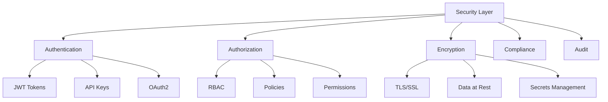

# Security

SYMindX implements comprehensive security measures to protect agent operations, user data, and system integrity. The security framework encompasses authentication, authorization, encryption, compliance, and audit capabilities to meet enterprise requirements.

## Architecture Overview



## Authentication

### JWT-Based Authentication
SYMindX uses JSON Web Tokens for secure session management:

```typescript
// JWT configuration
{
  "security": {
    "jwt": {
      "secret": process.env.JWT_SECRET,
      "algorithm": "HS256",
      "expiresIn": "24h",
      "refreshTokenExpiry": "7d",
      "issuer": "symindx",
      "audience": "symindx-agents"
    }
  }
}
```

**Implementation:**
```typescript
import { generateToken, verifyToken } from '@symindx/security';

// Generate tokens
const tokens = await generateToken({
  userId: user.id,
  roles: ['agent_operator', 'data_viewer'],
  permissions: ['agent:read', 'agent:control']
});

// Verify and decode
const payload = await verifyToken(token);
if (payload.exp < Date.now()) {
  throw new Error('Token expired');
}
```

### API Key Management
Secure API key generation and validation:

```typescript
// API key configuration
const apiKeyConfig = {
  length: 32,
  prefix: 'sk-symindx-',
  hash: 'sha256',
  rotation: {
    enabled: true,
    interval: '90d',
    overlap: '7d'
  }
};

// Generate API key
const apiKey = await createApiKey({
  name: 'Production Agent Key',
  scopes: ['agent:*', 'memory:read'],
  expiresAt: new Date('2024-12-31')
});
```

### OAuth2 Integration
Support for external identity providers:

```typescript
// OAuth2 configuration
{
  "oauth": {
    "providers": {
      "google": {
        "clientId": process.env.GOOGLE_CLIENT_ID,
        "clientSecret": process.env.GOOGLE_CLIENT_SECRET,
        "callbackUrl": "/auth/google/callback"
      },
      "github": {
        "clientId": process.env.GITHUB_CLIENT_ID,
        "clientSecret": process.env.GITHUB_CLIENT_SECRET,
        "scopes": ["user:email", "read:org"]
      }
    }
  }
}
```

## Authorization

### Role-Based Access Control (RBAC)
Fine-grained permission system with hierarchical roles:

```typescript
// Role definitions
const roles = {
  admin: {
    name: 'Administrator',
    permissions: ['*'],
    inherits: []
  },
  operator: {
    name: 'Agent Operator',
    permissions: [
      'agent:create', 'agent:read', 'agent:update', 'agent:control',
      'memory:read', 'extension:configure'
    ],
    inherits: ['viewer']
  },
  viewer: {
    name: 'Read-Only User',
    permissions: ['agent:read', 'memory:read', 'logs:read'],
    inherits: []
  }
};

// Permission check
if (!user.hasPermission('agent:delete')) {
  throw new ForbiddenError('Insufficient permissions');
}
```

### Policy-Based Authorization
Dynamic authorization policies:

```typescript
// Policy definition
const policies = [
  {
    name: 'agent-data-isolation',
    effect: 'deny',
    actions: ['memory:read', 'memory:write'],
    resources: ['agent:*'],
    conditions: {
      'agent.owner': { '$ne': '${user.id}' }
    }
  },
  {
    name: 'time-based-access',
    effect: 'allow',
    actions: ['*'],
    resources: ['*'],
    conditions: {
      'request.time': { 
        '$gte': '09:00',
        '$lte': '17:00'
      }
    }
  }
];
```

### Resource-Level Permissions
Granular access control for individual resources:

```typescript
// Resource permissions
const resourceAcl = {
  'agent:nyx-001': {
    owner: 'user-123',
    permissions: {
      'user-123': ['*'],
      'team-alpha': ['read', 'control'],
      'user-456': ['read']
    }
  }
};
```

## Encryption

### Data in Transit
All communications encrypted with TLS 1.3:

```typescript
// TLS configuration
{
  "tls": {
    "minVersion": "TLSv1.3",
    "ciphers": [
      "TLS_AES_256_GCM_SHA384",
      "TLS_CHACHA20_POLY1305_SHA256"
    ],
    "certificatePath": "/certs/server.crt",
    "keyPath": "/certs/server.key",
    "ca": "/certs/ca.crt"
  }
}
```

### Data at Rest
Encryption for stored data:

```typescript
// Encryption configuration
const encryption = {
  algorithm: 'aes-256-gcm',
  keyDerivation: 'pbkdf2',
  iterations: 100000,
  saltLength: 32,
  
  // Encrypt sensitive data
  async encrypt(data: string): Promise<EncryptedData> {
    const salt = crypto.randomBytes(this.saltLength);
    const key = await this.deriveKey(masterKey, salt);
    const iv = crypto.randomBytes(16);
    const cipher = crypto.createCipheriv(this.algorithm, key, iv);
    
    return {
      data: cipher.update(data, 'utf8', 'base64'),
      salt: salt.toString('base64'),
      iv: iv.toString('base64')
    };
  }
};
```

### Secrets Management
Secure handling of sensitive configuration:

```typescript
// Secrets manager integration
import { SecretsManager } from '@symindx/security';

const secrets = new SecretsManager({
  provider: 'vault',
  endpoint: process.env.VAULT_ADDR,
  token: process.env.VAULT_TOKEN,
  path: 'secret/symindx'
});

// Retrieve secrets
const apiKeys = await secrets.get('api-keys');
const dbPassword = await secrets.get('database/password');
```

## Compliance

### GDPR Compliance
Data protection and privacy features:

```typescript
// GDPR compliance tools
const gdpr = {
  // Data export
  async exportUserData(userId: string): Promise<UserData> {
    return {
      profile: await getProfile(userId),
      memories: await getMemories(userId),
      conversations: await getConversations(userId),
      metadata: await getMetadata(userId)
    };
  },
  
  // Right to erasure
  async deleteUserData(userId: string): Promise<void> {
    await deleteProfile(userId);
    await deleteMemories(userId);
    await deleteConversations(userId);
    await auditLog('user_data_deleted', { userId });
  },
  
  // Consent management
  async updateConsent(userId: string, consents: Consents) {
    await saveConsents(userId, {
      ...consents,
      timestamp: new Date(),
      ip: request.ip
    });
  }
};
```

### HIPAA Compliance
Healthcare data protection:

```typescript
// HIPAA safeguards
{
  "hipaa": {
    "encryption": {
      "enabled": true,
      "algorithm": "AES-256"
    },
    "accessControl": {
      "minimumPasswordLength": 12,
      "sessionTimeout": 900,
      "mfaRequired": true
    },
    "audit": {
      "enabled": true,
      "retention": "6 years",
      "includesPHI": false
    }
  }
}
```

### SOX Compliance
Financial data controls:

```typescript
// SOX controls
const soxControls = {
  changeManagement: {
    approvalRequired: true,
    segregationOfDuties: true,
    changeLog: true
  },
  
  accessReview: {
    frequency: 'quarterly',
    reviewers: ['security-team', 'compliance-team'],
    autoRevoke: true
  }
};
```

## Audit & Monitoring

### Comprehensive Audit Logging
Track all security-relevant events:

```typescript
// Audit logger
const auditLogger = new AuditLogger({
  storage: 'elasticsearch',
  index: 'symindx-audit',
  retention: '1 year',
  
  events: [
    'auth.login', 'auth.logout', 'auth.failed',
    'permission.granted', 'permission.denied',
    'data.access', 'data.modify', 'data.delete',
    'config.change', 'security.alert'
  ]
});

// Log security event
await auditLogger.log({
  event: 'data.access',
  user: userId,
  resource: 'agent:nyx-001:memories',
  action: 'read',
  result: 'success',
  metadata: {
    ip: request.ip,
    userAgent: request.headers['user-agent'],
    timestamp: new Date()
  }
});
```

### Security Monitoring
Real-time threat detection:

```typescript
// Security monitoring
const monitor = new SecurityMonitor({
  rules: [
    {
      name: 'brute-force-detection',
      condition: 'failed_logins > 5 in 5m',
      action: 'block_ip'
    },
    {
      name: 'privilege-escalation',
      condition: 'permission_denied > 10 in 1m',
      action: 'alert'
    },
    {
      name: 'data-exfiltration',
      condition: 'data_export > 1GB in 1h',
      action: 'throttle'
    }
  ]
});
```

## Best Practices

### Security Headers
Implement comprehensive security headers:

```typescript
app.use(helmet({
  contentSecurityPolicy: {
    directives: {
      defaultSrc: ["'self'"],
      scriptSrc: ["'self'", "'unsafe-inline'"],
      styleSrc: ["'self'", "'unsafe-inline'"],
      imgSrc: ["'self'", "data:", "https:"],
    }
  },
  hsts: {
    maxAge: 31536000,
    includeSubDomains: true,
    preload: true
  }
}));
```

### Input Validation
Strict validation for all inputs:

```typescript
const validator = {
  sanitize: (input: string) => {
    return input
      .replace(/<script\b[^<]*(?:(?!<\/script>)<[^<]*)*<\/script>/gi, '')
      .replace(/[^\w\s-.,!?]/g, '');
  },
  
  validate: (schema: Schema, data: any) => {
    const result = schema.validate(data);
    if (result.error) {
      throw new ValidationError(result.error.details);
    }
    return result.value;
  }
};
```

### Secure Defaults
Configuration with security in mind:

```typescript
const secureDefaults = {
  authentication: {
    required: true,
    mfaEnabled: false,
    sessionTimeout: 3600
  },
  encryption: {
    enabled: true,
    algorithm: 'aes-256-gcm'
  },
  audit: {
    enabled: true,
    level: 'info'
  },
  cors: {
    enabled: false,
    origins: []
  }
};
```

Security is not an afterthought in SYMindX—it's built into every layer of the system to ensure your AI agents operate safely and compliantly in any environment.
