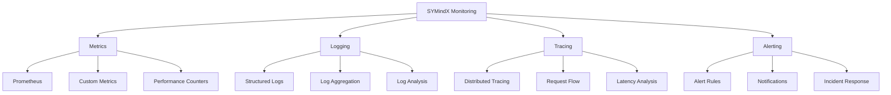

# Monitoring

SYMindX provides comprehensive monitoring and observability features to ensure reliable agent operations, track performance metrics, and maintain system health. The monitoring stack integrates with popular tools like Prometheus, Grafana, and ELK stack for complete visibility.

## Architecture Overview



## Metrics Collection

### Built-in Metrics
SYMindX exposes comprehensive metrics via Prometheus format:

```typescript
// Metrics configuration
{
  "monitoring": {
    "metrics": {
      "enabled": true,
      "port": 9090,
      "path": "/metrics",
      "defaultLabels": {
        "service": "symindx",
        "environment": "production"
      }
    }
  }
}
```

**Core Metrics:**
```typescript
// Agent metrics
symindx_agent_active_total{agent="nyx"} 1
symindx_agent_messages_processed_total{agent="nyx",status="success"} 1523
symindx_agent_response_time_seconds{agent="nyx",quantile="0.99"} 2.3
symindx_agent_memory_usage_bytes{agent="nyx"} 134217728

// Portal metrics
symindx_portal_requests_total{portal="openai",model="gpt-4"} 892
symindx_portal_tokens_used_total{portal="anthropic",type="input"} 45231
symindx_portal_latency_seconds{portal="groq",quantile="0.95"} 0.8
symindx_portal_errors_total{portal="openai",error="rate_limit"} 12

// Extension metrics
symindx_extension_active{extension="telegram"} 1
symindx_extension_events_processed{extension="slack",event="message"} 341
symindx_extension_queue_size{extension="api"} 23
```

### Custom Metrics
Define application-specific metrics:

```typescript
import { Counter, Histogram, Gauge, register } from 'prom-client';

// Define custom metrics
const conversationDuration = new Histogram({
  name: 'symindx_conversation_duration_seconds',
  help: 'Duration of agent conversations',
  labelNames: ['agent', 'channel'],
  buckets: [0.1, 0.5, 1, 2, 5, 10, 30, 60]
});

const activeConversations = new Gauge({
  name: 'symindx_active_conversations',
  help: 'Number of active conversations',
  labelNames: ['agent']
});

const memoryOperations = new Counter({
  name: 'symindx_memory_operations_total',
  help: 'Total memory operations',
  labelNames: ['operation', 'provider']
});

// Track metrics
conversationDuration.observe({ agent: 'nyx', channel: 'telegram' }, 23.5);
activeConversations.set({ agent: 'nyx' }, 3);
memoryOperations.inc({ operation: 'store', provider: 'sqlite' });
```

### Performance Monitoring
Track detailed performance metrics:

```typescript
// Performance tracker
class PerformanceMonitor {
  private metrics = new Map<string, Histogram>();
  
  track(operation: string, duration: number, labels?: Record<string, string>) {
    if (!this.metrics.has(operation)) {
      this.metrics.set(operation, new Histogram({
        name: `symindx_${operation}_duration_seconds`,
        help: `Duration of ${operation} operations`,
        labelNames: Object.keys(labels || {})
      }));
    }
    
    this.metrics.get(operation)!.observe(labels || {}, duration);
  }
  
  async measure<T>(operation: string, fn: () => Promise<T>, labels?: Record<string, string>): Promise<T> {
    const start = Date.now();
    try {
      const result = await fn();
      this.track(operation, (Date.now() - start) / 1000, { ...labels, status: 'success' });
      return result;
    } catch (error) {
      this.track(operation, (Date.now() - start) / 1000, { ...labels, status: 'error' });
      throw error;
    }
  }
}
```

## Logging

### Structured Logging
Implement comprehensive structured logging:

```typescript
import winston from 'winston';
import { ElasticsearchTransport } from 'winston-elasticsearch';

// Logger configuration
const logger = winston.createLogger({
  level: process.env.LOG_LEVEL || 'info',
  format: winston.format.combine(
    winston.format.timestamp(),
    winston.format.errors({ stack: true }),
    winston.format.json()
  ),
  defaultMeta: { 
    service: 'symindx',
    version: process.env.VERSION
  },
  transports: [
    // Console output
    new winston.transports.Console({
      format: winston.format.combine(
        winston.format.colorize(),
        winston.format.simple()
      )
    }),
    
    // File output
    new winston.transports.File({ 
      filename: 'error.log', 
      level: 'error' 
    }),
    new winston.transports.File({ 
      filename: 'combined.log' 
    }),
    
    // Elasticsearch
    new ElasticsearchTransport({
      level: 'info',
      clientOpts: { node: 'http://localhost:9200' },
      index: 'symindx-logs'
    })
  ]
});

// Contextual logging
logger.child({ agent: 'nyx', requestId: '123' }).info('Processing message', {
  channel: 'telegram',
  userId: 'user456',
  messageLength: 128
});
```

### Log Aggregation
Centralize logs with ELK stack:

```yaml
# logstash.conf
input {
  tcp {
    port => 5000
    codec => json
  }
}

filter {
  if [service] == "symindx" {
    mutate {
      add_field => { "[@metadata][target_index]" => "symindx-%{+YYYY.MM.dd}" }
    }
    
    if [level] == "error" {
      mutate {
        add_tag => [ "alert" ]
      }
    }
  }
}

output {
  elasticsearch {
    hosts => ["localhost:9200"]
    index => "%{[@metadata][target_index]}"
  }
}
```

### Agent Activity Logs
Track detailed agent activities:

```typescript
// Agent activity logger
class AgentActivityLogger {
  log(agent: Agent, activity: string, details: any) {
    logger.info('Agent activity', {
      agentId: agent.id,
      agentName: agent.name,
      activity,
      details,
      timestamp: new Date().toISOString(),
      context: {
        portal: agent.portal.name,
        memory: agent.memory.provider,
        extensions: agent.extensions.map(e => e.name)
      }
    });
  }
  
  logThought(agent: Agent, thought: string) {
    this.log(agent, 'thought', { thought });
  }
  
  logAction(agent: Agent, action: string, result: any) {
    this.log(agent, 'action', { action, result });
  }
  
  logConversation(agent: Agent, message: string, response: string) {
    this.log(agent, 'conversation', { 
      message, 
      response,
      tokenCount: this.countTokens(message + response)
    });
  }
}
```

## Distributed Tracing

### OpenTelemetry Integration
Trace requests across the system:

```typescript
import { NodeSDK } from '@opentelemetry/sdk-node';
import { getNodeAutoInstrumentations } from '@opentelemetry/auto-instrumentations-node';
import { JaegerExporter } from '@opentelemetry/exporter-jaeger';
import { Resource } from '@opentelemetry/resources';
import { SemanticResourceAttributes } from '@opentelemetry/semantic-conventions';

// Initialize tracing
const traceExporter = new JaegerExporter({
  endpoint: 'http://localhost:14268/api/traces',
});

const sdk = new NodeSDK({
  resource: new Resource({
    [SemanticResourceAttributes.SERVICE_NAME]: 'symindx',
    [SemanticResourceAttributes.SERVICE_VERSION]: process.env.VERSION,
  }),
  traceExporter,
  instrumentations: [
    getNodeAutoInstrumentations({
      '@opentelemetry/instrumentation-fs': {
        enabled: false,
      },
    }),
  ],
});

sdk.start();
```

### Custom Spans
Create detailed traces for agent operations:

```typescript
import { trace } from '@opentelemetry/api';

const tracer = trace.getTracer('symindx');

// Trace agent processing
async function processAgentMessage(agent: Agent, message: string) {
  const span = tracer.startSpan('agent.process_message', {
    attributes: {
      'agent.id': agent.id,
      'agent.name': agent.name,
      'message.length': message.length
    }
  });
  
  try {
    // Memory retrieval
    const memorySpan = tracer.startSpan('memory.retrieve', { parent: span });
    const memories = await agent.memory.retrieve(message);
    memorySpan.setAttribute('memory.count', memories.length);
    memorySpan.end();
    
    // Portal processing
    const portalSpan = tracer.startSpan('portal.generate', { parent: span });
    const response = await agent.portal.generate(message, memories);
    portalSpan.setAttribute('portal.name', agent.portal.name);
    portalSpan.setAttribute('portal.tokens', response.tokens);
    portalSpan.end();
    
    span.setStatus({ code: 1 });
    return response;
  } catch (error) {
    span.recordException(error);
    span.setStatus({ code: 2, message: error.message });
    throw error;
  } finally {
    span.end();
  }
}
```

## Alerting

### Alert Configuration
Define comprehensive alert rules:

```yaml
# prometheus-alerts.yml
groups:
  - name: symindx_alerts
    interval: 30s
    rules:
      # Agent health
      - alert: AgentDown
        expr: symindx_agent_active_total == 0
        for: 5m
        labels:
          severity: critical
        annotations:
          summary: "Agent {{ $labels.agent }} is down"
          description: "Agent has been inactive for more than 5 minutes"
      
      # High error rate
      - alert: HighErrorRate
        expr: rate(symindx_agent_errors_total[5m]) > 0.1
        for: 5m
        labels:
          severity: warning
        annotations:
          summary: "High error rate for agent {{ $labels.agent }}"
          description: "Error rate is {{ $value }} errors per second"
      
      # Portal issues
      - alert: PortalRateLimited
        expr: increase(symindx_portal_errors_total{error="rate_limit"}[5m]) > 5
        labels:
          severity: warning
        annotations:
          summary: "Portal {{ $labels.portal }} is being rate limited"
      
      # Performance degradation
      - alert: SlowResponseTime
        expr: histogram_quantile(0.95, symindx_agent_response_time_seconds) > 5
        for: 10m
        labels:
          severity: warning
        annotations:
          summary: "Slow response times detected"
          description: "95th percentile response time is {{ $value }} seconds"
      
      # Resource usage
      - alert: HighMemoryUsage
        expr: symindx_agent_memory_usage_bytes > 1073741824  # 1GB
        for: 10m
        labels:
          severity: warning
        annotations:
          summary: "High memory usage for agent {{ $labels.agent }}"
```

### Notification Channels
Configure alert notifications:

```typescript
// Alert manager configuration
{
  "alerting": {
    "channels": {
      "slack": {
        "webhook": process.env.SLACK_WEBHOOK,
        "channel": "#symindx-alerts",
        "username": "SYMindX Monitor"
      },
      "email": {
        "smtp": {
          "host": "smtp.gmail.com",
          "port": 587,
          "auth": {
            "user": process.env.SMTP_USER,
            "pass": process.env.SMTP_PASS
          }
        },
        "recipients": ["ops@example.com"]
      },
      "pagerduty": {
        "serviceKey": process.env.PAGERDUTY_KEY,
        "severity": "critical"
      }
    },
    "routes": [
      {
        "match": { "severity": "critical" },
        "channels": ["pagerduty", "slack", "email"]
      },
      {
        "match": { "severity": "warning" },
        "channels": ["slack", "email"]
      }
    ]
  }
}
```

## Dashboards

### Grafana Dashboard
Comprehensive monitoring dashboard configuration:

```json
{
  "dashboard": {
    "title": "SYMindX Monitoring",
    "panels": [
      {
        "title": "Active Agents",
        "targets": [{
          "expr": "sum(symindx_agent_active_total)"
        }],
        "type": "stat"
      },
      {
        "title": "Message Processing Rate",
        "targets": [{
          "expr": "sum(rate(symindx_agent_messages_processed_total[5m]))"
        }],
        "type": "graph"
      },
      {
        "title": "Response Time Distribution",
        "targets": [{
          "expr": "histogram_quantile(0.99, symindx_agent_response_time_seconds)"
        }],
        "type": "heatmap"
      },
      {
        "title": "Portal Token Usage",
        "targets": [{
          "expr": "sum by (portal) (rate(symindx_portal_tokens_used_total[1h]))"
        }],
        "type": "piechart"
      },
      {
        "title": "Error Rate by Agent",
        "targets": [{
          "expr": "sum by (agent) (rate(symindx_agent_errors_total[5m]))"
        }],
        "type": "bargraph"
      }
    ]
  }
}
```

### Real-time Monitoring
Live agent status dashboard:

```typescript
// WebSocket real-time metrics
class RealtimeMonitor {
  private ws: WebSocketServer;
  private metrics: Map<string, any> = new Map();
  
  constructor(port: number) {
    this.ws = new WebSocketServer({ port });
    this.setupMetricsCollection();
  }
  
  private setupMetricsCollection() {
    setInterval(async () => {
      const metrics = {
        timestamp: Date.now(),
        agents: await this.getAgentMetrics(),
        system: await this.getSystemMetrics(),
        portals: await this.getPortalMetrics()
      };
      
      this.broadcast(metrics);
    }, 1000);
  }
  
  private broadcast(data: any) {
    this.ws.clients.forEach(client => {
      if (client.readyState === WebSocket.OPEN) {
        client.send(JSON.stringify(data));
      }
    });
  }
}
```

## Health Checks

### Comprehensive Health Monitoring
Multi-level health check system:

```typescript
// Health check implementation
class HealthMonitor {
  async checkHealth(): Promise<HealthStatus> {
    const checks = await Promise.allSettled([
      this.checkAgents(),
      this.checkDatabase(),
      this.checkPortals(),
      this.checkExtensions(),
      this.checkSystem()
    ]);
    
    const results = checks.map((check, index) => ({
      component: ['agents', 'database', 'portals', 'extensions', 'system'][index],
      status: check.status === 'fulfilled' ? check.value : 'unhealthy',
      error: check.status === 'rejected' ? check.reason : undefined
    }));
    
    return {
      status: results.every(r => r.status === 'healthy') ? 'healthy' : 'degraded',
      timestamp: new Date().toISOString(),
      checks: results,
      version: process.env.VERSION
    };
  }
}
```

### Automated Recovery
Self-healing capabilities:

```typescript
// Auto-recovery system
class AutoRecovery {
  async monitor() {
    const health = await healthMonitor.checkHealth();
    
    for (const check of health.checks) {
      if (check.status !== 'healthy') {
        await this.attemptRecovery(check.component, check.error);
      }
    }
  }
  
  private async attemptRecovery(component: string, error: Error) {
    logger.warn(`Attempting recovery for ${component}`, { error });
    
    switch (component) {
      case 'agents':
        await this.restartAgents();
        break;
      case 'database':
        await this.reconnectDatabase();
        break;
      case 'portals':
        await this.rotatePortals();
        break;
    }
  }
}
```

Comprehensive monitoring ensures SYMindX operates reliably at scale, providing deep insights into agent behavior, system performance, and potential issues before they impact users.
