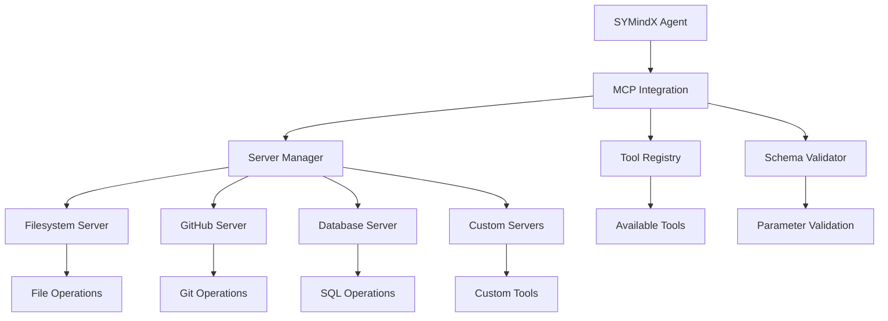

# Model Context Protocol (MCP) Integration

The Model Context Protocol (MCP) integration provides dynamic tool discovery and execution capabilities to SYMindX agents. MCP allows agents to discover and use tools from external servers at runtime, enabling powerful integrations with file systems, databases, APIs, and custom services.

## Overview

- **Protocol**: Model Context Protocol (MCP)
- **Dynamic Tools**: Discover tools at runtime from MCP servers
- **Server Management**: Add/remove MCP servers dynamically
- **Auto-Reconnection**: Maintain persistent connections
- **Schema Validation**: Automatic parameter validation

## Architecture



## Configuration

### Basic Setup

```typescript
import { mcpIntegration } from '@symindx/core';

// Add MCP servers during initialization
await mcpIntegration.addServer({
  name: 'filesystem',
  command: 'npx',
  args: ['@modelcontextprotocol/server-filesystem', '/path/to/workspace'],
  autoReconnect: true
});

// Tools are automatically available to all portals
const tools = mcpIntegration.getAvailableTools();
console.log('Discovered tools:', Array.from(tools.keys()));
```

### Advanced Configuration

```typescript
// Configure multiple MCP servers
const mcpConfig = {
  servers: [
    {
      name: 'filesystem',
      command: 'npx',
      args: ['@modelcontextprotocol/server-filesystem', '/workspace'],
      env: {},
      autoReconnect: true,
      reconnectDelay: 5000,
      maxReconnectAttempts: 3
    },
    {
      name: 'github',
      command: 'npx', 
      args: ['@modelcontextprotocol/server-github'],
      env: {
        GITHUB_TOKEN: process.env.GITHUB_TOKEN
      },
      autoReconnect: true
    },
    {
      name: 'database',
      command: 'node',
      args: ['/path/to/custom-db-server.js'],
      env: {
        DATABASE_URL: process.env.DATABASE_URL
      },
      autoReconnect: true,
      timeout: 30000
    }
  ],
  
  // Global settings
  defaultTimeout: 30000,
  enableLogging: true,
  toolPrefix: 'mcp_'
};

// Initialize with configuration
await mcpIntegration.initialize(mcpConfig);
```

## Available MCP Servers

### Filesystem Server

Access and manipulate files and directories.

```bash
# Install filesystem MCP server
npm install -g @modelcontextprotocol/server-filesystem
```

```typescript
// Add filesystem server
await mcpIntegration.addServer({
  name: 'filesystem',
  command: 'npx',
  args: ['@modelcontextprotocol/server-filesystem', '/workspace/project'],
  autoReconnect: true
});
```

**Available Tools:**
- `read_file` - Read file contents
- `write_file` - Write to files
- `list_directory` - List directory contents
- `create_directory` - Create directories
- `move_file` - Move/rename files
- `delete_file` - Delete files
- `search_files` - Search for files by pattern

**Example Usage:**
```typescript
// Read a configuration file
const configContent = await agent.useTool('read_file', {
  path: '/workspace/config.json'
});

// Write updated configuration
await agent.useTool('write_file', {
  path: '/workspace/config.json',
  content: JSON.stringify(newConfig, null, 2)
});
```

### GitHub Server

Interact with GitHub repositories, issues, and pull requests.

```bash
# Install GitHub MCP server
npm install -g @modelcontextprotocol/server-github
```

```typescript
// Add GitHub server with authentication
await mcpIntegration.addServer({
  name: 'github',
  command: 'npx',
  args: ['@modelcontextprotocol/server-github'],
  env: {
    GITHUB_TOKEN: process.env.GITHUB_TOKEN
  },
  autoReconnect: true
});
```

**Available Tools:**
- `create_repository` - Create new repositories
- `get_repository` - Get repository information
- `list_issues` - List repository issues
- `create_issue` - Create new issues
- `get_issue` - Get issue details
- `create_pull_request` - Create pull requests
- `list_commits` - List commit history
- `get_file_contents` - Read repository files

**Example Usage:**
```typescript
// Create a new issue
await agent.useTool('create_issue', {
  owner: 'username',
  repo: 'project',
  title: 'Bug: Application crashes on startup',
  body: 'Detailed description of the bug...',
  labels: ['bug', 'high-priority']
});

// Get repository information
const repoInfo = await agent.useTool('get_repository', {
  owner: 'username',
  repo: 'project'
});
```

### Database Server

Execute SQL queries and interact with databases.

```typescript
// Custom database MCP server
await mcpIntegration.addServer({
  name: 'database',
  command: 'node',
  args: ['/path/to/db-server.js'],
  env: {
    DATABASE_URL: process.env.DATABASE_URL,
    DB_TYPE: 'postgresql'
  },
  autoReconnect: true
});
```

**Available Tools:**
- `execute_query` - Execute SQL queries
- `get_schema` - Get database schema
- `list_tables` - List database tables
- `describe_table` - Get table structure
- `create_table` - Create new tables
- `insert_data` - Insert data into tables

**Example Usage:**
```typescript
// Query user data
const users = await agent.useTool('execute_query', {
  query: 'SELECT * FROM users WHERE active = true LIMIT 10',
  parameters: []
});

// Get table schema
const schema = await agent.useTool('describe_table', {
  table: 'users'
});
```

### Web Server

Interact with web APIs and scrape web content.

```typescript
// Add web interaction server
await mcpIntegration.addServer({
  name: 'web',
  command: 'npx',
  args: ['@modelcontextprotocol/server-web'],
  env: {
    USER_AGENT: 'SYMindX-Agent/1.0'
  },
  autoReconnect: true
});
```

**Available Tools:**
- `fetch_url` - Fetch web page content
- `post_request` - Make HTTP POST requests
- `extract_text` - Extract text from HTML
- `get_links` - Extract links from pages
- `search_web` - Search the web
- `scrape_data` - Structured data extraction

## Agent Integration

### Automatic Tool Discovery

```typescript
// Agents automatically discover MCP tools
const agent = createAgent('nyx', {
  character: characterConfig,
  portals: portalConfig,
  
  // MCP tools are automatically available
  enableMCPTools: true,
  
  // Optional: filter available tools
  mcpToolFilter: (toolName) => {
    // Only allow read operations
    return toolName.startsWith('read_') || toolName.startsWith('list_');
  }
});

// Agent can now use MCP tools
const response = await agent.processMessage(
  'Read the contents of the README.md file in the workspace'
);
```

### Portal Integration

```typescript
// MCP tools are available to all portals
const portal = createPortal('openai', {
  apiKey: process.env.OPENAI_API_KEY,
  model: 'gpt-4o',
  
  // MCP tools automatically added
  enableMCPTools: true
});

// Portal can use MCP tools in function calling
const response = await portal.generateChat([
  {
    role: 'user',
    content: 'List all TypeScript files in the src directory'
  }
]);
```

## Dynamic Tool Management

### Runtime Tool Discovery

```typescript
// Get all available tools
const allTools = mcpIntegration.getAvailableTools();
console.log('Available tools:', Array.from(allTools.keys()));

// Get tools from specific server
const filesystemTools = mcpIntegration.getToolsByServer('filesystem');
console.log('Filesystem tools:', filesystemTools);

// Check if specific tool is available
if (mcpIntegration.hasTools('read_file')) {
  const content = await agent.useTool('read_file', { path: '/config.json' });
}
```

### Server Management

```typescript
// Add server at runtime
await mcpIntegration.addServer({
  name: 'new-service',
  command: 'node',
  args: ['/path/to/service.js'],
  autoReconnect: true
});

// Remove server
await mcpIntegration.removeServer('old-service');

// List active servers
const servers = mcpIntegration.getActiveServers();
console.log('Active servers:', servers);

// Check server status
const status = mcpIntegration.getServerStatus('filesystem');
console.log('Server status:', status);
```

## Best Practices

### Security Considerations

1. **Server Validation**: Validate MCP servers before adding them
2. **Tool Access Control**: Implement permissions for tool access
3. **Environment Isolation**: Use environment variables for sensitive data
4. **Resource Limits**: Configure appropriate timeouts and limits

### Performance Optimization

1. **Connection Pooling**: Maintain persistent connections to servers
2. **Batch Operations**: Use batch execution for multiple operations
3. **Caching**: Cache tool schemas and results when appropriate
4. **Async Execution**: Use asynchronous execution for better performance

### Error Handling

1. **Graceful Degradation**: Provide fallbacks when MCP tools are unavailable
2. **Retry Logic**: Implement retry mechanisms for transient failures
3. **Monitoring**: Track tool usage and server health
4. **Logging**: Maintain detailed logs for debugging

## Next Steps

- Explore [Portal Integration](../../portals/) for AI provider integration
- Learn about [Agent Configuration](../../agents/configuration/) for agent setup
- Check [API Integration](./api-integration) for programmatic MCP usage
- See [Security Best Practices](../../security/) for secure deployments
