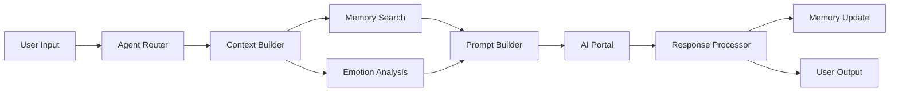

# Architecture

System architecture and design patterns

## Overview

SYMindX is built on a clean, modular architecture that emphasizes separation of concerns, extensibility, and scalability. This section provides a comprehensive overview of the system design, architectural patterns, and the principles that guide SYMindX development.

## Core Architecture Principles

### 1. Modularity
Every component in SYMindX is designed as an independent, swappable module:

```typescript
// Example: Swappable memory providers
const sqliteMemory = createMemoryProvider('sqlite', config);
const supabaseMemory = createMemoryProvider('supabase', config);
const neonMemory = createMemoryProvider('neon', config);

// All implement the same interface
interface MemoryProvider {
  initialize(config: MemoryConfig): Promise<void>;
  save(record: MemoryRecord): Promise<void>;
  search(query: SearchQuery): Promise<MemoryRecord[]>;
  delete(id: string): Promise<void>;
}
```

### 2. Event-Driven Design
Components communicate through events, enabling loose coupling:

```typescript
// Event-driven agent lifecycle
agent.on('thought-start', (context) => logger.debug('Thinking...'));
agent.on('memory-accessed', (memories) => cache.update(memories));
agent.on('emotion-change', (state) => ui.updateMoodIndicator(state));
agent.on('error', (error) => errorHandler.process(error));
```

### 3. Async-First
All operations are asynchronous by default for optimal performance:

```typescript
// Async operations throughout
async function processUserMessage(message: string) {
  const memories = await agent.memory.search(message);
  const context = await agent.buildContext(memories);
  const response = await agent.think(message, context);
  await agent.memory.save({ role: 'user', content: message });
  await agent.memory.save({ role: 'assistant', content: response });
  return response;
}
```

## System Layers

### Layer 1: Core Runtime

The foundation that manages agent lifecycle and coordination:

```typescript
export class Runtime {
  private agents: Map<string, Agent> = new Map();
  private registry: ModuleRegistry;
  private eventBus: EventBus;
  private tickTimer?: NodeJS.Timeout;
  
  async initialize(config: RuntimeConfig) {
    // Load configuration
    this.config = await this.loadConfig(config);
    
    // Initialize module registry
    this.registry = new ModuleRegistry();
    await this.registerCoreModules();
    
    // Set up event bus
    this.eventBus = new EnhancedEventBus();
    
    // Load agents
    await this.loadAgents();
    
    // Start tick loop
    this.startTickLoop();
  }
  
  private async tick() {
    const deltaTime = this.calculateDeltaTime();
    
    // Update all agents
    await Promise.all(
      Array.from(this.agents.values()).map(agent => 
        agent.tick(deltaTime).catch(this.handleAgentError)
      )
    );
    
    // Emit runtime metrics
    this.eventBus.emit('runtime:tick', {
      agents: this.agents.size,
      deltaTime,
      memory: process.memoryUsage()
    });
  }
}
```

### Layer 2: Agent Core

Individual agent architecture with pluggable modules:

```typescript
export class Agent {
  // Core properties
  id: string;
  name: string;
  personality: Personality;
  
  // Pluggable modules
  memory?: MemoryProvider;
  emotion?: EmotionModule;
  cognition?: CognitionModule;
  portal?: Portal;
  
  // Extensions
  extensions: Extension[] = [];
  
  // State management
  private state: AgentState;
  private eventEmitter: EventEmitter;
  
  async think(input: string, context?: Context): Promise<string> {
    // Pre-processing
    await this.eventEmitter.emit('think:start', { input, context });
    
    // Memory retrieval
    const memories = await this.memory?.search({
      query: input,
      limit: 10,
      threshold: 0.7
    });
    
    // Emotional processing
    const emotionalContext = await this.emotion?.process(input);
    
    // Cognitive planning
    const plan = await this.cognition?.plan(input, memories);
    
    // Generate response
    const prompt = this.buildPrompt(input, memories, emotionalContext, plan);
    const response = await this.portal?.generateText(prompt);
    
    // Post-processing
    await this.eventEmitter.emit('think:complete', { input, response });
    
    return response;
  }
}
```

### Layer 3: Module System

Standardized interfaces for all modules:

```typescript
// Base module interface
interface Module {
  name: string;
  version: string;
  initialize(config: any): Promise<void>;
  shutdown(): Promise<void>;
}

// Specialized module interfaces
interface MemoryProvider extends Module {
  save(record: MemoryRecord): Promise<void>;
  search(query: SearchQuery): Promise<MemoryRecord[]>;
  delete(id: string): Promise<void>;
  getStats(): Promise<MemoryStats>;
}

interface EmotionModule extends Module {
  updateState(input: EmotionInput): Promise<void>;
  getState(): EmotionState;
  process(context: any): Promise<EmotionalContext>;
}

interface CognitionModule extends Module {
  plan(goal: string, context: any): Promise<Plan>;
  reason(premise: string[], context: any): Promise<Conclusion>;
  decide(options: Option[], context: any): Promise<Decision>;
}
```

### Layer 4: Extension System

Plugins that add capabilities to agents:

```typescript
export interface Extension {
  name: string;
  version: string;
  
  // Lifecycle hooks
  init(context: ExtensionContext): Promise<void>;
  tick?(deltaTime: number): Promise<void>;
  shutdown?(): Promise<void>;
  
  // Optional capabilities
  skills?: Skill[];
  tools?: Tool[];
  commands?: Command[];
}

// Extension context provides access to agent
interface ExtensionContext {
  agent: Agent;
  config: any;
  events: EventEmitter;
  logger: Logger;
}
```

## Data Flow Architecture

### Request Processing Pipeline



### Memory Architecture

Hierarchical memory system with multiple backends:

```typescript
class MemoryArchitecture {
  // L1: Working memory (in-process cache)
  private workingMemory: LRUCache<string, MemoryRecord>;
  
  // L2: Recent memory (Redis)
  private recentMemory: RedisClient;
  
  // L3: Long-term memory (PostgreSQL/SQLite)
  private longTermMemory: DatabaseClient;
  
  // L4: Archived memory (S3/Cloud Storage)
  private archiveMemory: CloudStorage;
  
  async search(query: SearchQuery): Promise<MemoryRecord[]> {
    // Search in order of recency
    const results: MemoryRecord[] = [];
    
    // Check working memory
    const cached = this.searchWorkingMemory(query);
    if (cached.length > 0) results.push(...cached);
    
    // Check recent memory if needed
    if (results.length < query.limit) {
      const recent = await this.searchRecentMemory(query);
      results.push(...recent);
    }
    
    // Fall back to long-term memory
    if (results.length < query.limit) {
      const longTerm = await this.searchLongTermMemory(query);
      results.push(...longTerm);
    }
    
    return this.rankResults(results, query);
  }
}
```

## Scalability Patterns

### Horizontal Scaling

Distribute agents across multiple processes/machines:

```typescript
export class DistributedRuntime extends Runtime {
  private coordinator: Coordinator;
  private workers: Worker[] = [];
  
  async scaleOut(numWorkers: number) {
    for (let i = 0; i < numWorkers; i++) {
      const worker = await this.spawnWorker();
      this.workers.push(worker);
    }
    
    // Redistribute agents
    await this.coordinator.rebalance(this.agents, this.workers);
  }
  
  private async spawnWorker(): Promise<Worker> {
    if (this.config.mode === 'cluster') {
      return cluster.fork();
    } else if (this.config.mode === 'kubernetes') {
      return this.k8sClient.createPod(this.workerSpec);
    } else {
      return new Worker('./worker.js');
    }
  }
}
```

### Vertical Scaling

Optimize single-instance performance:

```typescript
class PerformanceOptimizedAgent extends Agent {
  // Parallel processing
  async processMultipleInputs(inputs: string[]) {
    return Promise.all(
      inputs.map(input => this.think(input))
    );
  }
  
  // Batch operations
  async batchMemoryOperations(operations: MemoryOperation[]) {
    const batches = chunk(operations, 100);
    
    for (const batch of batches) {
      await this.memory.batchExecute(batch);
    }
  }
  
  // Resource pooling
  private portalPool = new PortalPool({
    min: 2,
    max: 10,
    idleTimeout: 30000
  });
}
```

## Security Architecture

### Defense in Depth

Multiple security layers:

```typescript
class SecureRuntime extends Runtime {
  // Layer 1: Authentication
  private authenticator: Authenticator;
  
  // Layer 2: Authorization
  private authorizer: Authorizer;
  
  // Layer 3: Encryption
  private encryptor: Encryptor;
  
  // Layer 4: Audit logging
  private auditor: Auditor;
  
  async handleRequest(request: Request): Promise<Response> {
    // Authenticate
    const identity = await this.authenticator.verify(request.token);
    
    // Authorize
    if (!await this.authorizer.canAccess(identity, request.resource)) {
      throw new ForbiddenError();
    }
    
    // Decrypt if needed
    if (request.encrypted) {
      request.data = await this.encryptor.decrypt(request.data);
    }
    
    // Process request
    const response = await this.processRequest(request);
    
    // Audit
    await this.auditor.log({
      identity,
      action: request.action,
      resource: request.resource,
      timestamp: Date.now()
    });
    
    return response;
  }
}
```

## Design Patterns

### Factory Pattern
Used throughout for module creation:

```typescript
export function createMemoryProvider(
  type: string, 
  config: any
): MemoryProvider {
  switch (type) {
    case 'sqlite':
      return new SQLiteMemoryProvider(config);
    case 'supabase':
      return new SupabaseMemoryProvider(config);
    case 'neon':
      return new NeonMemoryProvider(config);
    default:
      throw new Error(`Unknown memory provider: ${type}`);
  }
}
```

### Observer Pattern
For event-driven communication:

```typescript
class ObservableAgent extends Agent {
  private observers: Set<Observer> = new Set();
  
  attach(observer: Observer) {
    this.observers.add(observer);
  }
  
  detach(observer: Observer) {
    this.observers.delete(observer);
  }
  
  private notify(event: AgentEvent) {
    for (const observer of this.observers) {
      observer.update(this, event);
    }
  }
}
```

### Strategy Pattern
For swappable algorithms:

```typescript
interface ResponseStrategy {
  generateResponse(context: Context): Promise<string>;
}

class CreativeStrategy implements ResponseStrategy {
  async generateResponse(context: Context) {
    return portal.generateText(context.prompt, {
      temperature: 0.9,
      topP: 0.95
    });
  }
}

class PreciseStrategy implements ResponseStrategy {
  async generateResponse(context: Context) {
    return portal.generateText(context.prompt, {
      temperature: 0.3,
      topP: 0.9
    });
  }
}
```

## Next Steps

- Explore [Data Flow](./data-flow) architecture in detail
- Learn about [Scalability](./scalability) patterns
- Review [Design Patterns](./patterns) used in SYMindX
- Study [Security Architecture](../security) implementation
