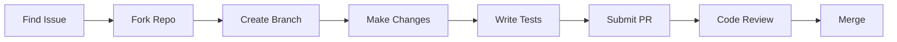

# Community

Community resources and support

## Overview

Welcome to the SYMindX community! We're a vibrant ecosystem of developers, researchers, and AI enthusiasts building the future of AI agents. Whether you're seeking help, sharing knowledge, or contributing code, you'll find a welcoming space here.

## Join Our Community

### Discord Server

Our primary community hub with 5,000+ members:

🔗 **[Join SYMindX Discord](https://discord.gg/symindx)**

**Channels:**
- `#general` - General discussion and announcements
- `#help` - Get support from community members
- `#showcase` - Share your projects and agents
- `#development` - Core development discussions
- `#research` - AI research and papers
- `#job-board` - AI/ML job opportunities

**Community Guidelines:**
1. Be respectful and inclusive
2. Help others when you can
3. Share knowledge freely
4. No spam or self-promotion without permission
5. Keep discussions on-topic

### GitHub Discussions

For longer-form conversations and proposals:

🔗 **[GitHub Discussions](https://github.com/symbaiex/symindx/discussions)**

**Categories:**
- **Ideas** - Propose new features or improvements
- **Q&A** - Ask and answer questions
- **Show and Tell** - Share your projects
- **General** - Community announcements and discussions

### Community Forums

Traditional forum for in-depth discussions:

🔗 **[SYMindX Forums](https://forums.symindx.com)**

**Popular Topics:**
- Agent Architecture Patterns
- Performance Optimization Tips
- Production Deployment Stories
- Research Papers Discussion
- Tutorial Requests

## Contributing

### Ways to Contribute

**Code Contributions:**
- Fix bugs and implement features
- Improve documentation
- Add tests and examples
- Optimize performance

**Non-Code Contributions:**
- Write tutorials and blog posts
- Create video content
- Answer questions in Discord
- Report bugs and suggest features
- Translate documentation

### Getting Started

1. **Read the Contributing Guide**
   ```bash
   # In the repository
   cat CONTRIBUTING.md
   ```

2. **Find Good First Issues**
   - [Good First Issues](https://github.com/symbaiex/symindx/labels/good%20first%20issue)
   - [Help Wanted](https://github.com/symbaiex/symindx/labels/help%20wanted)

3. **Set Up Development Environment**
   ```bash
   git clone https://github.com/symbaiex/symindx.git
   cd symindx
   bun install
   bun test
   ```

### Contribution Process



### Recognition

We recognize contributors through:
- **Contributors Page** - Listed in documentation
- **Discord Roles** - Special contributor badges
- **Swag** - T-shirts and stickers for significant contributions
- **Conference Tickets** - For top contributors

## Community Projects

### Featured Projects

**🤖 AgentVerse**
Multi-agent simulation platform built with SYMindX
- 1,000+ stars on GitHub
- Used by 50+ universities
- [View Project](https://github.com/community/agentverse)

**🎮 NPCMind**
Game NPC framework using SYMindX agents
- Powers 10+ indie games
- Dynamic personality system
- [View Project](https://github.com/community/npcmind)

**📚 EduAgent**
Educational assistant for personalized learning
- Adaptive curriculum generation
- Multi-modal content support
- [View Project](https://github.com/community/eduagent)

### Submit Your Project

Share your SYMindX project with the community:

1. Add topic `symindx` to your GitHub repo
2. Create a showcase post in Discord
3. Submit to our [Project Gallery](https://symindx.com/gallery)

## Learning Resources

### Community Tutorials

**Video Tutorials:**
- [SYMindX Crash Course](https://youtube.com/symindx-crash-course) (2hrs)
- [Building Your First Agent](https://youtube.com/first-agent) (30min)
- [Advanced Agent Patterns](https://youtube.com/advanced-patterns) (1hr)

**Written Guides:**
- [The Complete SYMindX Guide](https://blog.symindx.com/complete-guide)
- [Production Best Practices](https://blog.symindx.com/production)
- [Multi-Agent Systems Tutorial](https://blog.symindx.com/multi-agent)

### Community Blog

Read insights from community members:

🔗 **[blog.symindx.com](https://blog.symindx.com)**

**Recent Posts:**
- "Scaling to 1M Agents: Lessons Learned"
- "Building Emotional Intelligence in AI"
- "SYMindX vs LangChain: A Comparison"
- "Real-time Agent Collaboration Patterns"

### Research Papers

Academic papers using SYMindX:

1. **"Emergent Behaviors in Multi-Agent Systems"** (2024)
   - MIT AI Lab
   - [arXiv:2024.12345](https://arxiv.org/abs/2024.12345)

2. **"Emotional Modeling for Conversational AI"** (2024)
   - Stanford NLP Group
   - [Paper](https://papers.symindx.com/emotional-modeling)

## Events

### Upcoming Events

**SYMindX Conference 2024**
- 📅 September 15-17, 2024
- 📍 San Francisco, CA
- 🎟️ [Register](https://conf.symindx.com)

**Monthly Meetups:**
- 🌐 Virtual Agent Builders Meetup (First Tuesday)
- 🏙️ Local Meetups in 20+ cities
- 📅 [View Calendar](https://events.symindx.com)

### Hackathons

**Agent Hackathon Series:**
- Quarterly online hackathons
- $10,000 in prizes
- Categories: Gaming, Education, Enterprise, Creative
- [Learn More](https://hackathon.symindx.com)

## Community Stats

```javascript
{
  "discord_members": 5234,
  "github_stars": 12453,
  "contributors": 287,
  "total_agents_created": 150000,
  "countries_represented": 67,
  "languages_supported": 12
}
```

## Code of Conduct

We follow the [Contributor Covenant Code of Conduct](https://www.contributor-covenant.org/):

- **Be Respectful**: Treat everyone with respect
- **Be Inclusive**: Welcome people of all backgrounds
- **Be Collaborative**: Work together positively
- **Be Professional**: Keep discussions constructive

Report violations to: conduct@symindx.com

## Get Involved

### Daily Activities

- **Answer Questions**: Help others in #help channel
- **Share Knowledge**: Post tips in #til (Today I Learned)
- **Review PRs**: Help review pull requests
- **Test Features**: Try new releases and report issues

### Weekly Activities

- **Office Hours**: Tuesdays 2pm PST with core team
- **Show & Tell**: Fridays 3pm PST project demos
- **Paper Club**: Wednesdays 4pm PST research discussions

### Special Programs

**🌟 Champions Program**
Recognize active community members
- Monthly recognition
- Direct access to core team
- Early access to features
- [Apply Here](https://symindx.com/champions)

**🎓 Student Program**
Support for students and researchers
- Free credits for AI portals
- Mentorship opportunities
- Research collaboration
- [Learn More](https://symindx.com/students)

## Stay Updated

### Newsletter

Weekly updates on SYMindX development:

📧 **[Subscribe](https://symindx.com/newsletter)**

### Social Media

- **Twitter/X**: [@symindx](https://twitter.com/symindx)
- **LinkedIn**: [SYMindX](https://linkedin.com/company/symindx)
- **YouTube**: [SYMindX Channel](https://youtube.com/symindx)
- **Reddit**: [r/symindx](https://reddit.com/r/symindx)

## Next Steps

- Join our [Discord](https://discord.gg/symindx) server
- Check out [Community Projects](./showcase)
- Read [Contributing Guidelines](./contributors)
- Explore [Learning Resources](#learning-resources)

Welcome to the SYMindX community – we're excited to build the future of AI agents together!
