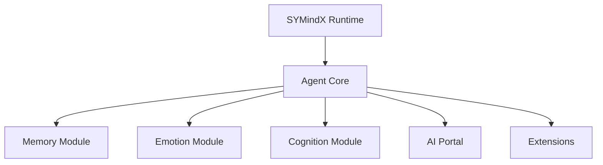

# Resources

Additional resources and references

## Overview

A comprehensive collection of resources to help you master SYMindX, stay updated with AI agent development, and connect with the broader ecosystem. From learning materials to development tools, find everything you need in one place.

## Learning Resources

### Official Resources

**📖 Documentation**
- [Official Docs](https://docs.symindx.com) - Comprehensive guides
- [API Reference](https://api.symindx.com) - Detailed API documentation
- [Examples Repository](https://github.com/symindx/examples) - Working code examples
- [Playground](https://playground.symindx.com) - Interactive online editor

**🎥 Video Content**
- [YouTube Channel](https://youtube.com/symindx) - Official tutorials
- [Getting Started Playlist](https://youtube.com/playlist?list=PLx...) - Beginner series
- [Advanced Techniques](https://youtube.com/playlist?list=PLy...) - Deep dives
- [Community Talks](https://youtube.com/playlist?list=PLz...) - Conference presentations

**📚 Books & Guides**
- [SYMindX Handbook](https://handbook.symindx.com) - Free online book
- [Agent Development Guide](https://symindx.com/guide.pdf) - PDF download
- [Best Practices Cookbook](https://cookbook.symindx.com) - Recipes and patterns

### Community Resources

**Tutorials & Articles**
- [Dev.to SYMindX Tag](https://dev.to/t/symindx) - Community tutorials
- [Medium Publications](https://medium.com/symindx) - In-depth articles
- [HashNode Stories](https://hashnode.com/n/symindx) - Developer experiences

**Course Platforms**
- [Udemy SYMindX Courses](https://udemy.com/courses/search/?q=symindx)
- [Coursera AI Agents](https://coursera.org/search?query=ai+agents)
- [YouTube Free Courses](https://youtube.com/results?search_query=symindx+course)

**Interactive Learning**
- [Codecademy Track](https://codecademy.com/learn/symindx) - Coming soon
- [Katacoda Scenarios](https://katacoda.com/symindx) - Hands-on labs
- [Replit Templates](https://replit.com/@symindx) - Start coding instantly

## Development Tools

### IDE Extensions

**VS Code**
- [SYMindX Extension](https://marketplace.visualstudio.com/items?itemName=symindx.vscode)
  - Syntax highlighting
  - IntelliSense support
  - Snippet library
  - Integrated debugging

**JetBrains**
- [IntelliJ Plugin](https://plugins.jetbrains.com/plugin/symindx)
- [WebStorm Plugin](https://plugins.jetbrains.com/plugin/symindx-ws)

**Other Editors**
- [Vim Plugin](https://github.com/symindx/vim-symindx)
- [Emacs Mode](https://github.com/symindx/emacs-symindx)
- [Sublime Package](https://packagecontrol.io/packages/SYMindX)

### CLI Tools

```bash
# SYMindX CLI
npm install -g @symindx/cli

# Commands
symindx init          # Initialize new project
symindx generate      # Generate agents/modules
symindx test         # Run tests
symindx deploy       # Deploy agents
symindx monitor      # Monitor running agents
```

### Browser Extensions

**SYMindX DevTools**
- [Chrome Extension](https://chrome.google.com/webstore/detail/symindx-devtools)
- [Firefox Add-on](https://addons.mozilla.org/en-US/firefox/addon/symindx-devtools/)
- Features:
  - WebSocket inspector
  - Agent state viewer
  - Performance profiler
  - Memory analyzer

### Testing Tools

**Testing Frameworks**
- [Jest Matchers](https://github.com/symindx/jest-matchers) - Custom assertions
- [Testing Library](https://github.com/symindx/testing-library) - Test utilities
- [Mock Providers](https://github.com/symindx/mock-providers) - Test doubles

**Load Testing**
- [K6 Scripts](https://github.com/symindx/k6-tests) - Performance testing
- [Artillery Config](https://github.com/symindx/artillery) - Load testing

## Code Resources

### Starter Templates

**Official Templates**
```bash
# Basic agent
npx create-symindx-app my-agent

# With TypeScript
npx create-symindx-app my-agent --typescript

# Multi-agent system
npx create-symindx-app my-system --template multi-agent

# Enterprise template
npx create-symindx-app my-enterprise --template enterprise
```

**Community Templates**
- [Next.js + SYMindX](https://github.com/templates/nextjs-symindx)
- [Express API Template](https://github.com/templates/express-symindx)
- [Electron Desktop App](https://github.com/templates/electron-symindx)
- [React Native Mobile](https://github.com/templates/react-native-symindx)

### Component Libraries

**UI Components**
- [@symindx/ui](https://npmjs.com/package/@symindx/ui) - React components
- [@symindx/vue-components](https://npmjs.com/package/@symindx/vue-components) - Vue.js
- [@symindx/angular](https://npmjs.com/package/@symindx/angular) - Angular

**Utility Libraries**
- [@symindx/utils](https://npmjs.com/package/@symindx/utils) - Helper functions
- [@symindx/testing](https://npmjs.com/package/@symindx/testing) - Test utilities
- [@symindx/migrations](https://npmjs.com/package/@symindx/migrations) - Migration tools

## AI/ML Resources

### Models & Datasets

**Pre-trained Models**
- [HuggingFace Models](https://huggingface.co/symindx) - Fine-tuned models
- [Model Zoo](https://models.symindx.com) - Curated model collection
- [Character Library](https://characters.symindx.com) - Pre-built personas

**Datasets**
- [Conversation Dataset](https://data.symindx.com/conversations) - 1M+ conversations
- [Memory Patterns](https://data.symindx.com/memories) - Memory examples
- [Emotion Labels](https://data.symindx.com/emotions) - Annotated emotions

### Research Papers

**Key Papers**
1. ["Emergent Communication in Multi-Agent Systems"](https://arxiv.org/abs/2024.xxxxx)
2. ["Memory-Augmented Neural Architectures"](https://arxiv.org/abs/2024.xxxxx)
3. ["Emotional Modeling for Conversational AI"](https://arxiv.org/abs/2024.xxxxx)

**Paper Collections**
- [Awesome AI Agents](https://github.com/awesome/ai-agents) - Curated list
- [Papers With Code](https://paperswithcode.com/task/ai-agents) - Implementations
- [arXiv AI Agents](https://arxiv.org/list/cs.AI/recent) - Latest research

### AI Provider Documentation

**LLM Providers**
- [OpenAI Docs](https://platform.openai.com/docs) - GPT models
- [Anthropic Docs](https://docs.anthropic.com) - Claude models
- [Google AI](https://ai.google.dev) - Gemini models
- [Mistral AI](https://docs.mistral.ai) - Open models

**Embedding Providers**
- [OpenAI Embeddings](https://platform.openai.com/docs/guides/embeddings)
- [Cohere Embed](https://docs.cohere.ai/docs/embeddings)
- [Voyage AI](https://docs.voyageai.com) - Specialized embeddings

## Reference Materials

### Glossary

**Core Terms**
- **Agent**: Autonomous AI entity with memory, emotion, and cognition
- **Module**: Pluggable component (memory, emotion, cognition)
- **Extension**: Plugin that adds capabilities to agents
- **Portal**: Interface to AI providers (OpenAI, Anthropic, etc.)
- **Character**: Pre-configured agent personality and settings

[Full Glossary](./glossary) →

### API Cheatsheet

```typescript
// Quick Reference
import { SYMindX } from '@symindx/core';

// Create agent
const agent = await SYMindX.createAgent(config);

// Memory operations
await agent.remember(content);
const memories = await agent.memory.search(query);

// Thinking & responding
const response = await agent.think(input);

// Event handling
agent.on('emotion-change', handler);
agent.on('memory-saved', handler);

// Lifecycle
await agent.start();
await agent.stop();
```

[Full API Reference](https://api.symindx.com) →

### Architecture Diagrams

**System Overview**


[Architecture Guide](../architecture) →

## External Resources

### Related Projects

**Frameworks**
- [LangChain](https://langchain.com) - LLM application framework
- [LlamaIndex](https://llamaindex.ai) - Data framework for LLMs
- [AutoGPT](https://github.com/Significant-Gravitas/AutoGPT) - Autonomous AI
- [BabyAGI](https://github.com/yoheinakajima/babyagi) - Task-driven AI

**Tools**
- [Pinecone](https://pinecone.io) - Vector database
- [Weaviate](https://weaviate.io) - Vector search engine
- [ChromaDB](https://chromadb.com) - Embedding database
- [Qdrant](https://qdrant.tech) - Vector similarity search

### Community Links

**Social Media**
- Twitter: [@symindx](https://twitter.com/symindx)
- LinkedIn: [SYMindX Company](https://linkedin.com/company/symindx)
- Reddit: [r/symindx](https://reddit.com/r/symindx)
- Discord: [Join Server](https://discord.gg/symindx)

**Developer Communities**
- [Dev.to #symindx](https://dev.to/t/symindx)
- [Stack Overflow Tag](https://stackoverflow.com/questions/tagged/symindx)
- [GitHub Discussions](https://github.com/symindx/symindx/discussions)
- [Gitter Chat](https://gitter.im/symindx/community)

### Podcasts & Talks

**Featured Episodes**
- [AI Engineering Podcast Ep. 42](https://aiengineering.fm/42) - "Building Agent Systems"
- [Practical AI Ep. 198](https://practicalai.fm/198) - "SYMindX Deep Dive"
- [TWIML Ep. 456](https://twimlai.com/456) - "Multi-Agent Architectures"

**Conference Talks**
- [NeurIPS 2023](https://youtube.com/watch?v=...) - "Emergent Agent Behaviors"
- [AI Summit 2024](https://youtube.com/watch?v=...) - "Production AI Agents"
- [JSConf 2024](https://youtube.com/watch?v=...) - "JavaScript Meets AI"

## Contributing Resources

### How to Contribute

**Code Contributions**
- [Contributing Guide](https://github.com/symindx/symindx/blob/main/CONTRIBUTING.md)
- [Development Setup](https://github.com/symindx/symindx/blob/main/docs/DEVELOPMENT.md)
- [Code of Conduct](https://github.com/symindx/symindx/blob/main/CODE_OF_CONDUCT.md)

**Documentation**
- [Docs Repository](https://github.com/symindx/docs)
- [Style Guide](https://github.com/symindx/docs/blob/main/STYLE_GUIDE.md)
- [Translation Guide](https://github.com/symindx/docs/blob/main/TRANSLATION.md)

## Next Steps

- Bookmark this page for quick reference
- Join our [Newsletter](https://symindx.com/newsletter) for updates
- Explore the [Learning Path](./learning) for structured education
- Check out [Tools](./tools) for development utilities

The SYMindX ecosystem is constantly growing. Check back regularly for new resources!
