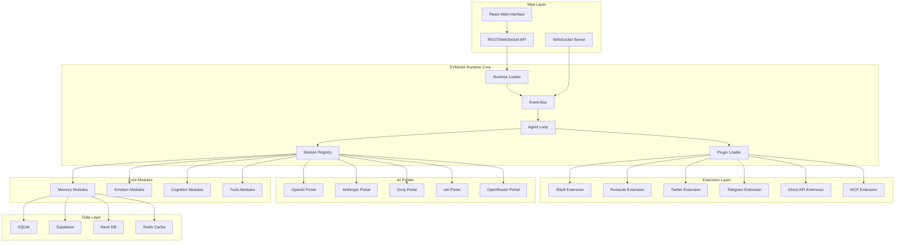
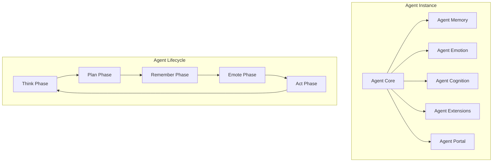
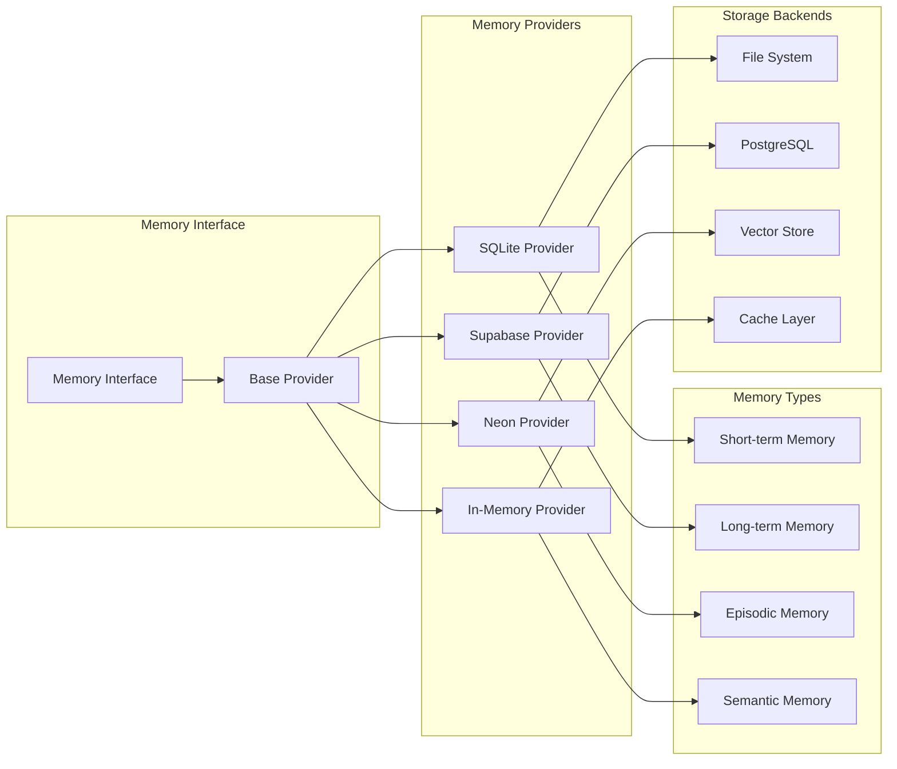
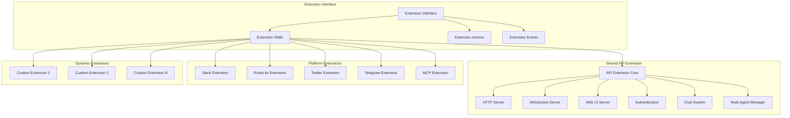
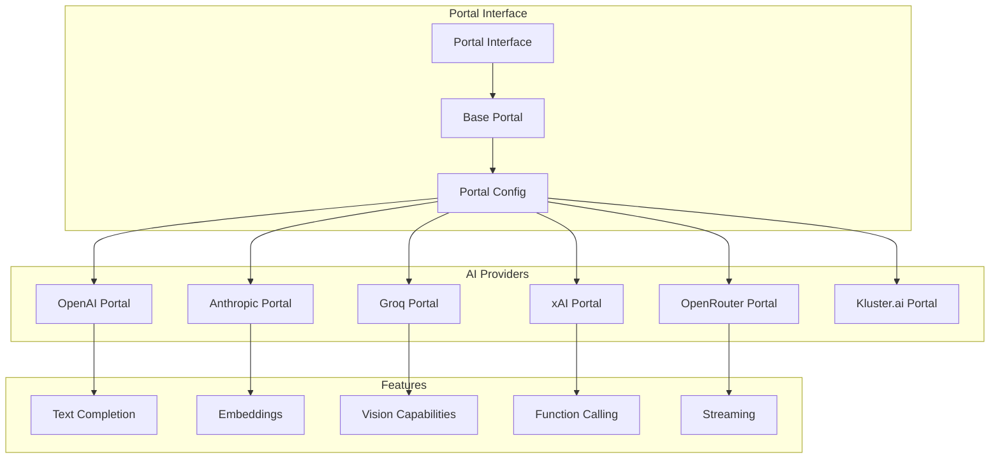
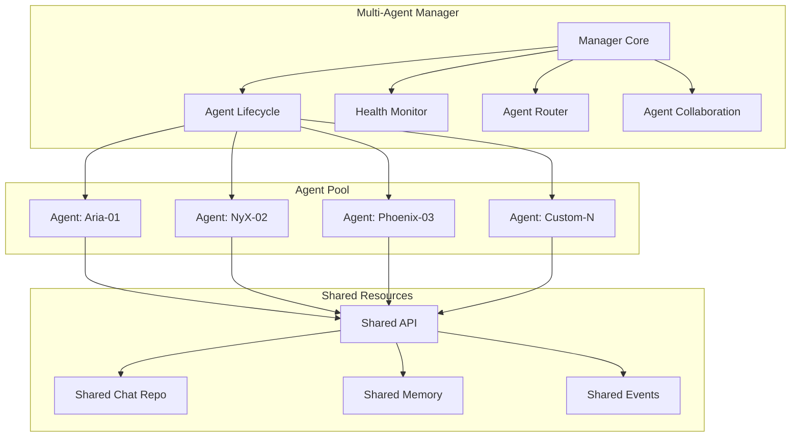
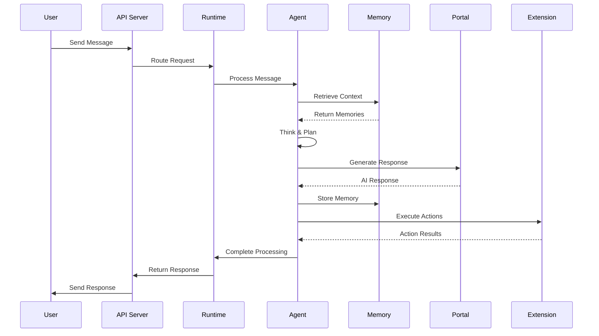
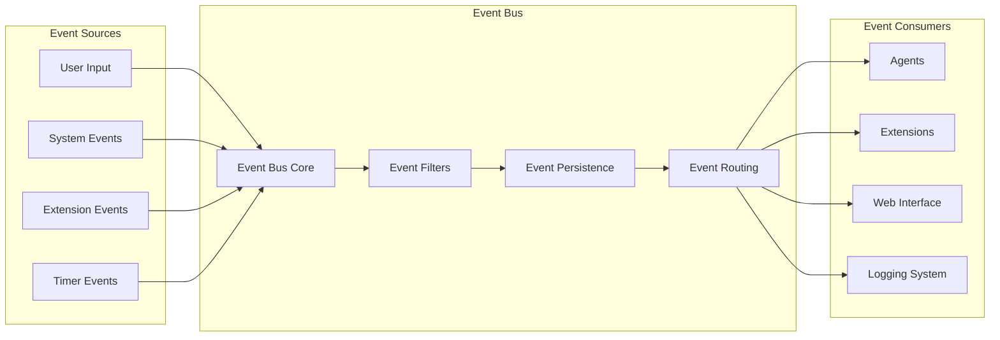
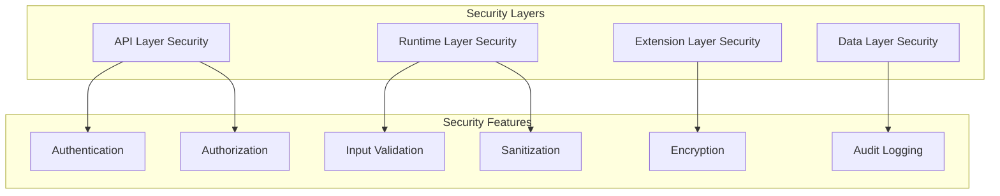

# Architecture Overview

SYMindX is built on a modular, event-driven architecture designed for scalability, extensibility, and real-time performance. This document provides a comprehensive overview of the system design and architectural patterns.

## High-Level Architecture



## Core Architectural Principles

### 1. Modular Design
- **Separation of Concerns**: Each module has a single, well-defined responsibility
- **Plugin Architecture**: Extensions and modules can be loaded/unloaded dynamically
- **Interface-Based Design**: All modules implement standard interfaces for consistency
- **Dependency Injection**: Components receive their dependencies rather than creating them

### 2. Event-Driven Architecture
- **Asynchronous Communication**: Components communicate through events rather than direct calls
- **Loose Coupling**: Modules don't need to know about each other's internal implementation
- **Scalability**: Easy to add new event listeners and processors
- **Real-time Updates**: Events enable live updates to the web interface

### 3. Factory Pattern Implementation
- **Dynamic Module Creation**: Modules are created through factory functions
- **Configuration-Driven**: Module behavior is controlled through configuration
- **Type Safety**: TypeScript ensures compile-time safety for all factory operations
- **Extensibility**: New module types can be added without changing core code

### 4. Memory-Centric Design
- **Persistent Context**: All agent interactions are stored in memory systems
- **Semantic Search**: Vector-based memory retrieval for context-aware responses
- **Memory Consolidation**: Automatic optimization of stored memories
- **Multi-Provider Support**: Pluggable memory backends for different use cases

## System Components

### Runtime Core

#### SYMindX Runtime
The central orchestrator that manages the entire system lifecycle:

```typescript
// SYMindX Runtime interface
interface SYMindXRuntimeType {
  // Core components
  agents: Map<string, Agent>
  eventBus: EventBus
  registry: ModuleRegistry
  pluginLoader: PluginLoader
  
  // Lifecycle management
  start(): Promise<void>
  stop(): Promise<void>
  tick(): Promise<void>
  
  // Agent management
  loadAgent(config: AgentConfig): Promise<Agent>
  unloadAgent(agentId: string): Promise<void>
}
```

**Key Responsibilities:**
- Agent lifecycle management
- Module registration and discovery
- Event bus coordination
- Tick loop execution
- Error handling and recovery

#### Event Bus
High-performance event system with persistence and replay capabilities:

```typescript
interface EventBus {
  // Event publishing
  emit(event: AgentEvent): void
  publish(event: AgentEvent): Promise<void>
  
  // Event subscription
  on(eventType: string, handler: EventHandler): void
  subscribe(pattern: EventPattern, handler: EventHandler): string
  
  // Event management
  getEvents(): AgentEvent[]
  replay(filter?: EventFilter): Promise<AgentEvent[]>
}
```

**Features:**
- Event persistence with compression
- Replay capabilities for debugging
- Pattern-based subscriptions
- Performance monitoring
- Automatic batching and buffering

#### Module Registry
Type-safe registry for all system modules:

```typescript
// Module Registry interface
interface ModuleRegistryType {
  // Factory registration
  registerEmotionFactory(type: string, factory: EmotionModuleFactory): void
  registerCognitionFactory(type: string, factory: CognitionModuleFactory): void
  registerPortalFactory(type: string, factory: PortalFactory): void
  
  // Instance registration
  registerExtension(id: string, extension: Extension): void
  registerMemoryProvider(id: string, provider: MemoryProvider): void
  
  // Module creation
  createEmotionModule(type: string, config: any): EmotionModule
  createCognitionModule(type: string, config: any): CognitionModule
  createPortal(type: string, config: PortalConfig): Portal
  
  // Module retrieval
  getExtension(id: string): Extension | undefined
  getMemoryProvider(id: string): MemoryProvider | undefined
}
```

### Agent Architecture



#### Agent Tick Loop
Each agent follows a structured processing cycle:

1. **Context Gathering**
   - Retrieve unprocessed events
   - Fetch relevant memories
   - Assess current state
   - Analyze environment

2. **Cognitive Processing**
   - Think about current situation
   - Plan appropriate responses
   - Consider emotional context
   - Generate actions

3. **Memory Formation**
   - Store new experiences
   - Update existing memories
   - Consolidate important information
   - Tag for future retrieval

4. **Emotional Processing**
   - Update emotion state
   - Apply personality modifiers
   - Calculate emotion decay
   - Trigger emotional responses

5. **Action Execution**
   - Execute planned actions
   - Update extension states
   - Emit result events
   - Handle errors gracefully

### Memory Architecture



#### Memory Consolidation
```typescript
interface MemoryConsolidation {
  // Consolidation process
  consolidateMemories(memories: MemoryRecord[]): Promise<MemoryRecord[]>
  
  // Importance scoring
  calculateImportance(memory: MemoryRecord): number
  
  // Memory optimization
  optimizeStorage(): Promise<void>
  
  // Retrieval optimization
  buildIndices(): Promise<void>
}
```

### Extension System



#### Shared API Extension Architecture

The API extension serves as the central communication hub for all agents:

```typescript
// Shared API Extension instance used by all agents
const apiExtension = new APIExtension({
  port: 8080,
  wsPort: 8080,
  webUIPort: 3001,
  enableCORS: true,
  authentication: {
    enabled: true,
    type: 'bearer'
  }
});

// All agents share the same API instance
runtime.registerSharedExtension('api', apiExtension);

// Agents can access shared services
agent.on('message', async (msg) => {
  // Access shared chat repository
  const chatRepo = apiExtension.getChatRepository();
  await chatRepo.addMessage({
    conversationId: msg.conversationId,
    role: 'assistant',
    content: response,
    agentId: agent.id
  });
});
```

#### Extension Lifecycle
```typescript
interface Extension {
  // Metadata
  id: string
  name: string
  version: string
  enabled: boolean
  
  // Configuration
  config: ExtensionConfig
  
  // Lifecycle hooks
  init(agent: Agent): Promise<void>
  tick(agent: Agent): Promise<void>
  cleanup?(): Promise<void>
  
  // Capabilities
  actions: Record<string, ExtensionAction>
  events: Record<string, ExtensionEventHandler>
  skills: Record<string, ExtensionSkill>
}
```

### AI Portal Architecture



## Multi-Agent Architecture

### Multi-Agent Manager

The Multi-Agent Manager provides centralized coordination and management of multiple agent instances:



#### Agent Spawning and Lifecycle

```typescript
// Spawn a new agent instance
const agentId = await multiAgentManager.spawnAgent({
  characterId: 'aria',
  instanceName: 'Aria-Analytics-01',
  config: {
    memory: 'postgres',
    emotion: {
      sensitivity: 0.6
    }
  },
  autoStart: true
});

// Manage agent lifecycle
await multiAgentManager.stopAgent(agentId);
await multiAgentManager.restartAgent(agentId);
```

#### Agent Routing and Discovery

```typescript
// Find agents by specialty
const analyticalAgents = multiAgentManager.findAgentsBySpecialty('analytical');

// Route conversation to best agent
const bestAgent = multiAgentManager.routeConversation({
  specialty: ['technical', 'analytical'],
  personalityTraits: ['precise', 'helpful'],
  capabilities: ['code_analysis'],
  responseStyle: 'detailed',
  excludeAgents: ['agent_123']
});
```

#### Health Monitoring

```typescript
interface AgentHealthStatus {
  agentId: string
  name: string
  status: AgentStatus
  uptime: number
  memoryUsage: number
  lastHeartbeat: Date
  errorCount: number
  messageCount: number
  averageResponseTime: number
  isHealthy: boolean
}

// Get system-wide metrics
const metrics = multiAgentManager.getSystemMetrics();
// {
//   totalAgents: 5,
//   activeAgents: 3,
//   idleAgents: 1,
//   errorAgents: 1,
//   totalMemoryUsage: 262144000,
//   totalMessageCount: 1523,
//   averageResponseTime: 112,
//   systemLoad: 60
// }
```

### Shared Resource Management

All agents share common infrastructure for efficiency:

1. **Shared API Extension**: Single HTTP/WebSocket server for all agents
2. **Shared Chat Repository**: Centralized conversation storage
3. **Shared Event Bus**: Inter-agent communication
4. **Shared Memory Pool**: Optional shared memory cache

```typescript
// Shared API extension configuration
const sharedApiConfig = {
  singleton: true,  // Only one instance
  sharedResources: {
    chatRepository: true,
    memoryCache: true,
    eventBus: true
  }
};

// Agents access shared resources
agent.on('message', async (msg) => {
  // All agents use the same chat repository
  const chatRepo = runtime.getSharedResource('chatRepository');
  await chatRepo.addMessage({
    conversationId: msg.conversationId,
    agentId: agent.id,
    content: response
  });
});
```

## Data Flow Architecture

### Request Processing Flow



### Event Flow Architecture



## Configuration Architecture

### Runtime Configuration
```typescript
interface RuntimeConfig {
  // Core settings
  tickInterval: number
  maxAgents: number
  
  // Module paths
  extensions: {
    autoLoad: boolean
    paths: string[]
  }
  
  // Storage configuration
  persistence: {
    enabled: boolean
    storePath: string
    maxFileSize: number
    compressionEnabled: boolean
    retentionDays: number
  }
  
  // Performance settings
  performance: {
    maxSubscribers: number
    eventBufferSize: number
    batchSize: number
    flushIntervalMs: number
  }
  
  // Monitoring
  monitoring: {
    metricsEnabled: boolean
    slowEventThresholdMs: number
    errorRetryAttempts: number
  }
}
```

### Agent Configuration
```typescript
interface AgentConfig {
  // Identity
  id: string
  core: {
    name: string
    tone: string
    description: string
  }
  
  // Background
  lore: {
    origin: string
    motive: string
    backstory: string
  }
  
  // Psychology
  psyche: {
    traits: string[]
    defaults: {
      memory: string
      emotion: string
      cognition: string
      portal?: string
    }
    emotion?: EmotionConfig
    cognition?: CognitionConfig
    memory?: MemoryConfig
  }
  
  // Capabilities
  modules: {
    extensions: string[]
    tools?: {
      enabled: boolean
      system: string
      categories?: string[]
    }
  }
  
  // Advanced features
  advanced?: {
    learningRate: number
    adaptationEnabled: boolean
    personalityDrift?: PersonalityDriftConfig
  }
}
```

## Security Architecture

### Security Layers



### Plugin Security
```typescript
interface PluginSecurity {
  // Sandboxing
  createSandbox(plugin: Plugin): Sandbox
  validatePlugin(manifest: PluginManifest): ValidationResult
  
  // Permissions
  checkPermissions(plugin: Plugin, action: string): boolean
  grantPermission(plugin: Plugin, permission: Permission): void
  
  // Monitoring
  auditAction(plugin: Plugin, action: string, result: any): void
  detectAnomalies(plugin: Plugin): AnomalyReport[]
}
```

## Performance Architecture

### Scalability Features
- **Horizontal Scaling**: Multiple runtime instances with shared storage
- **Load Balancing**: Request distribution across runtime instances
- **Caching**: Multi-layer caching for memory and API responses
- **Connection Pooling**: Efficient database connection management

### Performance Monitoring
```typescript
interface PerformanceMonitor {
  // Metrics collection
  recordMetric(name: string, value: number, tags?: Record<string, string>): void
  
  // Performance analysis
  getMetrics(timeRange: TimeRange): Metric[]
  analyzeBottlenecks(): BottleneckReport[]
  
  // Optimization suggestions
  suggestOptimizations(): OptimizationSuggestion[]
}
```

## Next Steps

Now that you understand the architecture:

1. **[Core Runtime](core-runtime)** - Deep dive into the runtime system
2. **[Module System](module-system)** - Understanding modular components
3. **[Extension System](extension-system)** - Building custom extensions
4. **[Portal System](portal-system)** - Integrating AI providers
5. **[Event System](event-system)** - Event-driven communication
6. **[Memory System](memory-system)** - Persistent agent memory
7. **[Security](security)** - Security best practices and implementation

The modular architecture ensures that SYMindX can grow with your needs while maintaining performance and reliability. 🏗️