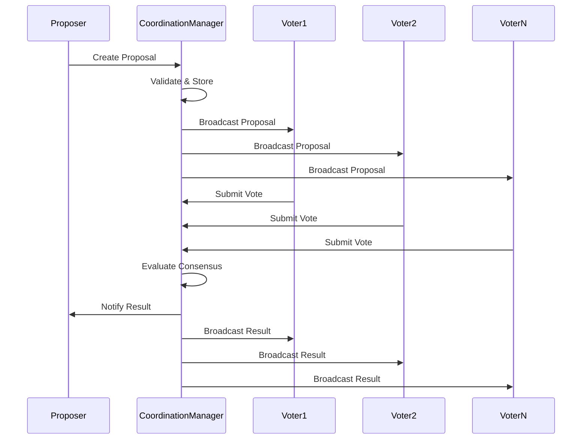

# Multi-Agent Coordination Protocols for SYMindX

## Overview

SYMindX features a sophisticated multi-agent coordination system that enables secure inter-agent communication, collaborative decision-making, intelligent task distribution, and shared memory management. This document outlines the coordination protocols, patterns, and best practices for building scalable multi-agent systems.

## Architecture

The coordination system is built around the `CoordinationManager` class which orchestrates all multi-agent protocols through several key components:

### Core Components

1. **Communication Channels** - Secure message passing between agents
2. **Consensus Mechanisms** - Collaborative decision-making algorithms
3. **Task Distribution** - Intelligent workload allocation and load balancing
4. **Shared Memory Pools** - Synchronized memory management with conflict resolution
5. **Monitoring & Observability** - Real-time coordination metrics and health monitoring

### Integration Points

- **MultiAgentManager** - Enhanced with coordination capabilities
- **EventBus** - Message routing and event distribution
- **ResourceManager** - Resource allocation and conflict resolution
- **API Endpoints** - HTTP interface for coordination management

## Communication Protocols

### Channel Types

The system supports multiple communication channel types optimized for different coordination patterns:

#### 1. Direct Channels
- **Purpose**: One-to-one agent communication
- **Latency**: <10ms average
- **Security**: Authentication + optional encryption
- **Use Cases**: Private consultation, resource negotiation

#### 2. Group Channels
- **Purpose**: Multi-party agent collaboration
- **Latency**: <50ms for groups up to 10 agents
- **Security**: Role-based authorization
- **Use Cases**: Team coordination, collaborative planning

#### 3. Broadcast Channels
- **Purpose**: System-wide announcements
- **Latency**: <100ms for system-wide delivery
- **Security**: Admin-only sending rights
- **Use Cases**: Emergency notifications, system updates

#### 4. Consensus Channels
- **Purpose**: Structured decision-making processes
- **Latency**: Variable based on consensus type
- **Security**: Cryptographic vote integrity
- **Use Cases**: Policy decisions, resource allocation votes

### Message Security

All coordination messages include:
- **Authentication**: Sender identity verification
- **Integrity**: Cryptographic signatures prevent tampering
- **Audit Logging**: Complete message trail for compliance
- **Optional Encryption**: End-to-end encryption for sensitive data

### Message Priorities

| Priority | Response Time | Use Cases |
|----------|---------------|-----------|
| EMERGENCY | <5ms | System failures, security breaches |
| CRITICAL | <10ms | Resource conflicts, deadlock resolution |
| HIGH | <50ms | Task assignments, consensus proposals |
| NORMAL | <200ms | General communication, status updates |
| LOW | <1s | Background sync, metrics collection |

## Consensus Mechanisms

### Supported Algorithms

#### 1. Simple Majority
- **Threshold**: >50% approval votes
- **Performance**: O(n) message complexity
- **Use Cases**: General decisions, policy updates
- **Failure Tolerance**: Up to 49% Byzantine faults

#### 2. Super Majority
- **Threshold**: ≥67% approval votes
- **Performance**: O(n) message complexity
- **Use Cases**: Critical system changes, security policies
- **Failure Tolerance**: Up to 33% Byzantine faults

#### 3. Unanimous Consensus
- **Threshold**: 100% approval votes
- **Performance**: O(n) message complexity
- **Use Cases**: High-stakes decisions, emergency protocols
- **Failure Tolerance**: Zero fault tolerance

#### 4. Byzantine Fault Tolerant (BFT)
- **Threshold**: >67% of honest nodes
- **Performance**: O(n³) message complexity
- **Use Cases**: Adversarial environments, financial operations
- **Failure Tolerance**: Up to 33% malicious faults

### Consensus Workflow



### Consensus Configuration

```javascript
// Create a consensus proposal
const proposalId = await multiAgentManager.requestConsensus(
  'proposer-agent-id',
  {
    type: 'resource_allocation',
    resource: 'shared-database',
    allocation: {
      'agent-1': 30,
      'agent-2': 70
    }
  },
  ['agent-1', 'agent-2', 'agent-3'], // participants
  'super_majority', // consensus type
  300000 // 5 minute timeout
);
```

## Task Distribution

### Intelligent Load Balancing

The task distribution system uses a multi-factor scoring algorithm to select optimal agents:

#### Scoring Factors
1. **Capability Match** (40%): Agent skills vs. task requirements
2. **Current Workload** (25%): Number of active tasks
3. **Performance History** (20%): Success rate and response times
4. **Resource Availability** (15%): Memory, CPU, network capacity

#### Load Balancing Strategies

##### Round Robin
- **Algorithm**: Sequential agent selection
- **Use Case**: Uniform task distribution
- **Overhead**: O(1)

##### Least Loaded
- **Algorithm**: Select agent with minimum workload
- **Use Case**: Performance optimization
- **Overhead**: O(n)

##### Capability-Based
- **Algorithm**: Best capability match with load balancing
- **Use Case**: Specialized task requirements
- **Overhead**: O(n log n)

##### Weighted Fair Queuing
- **Algorithm**: Proportional load based on agent capacity
- **Use Case**: Heterogeneous agent environments
- **Overhead**: O(n)

### Task Requirements Specification

```javascript
const taskRequirements = {
  capabilities: ['natural_language_processing', 'data_analysis'],
  resources: [
    {
      type: 'memory',
      amount: 512, // MB
      duration: 3600, // seconds
      exclusive: false
    },
    {
      type: 'cpu',
      amount: 80, // percentage
      duration: 1800,
      exclusive: true
    }
  ],
  performance: {
    maxLatency: 5000, // milliseconds
    minThroughput: 100, // operations/second
    reliability: 0.99 // 99% success rate
  }
};
```

### Task Lifecycle

1. **Submission**: Task submitted with requirements
2. **Evaluation**: Agent eligibility assessment
3. **Assignment**: Optimal agent selection and notification
4. **Acceptance**: Agent confirms task acceptance
5. **Execution**: Task processing with progress updates
6. **Completion**: Results delivery and resource cleanup

## Shared Memory Management

### Memory Pool Architecture

Shared memory pools enable collaborative knowledge management with sophisticated conflict resolution:

#### Access Control Models

##### Role-Based Access Control (RBAC)
- **Read Permission**: View memory contents
- **Write Permission**: Modify memory contents
- **Delete Permission**: Remove memories
- **Share Permission**: Grant access to other agents

##### Consensus-Based Access Control
- **Write Operations**: Require consensus approval
- **Critical Deletions**: Super-majority required
- **Access Grants**: Simple majority approval

#### Synchronization Strategies

##### Immediate Consistency
- **Latency**: <10ms propagation
- **Consistency**: Strong consistency guaranteed
- **Use Case**: Critical real-time coordination
- **Overhead**: High network traffic

##### Eventual Consistency
- **Latency**: <5s propagation
- **Consistency**: Eventually consistent
- **Use Case**: General knowledge sharing
- **Overhead**: Minimal network traffic

##### Batch Synchronization
- **Latency**: Configurable intervals (default: 5s)
- **Consistency**: Periodic consistency
- **Use Case**: High-throughput environments
- **Overhead**: Optimized batch operations

### Conflict Resolution

When multiple agents modify the same memory simultaneously, conflicts are resolved using configured strategies:

#### Last Writer Wins
- **Algorithm**: Most recent timestamp takes precedence
- **Performance**: O(1) resolution time
- **Guarantees**: Simple conflict resolution
- **Use Case**: Non-critical memory updates

#### First Writer Wins
- **Algorithm**: First committed change takes precedence
- **Performance**: O(1) resolution time
- **Guarantees**: Prevents race conditions
- **Use Case**: Resource reservations

#### Consensus Resolution
- **Algorithm**: Participants vote on conflict resolution
- **Performance**: O(n) message complexity
- **Guarantees**: Democratic conflict resolution
- **Use Case**: Critical shared state

#### Manual Resolution
- **Algorithm**: Human or administrator intervention
- **Performance**: Variable resolution time
- **Guarantees**: Expert decision making
- **Use Case**: Complex business logic conflicts

### Memory Pool Configuration

```javascript
// Create a shared memory pool
const poolId = await multiAgentManager.createSharedMemoryPool(
  'collaboration-memories',
  ['agent-1', 'agent-2', 'agent-3'], // participants
  {
    accessControl: {
      requireConsensusForWrite: true,
      auditAccess: true,
      encryptMemories: false
    },
    synchronization: {
      strategy: 'eventual_consistency',
      conflictResolution: 'consensus_required',
      syncIntervalMs: 5000
    }
  }
);
```

## Coordination Patterns

### Common Coordination Patterns

#### 1. Leader-Follower Pattern
- **Structure**: One agent coordinates multiple followers
- **Use Case**: Centralized task management
- **Implementation**: Consensus-based leader election

```javascript
// Enable leader-follower coordination
const collaboration = await multiAgentManager.enableAdvancedCollaboration(
  ['leader-agent', 'follower-1', 'follower-2'],
  {
    communicationChannels: true,
    taskDistribution: true,
    consensusDecisions: false // leader makes decisions
  }
);
```

#### 2. Peer-to-Peer Collaboration
- **Structure**: Equal agents collaborate directly
- **Use Case**: Decentralized problem solving
- **Implementation**: Group channels + consensus decisions

```javascript
// Enable peer-to-peer coordination
const collaboration = await multiAgentManager.enableAdvancedCollaboration(
  ['peer-1', 'peer-2', 'peer-3'],
  {
    communicationChannels: true,
    sharedMemory: true,
    consensusDecisions: true // all peers vote
  }
);
```

#### 3. Pipeline Pattern
- **Structure**: Sequential processing chain
- **Use Case**: Multi-stage data processing
- **Implementation**: Task dependencies + direct channels

#### 4. Fork-Join Pattern
- **Structure**: Parallel execution with result aggregation
- **Use Case**: Parallel computation with merge
- **Implementation**: Task distribution + consensus result aggregation

#### 5. Observer Pattern
- **Structure**: Observers monitor subject agents
- **Use Case**: System monitoring, event-driven responses
- **Implementation**: Broadcast channels + event subscriptions

### Anti-Patterns to Avoid

#### 1. Chatty Communication
- **Problem**: Excessive message passing
- **Solution**: Batch operations, reduce update frequency
- **Impact**: Network congestion, increased latency

#### 2. Byzantine Generals Problem
- **Problem**: Malicious or faulty agents disrupting consensus
- **Solution**: Use BFT consensus, agent reputation systems
- **Impact**: Incorrect decisions, system instability

#### 3. Deadlock Scenarios
- **Problem**: Circular resource dependencies
- **Solution**: Timeout mechanisms, deadlock detection
- **Impact**: System freeze, resource starvation

#### 4. Split-Brain Syndrome
- **Problem**: Network partitions causing inconsistent state
- **Solution**: Quorum-based decisions, partition tolerance
- **Impact**: Conflicting system states

## Performance Optimization

### Latency Optimization

#### Message Routing
- **Direct Routes**: Agent-to-agent communication bypasses central routing
- **Message Batching**: Group multiple operations in single messages
- **Connection Pooling**: Reuse persistent connections

#### Consensus Optimization
- **Early Termination**: Stop voting once threshold reached  
- **Parallel Voting**: Simultaneous vote collection
- **Vote Caching**: Reuse recent votes for similar proposals

### Throughput Optimization

#### Task Distribution
- **Pipelining**: Overlap task assignment with execution
- **Bulk Operations**: Process multiple tasks simultaneously
- **Agent Pools**: Pre-allocated agents for common tasks

#### Memory Synchronization
- **Delta Sync**: Only sync changed memory portions
- **Compression**: Compress large memory objects
- **Lazy Loading**: Load memories on-demand

### Resource Management

#### Memory Management
- **Pool Limits**: Configure maximum memory per pool
- **Garbage Collection**: Automatic cleanup of expired memories  
- **Memory Tiering**: Hot/warm/cold memory classification

#### Network Optimization
- **Message Compression**: Reduce network bandwidth usage
- **Connection Multiplexing**: Share connections across channels
- **Quality of Service**: Priority-based message routing

## Monitoring and Observability

### Key Metrics

#### Communication Metrics
- **Message Throughput**: Messages per second per channel
- **Average Latency**: End-to-end message delivery time
- **Error Rate**: Failed message delivery percentage
- **Channel Utilization**: Active channels vs. total channels

#### Consensus Metrics
- **Consensus Rate**: Successful consensus percentage
- **Average Decision Time**: Time from proposal to resolution
- **Vote Participation**: Agent voting participation rate
- **Timeout Rate**: Consensus timeout percentage

#### Task Distribution Metrics
- **Task Completion Rate**: Successfully completed tasks percentage
- **Average Task Time**: Time from assignment to completion
- **Load Balance Score**: Distribution uniformity across agents
- **Queue Length**: Pending tasks per agent

#### Shared Memory Metrics
- **Sync Latency**: Memory synchronization delay
- **Conflict Rate**: Memory conflicts per hour
- **Resolution Time**: Average conflict resolution time
- **Memory Utilization**: Used vs. allocated memory

### Health Monitoring

The system continuously monitors coordination health using a weighted scoring algorithm:

#### Health Calculation
```
Health Score = (
  Channel_Health * 0.3 +
  Consensus_Health * 0.25 +
  Task_Health * 0.25 +
  Memory_Health * 0.2
)
```

#### Health Thresholds
- **Healthy**: Score ≥ 0.8, all systems operational
- **Degraded**: Score 0.6-0.8, some performance issues
- **Unhealthy**: Score < 0.6, significant problems requiring intervention

### Alerting

#### Alert Levels
1. **INFO**: Routine operational events
2. **WARN**: Performance degradation detected
3. **ERROR**: Component failures or timeouts
4. **CRITICAL**: System-wide coordination failures

#### Alert Channels
- **Event Bus**: Real-time alerts to monitoring agents
- **HTTP Webhooks**: External monitoring system integration
- **Log Files**: Structured logging for analysis

## API Reference

### REST Endpoints

#### Channel Management
```http
POST /coordination/channels
Content-Type: application/json

{
  "name": "team-alpha-coordination",
  "type": "group",
  "participants": ["agent-1", "agent-2", "agent-3"],
  "security": {
    "authentication": true,
    "authorization": ["agent-1", "agent-2", "agent-3"]
  }
}
```

#### Consensus Requests
```http
POST /coordination/consensus
Content-Type: application/json

{
  "proposerId": "agent-1",
  "proposal": {
    "type": "resource_allocation",
    "details": { "resource": "shared-db", "allocation": 50 }
  },
  "participants": ["agent-1", "agent-2", "agent-3"],
  "type": "simple_majority",
  "timeoutMs": 300000
}
```

#### Task Distribution
```http
POST /coordination/tasks
Content-Type: application/json

{
  "requesterId": "coordinator-agent",
  "task": {
    "id": "nlp-analysis-001",
    "type": "natural_language_processing",
    "description": "Analyze customer feedback sentiment",
    "requirements": {
      "capabilities": ["nlp", "sentiment_analysis"],
      "resources": [
        {
          "type": "memory",
          "amount": 512,
          "duration": 3600,
          "exclusive": false
        }
      ]
    },
    "priority": 8,
    "estimatedDuration": 1800,
    "dependencies": [],
    "payload": {
      "dataSource": "customer_feedback_q4",
      "outputFormat": "json"
    }
  }
}
```

#### Shared Memory Pools
```http
POST /coordination/memory/pools
Content-Type: application/json

{
  "name": "research-findings",
  "participants": ["research-agent-1", "research-agent-2"],
  "config": {
    "accessControl": {
      "requireConsensusForWrite": true,
      "auditAccess": true
    },
    "synchronization": {
      "strategy": "eventual_consistency",
      "conflictResolution": "consensus_required"
    }
  }
}
```

#### Monitoring
```http
GET /coordination/metrics
```

```http
GET /coordination/health
```

### Event-Driven Integration

#### Event Types
- `consensus_reached`: Consensus decision completed
- `task_assigned`: Task successfully assigned to agent
- `memory_shared`: New memory added to shared pool
- `channel_created`: Communication channel established
- `conflict_detected`: Memory conflict identified
- `agent_registered`: Agent joined coordination system

#### Event Handlers
```javascript
// Listen for coordination events
multiAgentManager.on('consensus_reached', (event) => {
  console.log(`Consensus reached: ${event.proposalId}`);
  console.log(`Result: ${event.accepted ? 'Accepted' : 'Rejected'}`);
  console.log(`Votes: ${event.votes}`);
});

multiAgentManager.on('task_assigned', (event) => {
  console.log(`Task ${event.taskId} assigned to ${event.assigneeId}`);
});
```

## Best Practices

### Communication Design

#### 1. Channel Partitioning
- **Principle**: Separate channels by purpose and security level
- **Implementation**: Use different channels for control vs. data messages
- **Benefit**: Improved security and performance isolation

#### 2. Message Idempotency
- **Principle**: Messages should be safe to retry
- **Implementation**: Include correlation IDs and operation timestamps
- **Benefit**: Resilience to network failures and message duplication

#### 3. Graceful Degradation
- **Principle**: Continue operating with reduced functionality during failures
- **Implementation**: Fallback to simpler coordination mechanisms
- **Benefit**: System availability during partial failures

### Consensus Design

#### 1. Timeout Configuration
- **Fast Decisions**: 30-60 seconds for operational decisions
- **Strategic Decisions**: 5-15 minutes for policy changes
- **Critical Decisions**: 30+ minutes for system-wide changes

#### 2. Quorum Management
- **Dynamic Quorums**: Adjust required votes based on participant availability
- **Weighted Voting**: Give trusted agents more voting power
- **Tie Breaking**: Designate tie-breaker agents for even-numbered groups

#### 3. Proposal Quality
- **Clear Specifications**: Unambiguous proposal descriptions
- **Impact Analysis**: Include expected outcomes and risks
- **Alternatives**: Provide multiple options when possible

### Task Distribution Design

#### 1. Workload Estimation
- **Historical Data**: Use past performance for estimation
- **Resource Profiling**: Monitor agent resource consumption
- **Adaptive Learning**: Improve estimates based on outcomes

#### 2. Failure Handling
- **Task Reassignment**: Automatically reassign failed tasks
- **Timeout Management**: Set appropriate task timeouts
- **Retry Logic**: Implement exponential backoff for retries

#### 3. Load Balancing
- **Predictive Scaling**: Scale agent pools based on predicted load
- **Circuit Breakers**: Protect overloaded agents from additional tasks
- **Fair Scheduling**: Ensure equitable workload distribution

### Shared Memory Design

#### 1. Memory Organization
- **Logical Partitioning**: Group related memories in pools
- **Access Patterns**: Optimize for common read/write patterns
- **Lifecycle Management**: Implement proper memory cleanup

#### 2. Conflict Prevention
- **Optimistic Locking**: Use version numbers to detect conflicts
- **Critical Sections**: Identify and protect critical memory sections
- **Transaction Support**: Group related memory operations

#### 3. Performance Optimization
- **Caching Strategy**: Cache frequently accessed memories locally
- **Batch Operations**: Group multiple memory operations
- **Compression**: Compress large memory objects

## Security Considerations

### Authentication & Authorization

#### Agent Identity
- **Strong Authentication**: Cryptographic identity verification
- **Certificate Management**: Rotate certificates regularly
- **Identity Federation**: Support multiple identity providers

#### Access Control
- **Principle of Least Privilege**: Grant minimum required permissions
- **Dynamic Authorization**: Adjust permissions based on context
- **Audit Trails**: Log all access attempts and decisions

### Message Security

#### Encryption
- **Transport Layer**: TLS/SSL for all communications
- **Message Layer**: End-to-end encryption for sensitive data
- **Key Management**: Secure key generation and rotation

#### Integrity
- **Digital Signatures**: Cryptographically sign all messages
- **Hash Verification**: Verify message integrity on receipt
- **Replay Protection**: Prevent message replay attacks

### Consensus Security

#### Byzantine Resilience
- **Fault Tolerance**: Handle up to f Byzantine faults in 3f+1 system
- **Identity Binding**: Bind votes to authenticated agent identities
- **Vote Verification**: Cryptographically verify all votes

#### Sybil Attack Prevention
- **Identity Verification**: Require verified agent identities
- **Resource Proof**: Tie voting power to computational resources
- **Reputation Systems**: Weight votes based on agent reputation

## Troubleshooting Guide

### Common Issues

#### 1. High Message Latency
**Symptoms**: Messages take >1s to deliver
**Causes**: Network congestion, overloaded agents, inefficient routing
**Solutions**: 
- Enable message compression
- Optimize routing tables
- Scale message brokers
- Implement priority queuing

#### 2. Consensus Timeouts
**Symptoms**: Frequent consensus proposal timeouts
**Causes**: Slow agents, network partitions, Byzantine faults
**Solutions**:
- Increase timeout values
- Implement faster consensus algorithms
- Remove faulty agents from proposals
- Use dynamic timeout adjustment

#### 3. Task Distribution Imbalance
**Symptoms**: Some agents overloaded while others idle
**Causes**: Poor capability matching, incorrect load metrics
**Solutions**:
- Improve capability scoring algorithms
- Update agent capacity profiles
- Implement work stealing
- Use predictive load balancing

#### 4. Memory Conflicts
**Symptoms**: Frequent memory synchronization conflicts
**Causes**: High write concurrency, poor conflict resolution
**Solutions**:
- Implement optimistic locking
- Use eventual consistency model
- Partition memory by access patterns
- Enable conflict resolution voting

### Diagnostic Tools

#### 1. Coordination Dashboard
- Real-time system health monitoring
- Visual network topology display
- Performance metrics visualization
- Alert management interface

#### 2. Message Tracing
- End-to-end message tracking
- Latency analysis and bottleneck identification
- Message flow visualization
- Error rate monitoring

#### 3. Consensus Analyzer
- Proposal success/failure rates
- Vote participation analysis
- Decision time distributions
- Byzantine fault detection

#### 4. Task Performance Monitor
- Task completion metrics
- Agent workload distribution
- Resource utilization tracking
- SLA compliance monitoring

### Performance Tuning

#### 1. Message Optimization
```javascript
// Enable message compression
const channel = await coordinationManager.createChannel(
  'high-throughput-channel',
  'group',
  participants,
  {
    compression: true,
    batchSize: 100,
    flushInterval: 10 // ms
  }
);
```

#### 2. Consensus Tuning
```javascript
// Optimize consensus for fast decisions
const proposal = await coordinationManager.createConsensusProposal(
  proposerId,
  'simple_majority', // Faster than super_majority
  proposal,
  participants,
  60000 // Shorter timeout for fast decisions
);
```

#### 3. Memory Optimization
```javascript
// Configure memory pool for performance
const pool = await coordinationManager.createSharedMemoryPool(
  'high-performance-pool',
  participants,
  {
    synchronization: {
      strategy: 'batched', // Better performance than immediate
      syncIntervalMs: 100, // Aggressive sync for consistency
      conflictResolution: 'last_writer_wins' // Faster than consensus
    }
  }
);
```

## Future Enhancements

### Planned Features

#### 1. Machine Learning Integration
- **Predictive Load Balancing**: ML-based task assignment optimization
- **Anomaly Detection**: Automatic detection of coordination anomalies
- **Agent Behavior Learning**: Adaptive coordination based on agent patterns

#### 2. Advanced Consensus Algorithms
- **Raft Implementation**: Complete Raft consensus for leader election
- **PBFT Support**: Practical Byzantine Fault Tolerance
- **HoneyBadgerBFT**: Asynchronous Byzantine consensus

#### 3. Enhanced Security
- **Zero-Knowledge Proofs**: Privacy-preserving consensus voting
- **Homomorphic Encryption**: Computation on encrypted shared memories
- **Blockchain Integration**: Immutable coordination audit trails

#### 4. Scalability Improvements
- **Sharding Support**: Horizontal scaling through coordination sharding
- **Federation**: Multi-cluster coordination protocols
- **Edge Coordination**: Coordination at network edge for IoT agents

### Research Areas

#### 1. Distributed Systems
- **Consistency Models**: Eventual, causal, and strong consistency
- **Partition Tolerance**: CAP theorem implications for coordination
- **Network Protocols**: Custom protocols for agent communication

#### 2. Game Theory
- **Mechanism Design**: Incentive-compatible coordination protocols
- **Auction Theory**: Resource allocation through agent bidding
- **Coalition Formation**: Dynamic agent coalition strategies

#### 3. Artificial Intelligence
- **Multi-Agent Negotiation**: Automated negotiation protocols
- **Swarm Intelligence**: Collective decision-making algorithms
- **Emergence**: Studying emergent coordination behaviors

## Conclusion

The SYMindX multi-agent coordination system provides a comprehensive foundation for building sophisticated agent collaboration networks. By implementing secure communication channels, robust consensus mechanisms, intelligent task distribution, and synchronized shared memory, the system enables agents to work together effectively while maintaining security and performance.

The coordination protocols are designed to scale from small agent teams to large distributed systems, with monitoring and observability features to ensure reliable operation. The API-driven architecture allows for easy integration with external systems and provides flexibility for custom coordination patterns.

This implementation represents a significant advancement in multi-agent system coordination, providing the infrastructure necessary for building truly collaborative AI systems at scale.

---

*For technical support, bug reports, or feature requests, please refer to the SYMindX project repository and documentation.*