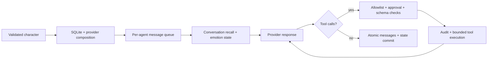

# @symindx/runtime 0.1.0

A Bun library and CLI for persistent character agents. This is the supported SYMindX core; it imports no legacy framework modules.

**Release status:** implementation candidate. Strict compilation and bundle validation are recorded in [IMPLEMENTATION.md](../../docs/v0.1/IMPLEMENTATION.md). Automated behavior tests and a real provider trial are outstanding. Do not infer production readiness from successful compilation.

## Install and build

Requires Bun **1.3.10+**; development uses the exact versions in `bun.lock`.

From the repository root:

```sh
bun install --cwd packages/runtime --frozen-lockfile --ignore-scripts
bun run typecheck
bun run build
bun --no-env-file packages/runtime/src/cli.ts --help
```

The runtime uses Bun's built-in SQLite and HTTP server. Node-only runtimes are unsupported. There are no third-party runtime dependencies; TypeScript, Bun declarations, and Prettier are development dependencies. The root legacy locks are retained historical work and are not part of this package's install.

### Windows and WSL

Use Bun inside a WSL checkout, or use a normal Windows directory with Windows Bun. This audit environment has Windows Bun operating on `\\wsl.localhost\...`; its package scripts fall through CMD and lose the working directory. Bun also fails an atomic lockfile rename on that UNC path.

After dependencies are installed, direct PowerShell commands from the repository root avoid the package-script issue:

```powershell
bun --no-env-file packages/runtime/node_modules/typescript/lib/tsc.js -p packages/runtime/tsconfig.json
bun --no-env-file packages/runtime/scripts/build.ts
bun --no-env-file packages/runtime/node_modules/typescript/lib/tsc.js -p packages/runtime/tsconfig.build.json
bun --no-env-file packages/runtime/src/cli.ts --help
```

If Windows Bun cannot install on the UNC path, use a local Windows checkout or install with Linux Bun in WSL. Use a local filesystem for the SQLite database. Do not share a WAL database over a network filesystem or between Windows and WSL processes.

## CLI

```sh
# Offline demonstration; creates a new local SQLite file if necessary.
bun --no-env-file packages/runtime/src/cli.ts chat --message "Hello"

# Create a schema-version-1 character without overwriting an existing file.
bun --no-env-file packages/runtime/src/cli.ts init --out ./character.json

# Load that character and start an interactive conversation.
bun --no-env-file packages/runtime/src/cli.ts chat --character ./character.json --db ./data/agents.sqlite

# Inspect persisted characters using the same database.
bun --no-env-file packages/runtime/src/cli.ts agents --db ./data/agents.sqlite
```

Commands are `init`, `chat`, `agents`, `serve`, `help`, and `version`. Chat accepts `--agent` and `--message`. Interactive chat accepts piped input and handles SIGINT/SIGTERM. Serve accepts `--host`, `--port`, and `--token-env`.

The built-in `demo` character uses `echo`: it returns the input with an `Echo:` prefix. It does not reason or call tools. With an empty database, chat/serve create this demo; the library creates only characters you explicitly register. Reopening the same database recalls its character snapshots and completed conversation turns.

CLI paths are relative to your working directory. The default database is `./symindx.sqlite`. Specify a new database for v0.1; existing legacy databases are incompatible.

## Character schema

See [characters/demo.json](characters/demo.json) for the complete offline example. Configuration rejects unknown fields, unsupported schema versions, duplicate tool names, and invalid limits. Character files are limited to 64 KiB.

For an actual model, change the provider to:

```json
{
  "type": "openai-compatible",
  "model": "YOUR_MODEL_ID",
  "baseUrl": "https://YOUR_PROVIDER_HOST/v1",
  "apiKeyEnv": "MODEL_API_KEY",
  "maxOutputTokens": 2048
}
```

Supply the named variable in the process environment; keys are not character fields. The adapter sends Chat Completions requests to `/v1/chat/completions` below the configured base path. It requires HTTPS except for loopback HTTP, rejects credentials/query/fragment in the URL, and rejects redirects. `maxOutputTokens` is sent as `max_completion_tokens`. The chosen endpoint must support this protocol, including that parameter and function tool calls. Provider-specific protocols need separate adapters; there is no automatic failover or retry.

The supported scripts disable Bun's automatic `.env` loading. If invoking Bun directly, use `--no-env-file` when you want that behavior. The application itself does not read secret files.

Optional fields:

| Field | Meaning |
| --- | --- |
| `memory.recentMessages` | Plain messages recalled within the character's current conversation; 2–200, default 20. |
| `emotion.enabled` | Include bounded heuristic state in the prompt; default false. |
| `emotion.decay` | Per-message decay in the range 0–1; default 0.85. |
| `tools` | Explicit allowlist of registered tool names; default empty. |

Emotion is an English word heuristic with valence/arousal bounds. It is not sentiment inference by a model, learned personality, psychological understanding, or an autonomous behavior system. State is per agent; conversations have separate history but share that agent's emotion state.

## Library

Build first, then import the local artifact:

```ts
import { SYMindXRuntime, loadCharacter } from './packages/runtime/dist/index.js';

const character = await loadCharacter('./character.json');
const runtime = new SYMindXRuntime({
  dbPath: './data/agents.sqlite',
  characters: [character],
});

await runtime.start();
try {
  const result = await runtime.sendMessage(character.id, 'Hello', {
    conversationId: 'session1',
  });
  console.log(result.message.content);
  console.log(runtime.history(character.id, 'session1'));
} finally {
  await runtime.stop();
}
```

Importing the package does not start an application, create a database, or open a port. `registerCharacter` validates and composes a character; `start` rehydrates stored characters and opens SQLite. `getAgent`, `listAgents`, `history`, and `toolAudit` return snapshots/data. `on` subscribes to lifecycle and completed-turn events and returns an unsubscribe function. Observer errors cannot invalidate committed turns.

`providerFactory` can inject a `Provider` implementation. Its `generate` method receives a system prompt, scoped messages, advertised tools, and an AbortSignal; it returns text and structured tool-call data. The runtime owns execution policy and persistence.

### Message and tool behavior



A turn stores the user message, intermediate assistant/tool messages, final assistant message, and state in one SQLite transaction. Provider failure, cancellation, or a turn conflict leaves no partial conversation turn. Tool audit records are written independently before and after an attempted execution, so failed turns can still have audit entries.

Recent recall contains plain user/assistant messages only. Previous tool transcripts remain in history but are omitted from recall to avoid orphan tool-call identifiers at window boundaries. Recall uses message and character-count limits rather than a tokenizer or semantic/vector search.

Default limits are 8 queued/active messages per agent, a 60-second deadline including queue time, 3 tool rounds, 8 calls per round, a 10-second tool deadline, 16,000 input characters, and 48,000 context characters. Provider HTTP responses are limited to 4 MiB; assistant text and tool results have further limits. A stale agent-state commit from another process fails with `CONFLICT`; it is not automatically retried.

The only built-in tool is read-only `clock`. Add it to a character's `tools` to advertise it to a tool-capable provider. Custom `ToolDefinition` handlers are trusted application code. The schema validator supports only the declared `JsonSchema` subset and rejects unknown schema keywords.

Write tools require both the character allowlist and `sendMessage(..., { approvedTools: ['name'] })` from the trusted application. HTTP clients cannot submit approvals or install tools. The write approval list is copied when the message is submitted.

**Tool contract:** handlers must honor AbortSignal and implement their own idempotency/recovery when they have external effects. JavaScript cannot forcibly terminate a handler that ignores cancellation. Such a handler can outlive `stop()`. SQLite commits do not roll back external tool effects; a completed effect can precede a failed conversation turn. Audit records omit arguments/results and are not a recovery journal. v0.1 provides no exactly-once execution guarantee.

## Local API

Set a high-entropy bearer token of at least 32 bytes in `SYMINDX_API_TOKEN`, then run:

```sh
bun --no-env-file packages/runtime/src/cli.ts serve --db ./data/agents.sqlite
```

The default is `http://127.0.0.1:8000`. Binding to public/private network interfaces is rejected. `createApiServer(runtime, { token, port: 0 })` supports an ephemeral port for an embedding application; that application owns both server and runtime shutdown.

| Method/path | Authentication | Body/query |
| --- | --- | --- |
| `GET /health` | None | Readiness only. |
| `GET /agents` | Bearer | No parameters. |
| `POST /agents/:id/chat` | Bearer | JSON `{ "text": "Hello", "conversationId": "session1" }`; conversation is optional. |
| `GET /agents/:id/history` | Bearer | Optional `conversationId` and `limit` (1–500). |

Send `Authorization: Bearer <token>` on protected routes and `Content-Type: application/json` for chat. Unknown body/query fields are rejected. Bodies are limited to 64 KiB with a 10-second read deadline. Tokens must contain no whitespace. Authentication uses constant-time comparison; cross-origin requests and non-loopback hosts are rejected. API errors omit provider bodies, API keys, and internal stack traces.

This API is for one local owner. The token grants access to all loaded agents/history. There are no user accounts, per-user authorization, remote TLS deployment, or cross-tenant isolation. SQLite stores plaintext conversation and tool output; operating-system access protects the files. Back up the database with SQLite-aware tooling rather than copying an active WAL file.

## Deliberate limits and next steps

No learning, autonomous background actions, semantic memory, multimodal support, MCP, external messaging integrations, web dashboard, or remote/container API deployment is exposed by this package. The legacy modules implement incompatible contracts and are not silently loaded.

Before calling this a solid release, complete the offline behavior gates and platform checks in [the implementation record](../../docs/v0.1/IMPLEMENTATION.md), then run an explicitly configured provider trial. The [audit](../../docs/audit-2026-10-03.md) explains why broad legacy feature migration should follow demonstrated product value.